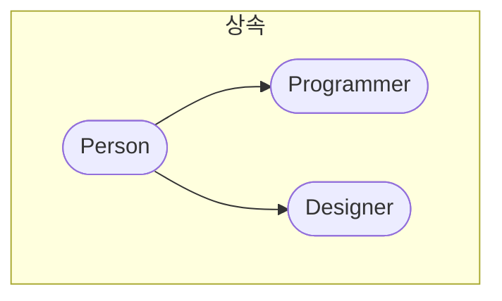

# 시작하기

https://www.youtube.com/watch?v=YOlr79NaAtQ

https://stackoverflow.com/questions/9959727/proto-vs-prototype-in-javascript

- [ ] JavaScript 객체 지향 프로그래밍
  - [ ] MDN : https://developer.mozilla.org/ko/docs/Learn/JavaScript/Objects
  - [ ] Fireship https://www.youtube.com/watch?v=dHrI-_xq1Vo
  - [ ] 코딩애플
    - [ ] https://www.youtube.com/watch?v=fsVL_xrYO0w&pp=ugMICgJrbxABGAE%3D
    - [ ] https://www.youtube.com/watch?v=wUgmzvExL_E

ES5 방식이 있고 ES6 방식이 있습니다. ES5는 면접질문용입니다. ES6는 2015년부터라고 한다면 적용하고 바뀌는 기간까지 생각해볼 필요가 있습니다. ES5 객체지향 프로그래밍은 레거시로 리팩토링할 대상이 됩니다. 이런 리팩토링 업무에 투입이 적합한지 판단하기 위해 ES5 객체지향 프로그래밍을 질문합니다. 또 자바스크립트에 대한 기초적인 이해를 충분히 가지고 있는지 판단 기준으로도 활용합니다. 하지만 새로운 App을 만단다면 ES6 문법을 사용하면 됩니다. 그래서 ES6 문법으로 자바스크립트의 객체지향 프로그래밍을 배우고 ES5 방식을 다음에 배우겠습니다.

자바스크립트로 OOP를 배울 때는 OOP개념과 자바스크립트 개념 동시에 공부해야 해서 난이도가 더 높습니다.

OOP 배우기 전까지 자료구조랑 알고리즘 배울 자격이 없습니다.

객체지향 프로그래밍을 시도할 실무적인 이유는 타입스크립트로 백엔드 엔지니어링 할 때입니다. 그 외에 학습을 목적으로도 학습해야 합니다. 자바스크립트의 동작원리를 이해하기 위해 너머야 하는 산 중 하나입니다.

this가 무엇을 바라보는지는 프로그래밍 중에 단기적으로 문제를 해결만 할 수 있는 것입니다. 이론적으로 무슨 동작원리 때문에 this가 바라보는 것을 알 수 있어도 왜 바라보는지 알 수 있어야 합니다.

객체지향 프로그래밍을 배우면 풀리는 학습 병목은 객체지향적인 고전 React, 자료구조와 알고리즘입니다. MDN 문서도 더 쉽게 읽을 수 있습니다.

## 객체지향 5대 원칙(a.k.a. SOLID 원칙)

## 자바스크립트 디자인 패턴

https://itnext.io/4-ways-to-implement-factory-pattern-in-javascript-2e019c2a9ada

https://itnext.io/7-ways-to-create-singleton-in-javascript-db95a75fbb76

# freecodecamp

[Intro to Object Oriented Programming - Crash Course](https://www.youtube.com/watch?v=SiBw7os-_zI)

프로그래밍 지식이 어느정도 있다고 가정합니다. 포괄적으로 다양한 언어에 적용할 수 있는 개념을 전달합니다. OOP가 무엇인지 이해하기 위해서는 객체를 이해해야 하고 객체를 이해하려면 원시형 자료형부터 이해를 시작해야 합니다.

원시형은 바이트, 정수, 실수, 부울리안, 더블, 문자(char)입니다. 초기 소프트웨어는 원시형으로 충분했지만 소프트웨어의 규모가 커지면서 정보를 정리할 수단이 필요해졌습니다.

예를 들어 체스 게임을 구현하면 나이트의 위치를 정수로 저장하고 생사여부를 부울리안으로 저장하고 싶을 것입니다. 유사한 정보들과 기능들을 보관하고 서로 참조하게 만드는 것이 좋습니다.

C언어에는 Structure 자료형을 지원합니다. Structure은 다양한 자료형을 보관할 수 있습니다. 정수, 실수, 문자열, 다른 Structure를 보관할 수 있습니다. 하지만 Array는 하나의 자료형만 저장합니다. Structure는 객체의 원형입니다.

Structure의 단점은 메서드를 정의할 수 없었습니다. 참조만 할 수 있었습니다. 객체는 메서드도 담을 수 있습니다.

객체가 가진 속성값은 객체를 생성하면서 할당됩니다. 이것은 init입니다. 나이트의 위치를 정의하면서 인스턴스를 생성하는 것과 같은 논리입니다. 메서드는 공유하지만 위치는 각자 다릅니다.

클래스랑 객체는 다릅니다. 객체는 클래스로 생성하는 것입니다. 그래서 구체적인 하나의 인스턴스(사례)에 해당하게 됩니다.

객체 지향 프로그래밍 4대 개념이 있습니다.

## 캡슐화 Encapsulation

캡슐화는 데이터와 메서드로 묶는 행위입니다. 데이터가 클래스 외부에서 변형이 가해지지 않다록 하는 것입니다. 변형은 메서드를 통해서만 가능하도록 합니다. Getter Setter 메서드 같은 것들이 대표적입니다.

일부 데이터는 Read only여야 합니다. 이런 경우 Getter 메서드만 접근가능하게 정의합니다.

클래스 외부의 정보가 클래스 내부의 정보를 변형하는 것을 막는 것이 중요합니다. 이런 문제는 대규모 프로젝트에서 자주 해결하는 방식입니다.

## 추상화 Abstraction

추상화는 필수적인 부분만 보여주고 자세히 알 필요없는 부분을 가리는 것을 의미합니다. 자동차를 운전하기 위해 자동차의 모든 엔진과 부품의 작동방식을 알 필요가 없습니다. 운전대, 기어, 패달 정도만 알고 제어하는 것처럼 클래스도 상통합니다. 클래스의 세부 동작방식을 필요해지기 전까지 알 필요 없습니다. 이런 특징은 인터페이스(Interface)와 적용(Implementation)으로 구현합니다.

인터페이스는 코드의 섹션이 다른 코드랑 상호작용하는 것을 의미합니다. 클래스속에 숨겨지고 메서드 이외에 제어를 접근할 수 없어야 합니다.

클래스가 각자 독립적으로 서로 의존적이지 않아야 합니다. 코드상 의존성이 발생하면 하나의 객체 혹은 클래스를 수정하면 다른 객체 혹은 클래스를 수정해야 합니다.

추상화는 프로그램을 점진적으로 개발할 수 있게 해줍니다. 상호의존성과 복잡성을 낮추어줍니다.

객체와 객체간 접촉이 발생하는 구체적인 인터페이스만 잘 결정합니다. 그리고 구현하는 방식을 중심으로 고민합니다.

## 상속 Inheritance

상속은 하나의 클래스가 클래스의 다른 특징을 받을 수 있게 해줍니다.

음식 --> 과일 --> 사과

구체화되면서 속성값만 다른 경우가 많을 것입니다.

하위의 클래스는 상위의 클래스의 메서드와 속성값을 접근하려고 합니다.

상속은 1 ~ 3 세대를 넘는 경우는 흔합니다.

상속은 접근변형자(Access Modifiers)

Public은 가장 간단한 접근 변형자입니다. 어디서든 접근할 수 있습니다. 부모 자매관계 상관없이 접근할 수 있습니다. 프로그램 위치랑 무관하게 접근할 수 있습니다.

Privet은 같은 클래스 내에서만 접근할 수 있습니다. 다른 곳에서 접근이 발생하면 안 될 때 사용합니다. 같은 이름을 사용해도 서로 접근할 수 없어서 문제가 안 됩니다.

Protected는 정의된 클래스에서 접근할 수 있습니다. 정의 된 클래스에서 Privet처럼 접근할 수 있습니다.

## 다형성 Polymorphism

다형성은 다양한 형태의 메서드를 받는 것입니다.

동적인 다형성은 프로그램 실행 중에 변형이 발생하는 경우입니다.

서브 클래스 수퍼 클래스 모두 존재할 때입니다. 클래스의 계층에 따라 실행방식이 달라질 수 있습니다.

자동차 클래스의 상송을 받은 슈퍼카 클래스가 존재합니다. 각자 다른 연비를 소모합니다. 운행 메서드를 실행하게 되면 연로 감소 비율 즉 메서드가 각각 다르게 실행됩니다. 이런 메서드가 동적으로 바뀌는 것을 동적 다형성이라고 합니다.

정적 다형성은 컴파일 타임 중에 발생합니다. 여러 같은 이름을 가진 여러 메서드에서 발생합니다.

## JavaScript Classes Tutorial

[JavaScript Classes Tutorial](https://www.youtube.com/watch?v=2ZphE5HcQPQ)

### The Basics

클래스는 프로그램 로직을 직접 좌우하지 않습니다. 클래스로 생성한 객체가 직접 좌우하게 됩니다.

객체는 2가지 부분을 정의할 수 있습니다. 보유하고 있는 값을 정의하는 것은 인스턴스 속성(property)입니다. 객체가 행하는 것들은 인스턴스 메서드들입니다.

예를 들어 인간은 이름, 나이, 키에 대한 정보를 가질 수 있습니다. 인스턴스 속성은 현재 상태를 알려주는 정보들에 불과합니다. 이런 정보는 인스턴스로 정의할 때마다 고유합니다.

인스턴스 메서드는 인스턴스가 수행하는 작업입니다. 인간으로 치면 대화하고 달리고 점프하는 것입니다. 일반적으로 인스턴스 메서드는 인스턴스 속성값을 활용해서 작업을 수행합니다.

```js
class Rectangle {
  // 생성자 함수
  constructor() {
    console.log("The rectangle is being created.");
  }
}

const myRectangle = new Rectangle(); // The rectangle is being created.
const myRectangle2 = new Rectangle(); // The rectangle is being created.
```

클래스를 정의할 때는 관례적으로 파스칼 케이스로 작성합니다. 대문자로 시작하고 단어마다 대문자로 구분하는 명명입니다.

모든 클래스는 생성자 함수를 반드시 가지고 있습니다. 생성자 함수는 인스턴스 객체 실행 주기 중에 한번만 실행하는 메서드입니다. 한번실행하지만 동시에 생성 중에 실행됩니다.

생성자 함수는 일반적인 함수처럼 행동합니다. 함수처럼 생성할 때마다 `console.log`를 실행했습니다.

```js
class Rectangle {
  constructor() {
    this.width = 4;
    this.height = 8;
    this.color = "blue";
  }
}

const myRectangle = new Rectangle();

console.log(myRectangle); // Rectangle { width: 4, height: 8, color: 'blue' }
```

생성자 함수는 객체를 설정할 할 때 사용합니다.

`this` 키워드는 현재 객체를 지칭합니다. `console.log`로 보면 object 자료형 속에 3개의 속성값이 담겨있는 것을 볼 수 있습니다. 이 속성값은 이 객체에게 적어도 이 코드 베이스의 프로그램에서는 고유한 값들입니다.

이제 조금더 실용적이게 프로그래밍 중에는 `Rectangle(4, 8, 'blue')`으로 입력해서 이런 속성값을 갖도록 하고 싶습니다. 생성자 함수에 인자를 받아 활용하면 간단하게 구현할 수 있습니다.

```js
class Rectangle {
  constructor(width, height, color) {
    this.width = width;
    this.height = height;
    this.color = color;
  }
  getArea() {
    return this.width * this.height;
  }
  printDescription() {
    console.log(
      `I am a rectangle ${this.width} x ${this.height} and I am ${this.color}`
    );
  }
}

const myRectangle1 = new Rectangle(4, 8, "blue");
const myRectangle2 = new Rectangle(10, 5, "red");

console.log(myRectangle1); // Rectangle { width: 4, height: 8, color: 'blue' }
console.log(myRectangle2); // Rectangle { width: 10, height: 5, color: 'red' }

console.log(myRectangle1.getArea()); // 32
console.log(myRectangle2.getArea()); // 50

console.log(myRectangle1.printDescription()); // I am a rectangle 4 x 8 and I am blue
console.log(myRectangle2.printDescription()); // I am a rectangle 10 x 5 and I am blue
```

이렇게 생성자 함수에 인자로 넘겨 주면 객체는 고유한 값을 가질 수 있게 됩니다.

메서드는 인스턴스에서 정의한 값을 활용해서 인스턴스의 속성처럼 고유한 값을 반환하게 됩니다.

여기까지 자바스크립트 클래스 문법적인 부분 시작입니다.

### Getters and Setters

Getters and Setters는 클래스의 메서드를 정의하는데 사용합니다. 속성값으로 사용하기 위해서 사용합니다. 속성처럼 보이지만 메서드입니다.

```js
class Square {
  constructor(width) {
    this.width = width;
    this.height = width;
  }
}
```

여기서 정사각형의 넓이를 구하려면 폭과 높이를 곱하면 됩니다. 여기서 getter를 정의해서 달성할 수 있습니다.

```js
class Square {
  constructor(width) {
    this.width = width;
    this.height = width; // 정사각형(Square)은 높이랑 폭이 같습니다.
  }
  // getter 함수 정의
  get area() {
    return this.width * this.height;
  }
}

const square1 = new Square(4);
console.log(square1.area); // 16  메서드인데 뒤에 괄호를 안 붙입니다.
```

이제 Setter 함수입니다. getter랑 비슷하게 작업합니다. Setter는 인스턴스에 새로운 값들을 할당할 수 있습니다. 속성같은 문법으로 수행할 수 있습니다.

```js
class Square {
  constructor(width) {
    this.width = width;
    this.height = width; // 정사각형(Square)은 높이랑 폭이 같습니다.
  }
  // getter 함수 정의
  get area() {
    return this.width * this.height;
  }
  set area(area) {
    this.width = Math.sqrt(area);
    this.height = this.width;
  }
}

const square1 = new Square(4);
console.log(square1.area); // 16  메서드인데 뒤에 괄호를 안 붙입니다.

square1.area = 25; // setter 함수 실행
console.log(square1.width, square1.height); // 5, 5 setter함수로 인스턴스의 값을 업데이트했습니다.
```

아래 코드로는 메서드를 실행한 횟수를 저장하는 인스턴스를 만들 수 있습니다.

```js
class Square {
  constructor(width) {
    this.width = width;
    this.height = width;
    this.numOfRequestForArea = 0;
  }
  get area() {
    this.numOfRequestForArea++; // 실행할 때마다 실행횟수 기록
    return this.width * this.height;
  }
  set area(area) {
    this.width = Math.sqrt(area);
    this.height = this.width;
  }
}

const square1 = new Square(4);

console.log(square1.area);
console.log(square1.area);
console.log(square1.area);
console.log(square1.area);
console.log(square1.numOfRequestForArea); // 4
```

### Static Methods

정적인 메서드입니다. 인스턴스 객체의 메서드가 아닙니다. 클래스를 통해서 접근합니다. 대표적으로 `helper` 메서드입니다. 인스턴스 객체에 묶여있지 않지만 유틸적으로 유용합니다.

```js
class Square {
  constructor(width) {
    this.width = width;
    this.height = width;
  }
  static equals(a, b) {
    return a.width * a.height === b.width * b.height;
  }
  static isValidDimensions(width, height) {
    return width === height;
  }
}

const square1 = new Square(8);
const square2 = new Square(4);

console.log(square1); // Square { width: 8, height: 8 }
console.log(Square.equals(square1, square2)); // false
console.log(Square.isValidDimensions(6, 6)); // true
```

정적인 메서드는 인스턴스에 사용할 수 없습니다. 클래스의 메서드로 접근할 수 있습니다.

정적 메서드는 `this` 키워드가 필요하지 않습니다.

### Inheritance and Extends

자바스크립트에서는 `Extends` 키워드가 상속을 구현합니다.

공통적인 특징을 가진 부모클래스를 만들고 부모의 능력에 추가 능력까지 있는 자식클래스를 만들 때 사용합니다.

분류학적으로 접근하는 것이 기본적입니다. 사람을 먼저 정의한 추상적인 것입니다. 상속받을 사람의 직업은 구체적입니다.

```js
class Person {
  constructor(name, age) {
    this.name = name;
    this.age = age;
  }
}

function developSoftware(programers) {}
```

`Person` -> `developSoftware`으로 상속 시켜야 합니다.

```js
class Person {
  constructor(name, age) {
    this.name = name;
    this.age = age;
  }
  describe() {
    console.log(`I am ${this.name} and I am ${this.age} old`);
  }
}

class Programer extends Person {
  constructor(name, age, yearsOfExperience) {
    super(name, age); // 메서드를 통해 상속할 프로퍼티를 받습니다.

    // 수동으로 만드는 영역입니다.
    this.yearsOfExperience = yearsOfExperience;
  }
}

const person1 = new Person("jeff", 45);
const programer1 = new Programer("Dom", 56, 12);

console.log(person1); // Person { name: 'jeff', age: 45 }
console.log(programer1); // Programer { name: 'Dom', age: 56, yearsOfExperience: 12 }
```

속성도 상속받지만 메서드도 같이 상속받습니다.

자바스크립트의 특징답게 프로토타입이 `Person`으로부터 체이닝 된 것입니다.

상속은 한 방향으로만 갑니다.

```js
class Person {
  constructor(name, age) {
    this.name = name;
    this.age = age;
  }
  describe() {
    console.log(`I am ${this.name} and I am ${this.age} old`);
  }
}

class Programer extends Person {
  constructor(name, age, yearsOfExperience) {
    super(name, age); // 메서드를 통해 상속할 프로퍼티를 받습니다.

    // 수동으로 만드는 영역입니다.
    this.yearsOfExperience = yearsOfExperience;
  }
  code() {
    console.log(`${this.name} is coding`);
  }
}

function developSoftware(programers) {
  for (let programer of programers) {
    programer.code();
  }
}

const programers = [new Programer("Dom", 56, 12), new Programer("jeff", 28, 2)];

developSoftware(programers);
// Dom is coding
// jeff is coding
```

### Polymorphism

다형성은 부모에서 자식으로 상속하면서 메서드를 다시 정의하는 것입니다.

```js
class Animal {
  constructor(name) {
    this.name = name;
  }
  makeSound() {
    // 다변형성을 이루기 위해 바꿀 메서드입니다.
    console.log("Generic Animal Sound!");
  }
}

class Dog extends Animal {
  constructor(name) {
    super(name);
  }
  makeSound() {
    // 메서드를 이렇게 오버라이딩(덮어쓰기)하는 행위가 다변형성입니다.
    console.log("Woof! Woof!");
  }
}

const a1 = new Animal("DOM");
const a2 = new Dog("Jeff");
a1.makeSound(); // Generic Animal Sound!
a2.makeSound(); // Woof! Woof!
```

자바스크립트의 특징 중 하나는 없으면 외부환경을 참조하는 것이랑 유사하게 메서드도 없으면 부모의 메서드를 참조합니다.

```js
class Animal {
  constructor(name) {
    this.name = name;
  }
  makeSound() {
    // 다변형성을 이루기 위해 바꿀 메서드입니다.
    console.log("Generic Animal Sound!");
  }
}

class Dog extends Animal {
  constructor(name) {
    super(name);
  }
  // makeSound() { // 메서드를 이렇게 오버라이딩(덮어쓰기)하는 행위가 다변형성입니다.
  //     console.log('Woof! Woof!')
  // }
}

const a1 = new Animal("DOM");
const a2 = new Dog("Jeff");
a1.makeSound(); // Generic Animal Sound!
a2.makeSound(); // Generic Animal Sound!
```

```js
class Animal {
  constructor(name) {
    this.name = name;
  }
  makeSound() {
    // 다변형성을 이루기 위해 바꿀 메서드입니다.
    console.log("Generic Animal Sound!");
  }
}

class Dog extends Animal {
  constructor(name) {
    super(name);
  }
  makeSound() {
    super.makeSound(); // 상속받은 메서드를 먼저 사용하고 난 후에 자식 클래스의 메서드를 실행하게 만듭니다.
    console.log("Woof! Woof!");
  }
}

const a1 = new Animal("DOM");
const a2 = new Dog("Jeff");
a1.makeSound(); // Generic Animal Sound!
a2.makeSound(); // Generic Animal Sound!  Woof! Woof!
```

메서드를 상속하고 자식에서 확징시키는 방식이 더 일반적으로 코드를 작성하는 방식입니다.

### Classes in Practice

자바스크립트의 클래스를 활용해서 html `ul`태그의 `li`태그를 CRUD 하는 연습입니다.

# 노마드 코더

[객체지향 프로그래밍? 문과도 이해쌉가능. 10분컷.](https://www.youtube.com/watch?v=cg1xvFy1JQQ)

객체지향 프로그래밍은 코드를 정리하는 프로그래밍 패러다임입니다. Java는 객체지향 프로그래밍을 기본 전제로 합니다. Python, JavaScript는 기본적으로 지원해줍니다.

```js
const playerOne = {
  // 캐릭터 속성 & 메서드
};
const playerTwo = {
  // 캐릭터 속성 & 메서드
};
const playerThree = {
  // 캐릭터 속성 & 메서드
};
```

이렇게 작성하면 하나 변형이 필요할 때 각각 모두 바꿔야 합니다. 코드 유지보수하기 상당히 나쁩니다.

클래스를 통해 찍어내는 것으로 유지보수하기 간단하게 만들 수 있습니다.

```js
class Player {
  constructor(name, health, skill) {
    this.name = name;
    this.health = health;
    this.skill = skill;
    this.xp = 0;
  }
  sayHello() {
    return `Hi, my name is ${this.name} and my skill is ${this.skill}`;
  }
  takeHit() {
    this.health = this.health - 5;
  }
}

const elon = new Player("name", 90, "something");
console.log(elon.sayHello()); // Hi, my name is name and my skill is something
```

클래스는 컨스트런터 이외 다양한 메서드를 가질 수 있습니다.

OOP에서 중요한 것은 상속입니다. 확장한다는 개념이 더 좋을 수 있습니다. 반복하는 부분은 부모에게 넘겨두고 달라지는 인스턴스에서 정의합니다.

객체에 상속이 없으면 코드는 이렇게 생겼습니다.

```js
class Human {
  constructor(name) {
    this.name = name;
    this.legs = 2;
    this.arms = 2;
  }
}

class Baby {
  constructor(name) {
    this.name = name;
    this.legs = 2;
    this.arms = 2;
  }
  cry() {
    return `waa waa`;
  }
}

class Teenager {
  constructor(name) {
    this.name = name;
    this.legs = 2;
    this.arms = 2;
  }
  curse() {
    return `@$%#$@!`;
  }
}
```

`constructor`부분에 중복이 발생하고 있습니다. 이런 중복은 상속을 통해서 제거해야 합니다.

```js
class Human {
  constructor(name) {
    this.name = name;
    this.legs = 2;
    this.arms = 2;
  }
}

class Baby extends Human {
  constructor(name) {
    super(name);
    this.cute = true;
  }
  cry() {
    return `waa waa`;
  }
}

class Teenager extends Human {
  constructor(name) {
    super(name);
    this.emotional = true;
  }
  curse() {
    return `@$%#$@!`;
  }
}
```

상속을 시키려면 `extends`와 `super` 메서드를 `constructor` 속에서 사용해야 합니다.

[개발자 전공필수? 객체지향 개념정리 10분컷.](https://www.youtube.com/watch?v=IeLWSKq0xIQ)

캡슐화는 클래스에 데이터를 넣는 것을 말합니다. this 키워드를 통해 클래스는 데이터를 스스로 접근할 수 있습니다.

```ts
class Entrepreneur {
  constructor(
    private firstName: string,
    private lastNmae: string,
    private shares: number,
    private company: string
  ) {}
  public calculateNetWorth() {
    return this.shares * getSharePrice(this.company);
  }
}

const elon = new Entrepreneur("elon", "musk", 170, "TSLA");

// 이런 뮤테이션 불가능
elon.shares = 0;
elon.company = "AMZN";
```

캡슐화는 정보의 접근과 변형을 결정합니다.

상속은 작은 클래스 단위로 나누어 재사용성을 높입니다.

```ts
class Entrepreneur {
  constructor(
    private firstName: string,
    private lastNmae: string,
    private shares: number,
    private company: string
  ) {}
  public calculateNetWorth() {
    return this.shares * getSharePrice(this.company);
  }
}

class Actor {
  constructor(
    private firstName: string,
    private lastNmae: string,
    private oscars: number,
    private age: number
  ) {}
}
```

이론 코드를 아래처럼 더 단순화 시킬 수 있습니다.

```ts
class Person {
  constructor(private firstName: string, private lastNmae: string) {}
  public sayHi() {
    return `Hi, my name is ${this.firstName} ${this.lastNmae}`;
  }
}

class Entrepreneur extends Person {
  constructor(
    firstName: string,
    lastNmae: string,
    private shares: number,
    private company: string
  ) {
    super(firstName, lastNmae);
  }
}

class Actor extends Person {
  constructor(
    firstName: string,
    lastNmae: string,
    private oscars: number,
    private age: number
  ) {
    super(firstName, lastNmae);
  }
}
```

추상화는 구현 세부 정보를 숨기는 일반 인터페이스를 지정하는 행위입니다. 인터페이스는 코드의 생산자가 보여줍니다. 반면 동작하는 구현방식은 숨깁니다.

코드는 보통 메서드로 제어할 수 있게 드러냅니다.

```ts
class BetterArray {
  private items: string[];
  constructor() {
    this.items = [];
  }
  public getItems() {
    return [...this.items];
  }
  public addItem(item: string) {
    this.items.push(item);
  }
  public removeItem(itemToDelete: string) {
    this.items = this.items.filter((item) => item !== itemToDelete);
  }
  public modifyItem(itemToChange: string, newValue: string) {
    const index = this.items.indexOf(itemToChange);
    if (index !== -1) {
      this.items[index] = newValue;
    }
  }
}
```

이런 코드로 추상화를 했습니다.

```ts
const arr = new BetterArray();
arr.addItem("I love");
arr.addItem("Javascript");
arr.modifyItem("Javascript", "Typescript");
```

이제 `public`으로 공개된 메서드로 인스턴스로 제어할 수 있습니다. 이 인스턴스를 제어할 때 함수 내용을 일일이 알 필요는 없습니다.

다형성은 다양한 측면 혹은 형태학의 결합입니다.

```ts
class Person {
  public sayHi() {
    return "hi";
  }
  public sayBye() {
    return "bye";
  }
}
class 한국인 extends Person {}
class Italian extends Person {}

const 박 = new 한국인();
const mario = new Italian();

박.sayHi();
mario.sayHi();
```

```ts
class 한국인 extends Person {
  public sayHi() {
    return "안녕!";
  }
}
```

이렇게 되면 메서드 오버라이딩으로 메서드를 덮어쓴 것입니다. 하지만 반환하는 자료형은 같도록 타입스크립트가 막고 있습니다.

# Web Dev Simplified

[What are Classes, Objects, and Constructors?](https://www.youtube.com/watch?v=5AWRivBk0Gw)

클래스는 설계도에 불과합니다. 실제 데이터를 가지고 있지 않습니다. 어떻게 담길지만 설계합니다.

```js
class House {
  constructor(color) {
    this.color = color; // 객체에만 정보가 남도록 합니다.
  }
  getFurniture() {
    // 메서드입니다.
    return `sofa`;
  }
}

const houseObject1 = new House("red");
const houseObject2 = new House("blue");

console.log(houseObject1.color);
console.log(houseObject1.getFurniture());

console.log(houseObject2.color);
console.log(houseObject2.getFurniture());

// red
// sofa
// blue
// sofa
```

# Fireship

[Object Oriented vs Functional Programming with TypeScript](https://www.youtube.com/watch?v=fsVL_xrYO0w)

# 코딩애플

[객체지향 Class 문법 10분만에 이해시켜줌 (자바스크립트)](https://www.youtube.com/watch?v=dHrI-_xq1Vo)

# 생활코딩

## 옛날 강의

객체 지향 프로그래밍는 처음 접하고 공부할 때 철학적이고 심오한 느낌을 많이 받습니다. 물론 철학적인 주제이기는 합니다.

객체는 상태(프로퍼티 값)과 행동(메서드)으로 이루어져있습니다. 상태와 행동이라는 단어도 사실 매우 추상적인 느낌이 강합니다.

소프트웨어는 여러개의 로직들의 합입니다.

소프트웨어 개발하는 과정에서 코드량이 많아지고 로직들이 복잡해집니다. 이런 로직과 코드량이 많아지면서 구분하고 정리가 필요해집니다.

스파게티코드에 가까워지는 것을 막기위해 다양한 방식으로 문제를 해결할 수 있습니다. 이중에 객체지향 프로그래밍이 방법 중 하나입니다.

객체를 만들어서 구체적인 문법적인 기능이 언어에서 지원합니다. 하나의 객체는 존재하는 취지에 따라서 기능과 연관된 메소드와 값을 담은 것이고 연관성이 없는 것과 구분하기 위한 존재입니다.

> 쉽게 생각하자. 객체는 변수와 메소드를 그룹핑한 것이다.
>
> - 생활코딩

객체지향 프로그래밍을 공부할 때는 2가지 부분으로 공부할 수 있습니다. 하나는 문법이고 다른 하나는 설계입니다.

처음 공부를 시작할 때는 문법은 무조건 배우게 됩니다. 그리고 쉬운 부분입니다. 어려운 것은 현실을 잘 반영한 소프트웨어를 개발하는 것 이것은 설계하는 것입니다.

설계는 현실의 특징을 잘 포착해서 소프트웨어에 잘 담는 것입니다. 현실은 복잡하고 소프트웨어는 단순합니다. 위성사진은 구체적인 현실입니다. 지하철 노선도는 추상화되었습니다. 지하철의 탑승자의 관심은 거리가 아닙니다. 환승, 순서, 종점을 알고싶어합니다. 복잡한 현실의 일부를 가리고 추상화시켰습니다.

추상화는 객체지향 프로그래밍에서만 나오는 개념은 아닙니다.

좋은 설계는 지혜와 경험의 문제입니다. 스스로 추구하는 것입니다. 우리나라가 직무역량으로 좋아하는 센스입니다.

문법을 먼저 배워야 설계원칙도 익힐 수 있습니다.

객체지향 프로그래밍의 개념은 생각보다 넓습니다.

객체를 만들면 다른 곳에 재사용하기 쉽습니다. 객체가 다른 여러곳에서 부품처럼 활용하게 됩니다.

객체로 코드를 묶어서 코드량을 줄이고 코드 가독성을 높이기 위한 방법입니다. 연관된 것을 묶고 분류하고 부품화합니다.

부품화를 한다고 모든 곳에서 재사용할 수 있는 것은 아닙니다.

제대로 된 부품이면 어떻게 동작하는지 몰라도 사용할 수 있어야 합니다. 객체의 내부의 동작방법을 숨기고 사용자에게 사용법만 노출합니다. 사용방법은 객체의 메소드를 통합니다. 메소드의 사용법만 알면 객체를 다룰 수 있습니다. 이것을 보고 정보의 은닉화 캡슐화라고 합니다.

좋은 부품의 또 다른 특징은 인터페이스를 제공합니다. 부품이 서로 교환할 수 있어야 합니다. 장치와 장치를 연결하는 접점을 보고 인터페이스라고 합니다. 서로 사용할 수 있는 관계와 없는 관계를 프로그래밍적으로 언어적으로 가능합니다.

비유는 문제가 많습니다. 의도하지 않은 점까지 전달될 가능성이 있습니다.

### 생성자와 new

자바스크립트는 프로토타입 기반 언어입니다. 이론 이유로 객체지향 언어의 문법을 비슷하게 사용하지만 사실은 함수형 언어의 특징을 가지고 있습니다. 기존 객체지향 프로그래밍 방식을 알면 오히려 혼란스러울 수 있습니다.

자바스크립트가 추구하는 객체지향 프로그래밍 언어는 아주 자유롭습니다. 다른 언어는 정적이고 엄격하게 규제하지만 자바스크립트는 위험할 정도로 자유롭습니다.

자바스크립트에서 객체를 만들 때는 `{}`으로 만듭니다.

```js
const person = {};

person.name = "Jake";
person.introduce = () => `my name is ${this.name}`;

console.log(person.name);
console.log(person.introduce());

// Jake
// my name is undefined
```

객체를 정의하는 중간이 떨어져있습니다. 그래서 `undefined`을 돌려주었습니다.

```js
const person = {
  name: "Jake",
  introduce: function () {
    return `my name is ${this.name}`;
  },
};

console.log(person.name);
console.log(person.introduce());

// Jake
// my name is Jake
```

이렇게 되면 `this`가 올바르게 처보고 있으면서 `undefined`을 출력하지 않습니다.

```js
const person1 = {
  name: "Jake",
  introduce: function () {
    return `my name is ${this.name}`;
  },
};
const person2 = {
  name: "fin",
  introduce: function () {
    return `my name is ${this.name}`;
  },
};

console.log(person1.name);
console.log(person1.introduce());
console.log(person2.name);
console.log(person2.introduce());

// Jake
// my name is Jake
// fin
// my name is fin
```

이렇게 작성하면 `this`가 보는 문제는 없지만 중복이 발생합니다.

자바스크립트는 함수형 언어처럼 취급하는 게 좋습니다. 자바스크립트에게 함수의 위상은 높습니다.

생성자함수의 역할은 객체를 만드는 함수입니다.

```js
function Person() {}
var p = new Person(); // 생성자 함수 p 식별자는 빈 object가 됩니다.
p.name = "Jake";
p.introduce = function () {
  return "My name is " + this.name;
};

console.log(p.name);
console.log(p.introduce());

// Jake
// my name is Jake
```

생성자 함수를 통해 `p` 식별자는 객체를 할 당하게 됩니다. 함수는 객체를 실행하는 것만 아니라 객체를 생성하는 주체가 됩니다.

```js
function Person(name) {
  this.name = name;
  this.introduce = function () {
    return "My name is " + this.name;
  };
}
var p1 = new Person("Jake");
var p2 = new Person("fin");

console.log(p1.name);
console.log(p1.introduce());
console.log(p2.name);
console.log(p2.introduce());

// Jake
// My name is Jake
// fin
// My name is fin
```

이렇게 생성자 함수를 만들면 장점은 여러개의 같은 객체에 대해서 중복을 제거할 수 있습니다. 생성자를 통해서 객체를 만들면 객체를 초기화를 하면서 만들어서 훨신더 코드가 간결해집니다.

### 전역객체

```js
// 함수 정의입니다.
function func() {
  alert("Hello?");
}
func(); // 함수 호출입니다.
window.func(); // 점(.)을 사용했다는 것 자체는 속성으로 메소드로 호출했습니다.
```

자바스크립트에서 함수를 정의할 때부터 전역객체의 메소드가 됩니다. 사실 지금까지 전역객체를 생략하고 암시적으로 명령을 내렸던 것입니다. 모든 변수와 함수는 전역객체의 프로퍼티에 불과합니다.

자바스크립트는 결국 객체지향 언어입니다. 모든 것은 전역객체 안에 속하기 때문에 그렇습니다.

```js
var o = {
  func: function () {
    alert("Hello?");
  },
};
o.func();
window.o.func();
```

`o`라는 객체도 전역객체를 생략하고 지금까지 사용했다는 것입니다. 전역객체 API를 접근할 수 있습니다. 전역객체는 실행환경에 따라 다릅니다. node.js의 전역객체와 브라우저의 전역객체는 각각 다릅니다. 브라우저는 `window`이고 node.js는 `global`입니다.

자바스크립트의 모든 객체는 전역객체의 프로퍼티입니다. `this`를 이해하기 전에 중요한 내용입니다.

### this

`this`라는 키워드는 특이합니다. `this`는 함수를 호출한 실행 컨텍스트를 의미합니다. 실행 컨텍스트에 따라 달라집니다. `this`는 할당이 되어 있는 변수입니다. 호출 방식에 따라 달라집니다.

```js
function func() {
  if (global === this) {
    console.log(true);
  }
}
func(); // true
```

전역객체의 `this`는 global입니다. 직관적으로 `global.func()`로 실행하고 있는 상태라고 암시를 추론할 수 있습니다.

```js
var o = {
  func: function func() {
    if (global === this) {
      console.log(`global`);
    } else if (o === this) {
      console.log(`object`);
    }
  },
};
o.func(); // object
```

`global.o.func()`로 실행합니다. `func()`랑 `global` 사이에는 `o`가 있습니다. 이런 경우 `this`는 함수를 앞에 붙은 `o`를 처다봅니다.

생성자 함수로 생성한 객체도 결국 같습니다. `this`는 실행컨텍스마다 다르지만 동일한 동작원리를 적용할 수 있습니다.

```js
var funcThis = null;

function Func() {
  funcThis = this; // funcThis식별자는 this를 할당합니다.
}
var o1 = Func(); // 함수로 호출합니다. 함수가 실행되면서 funcThis가 this를 할당하게 만듭니다.
if (funcThis === global) {
  // funcThis는 (global.)this 이기 때문에 참입니다.
  console.log(`global`);
}

var o2 = new Func(); // this는 생성자가 만든 객체를 바라봅니다. 생성자 함수로 o2에 객체가 할당되면서 this는 객체로서 o2를 바라봅니다.
if (funcThis === o2) {
  console.log(`object`);
}
// global
// object
```

#### apply, call

apply, call은 함수가 객체라는 사실을 보여줍니다.

```js
function sum(a, b) {
  // 전통적으로 함수를 만드는 방법입니다. 함수 리터럴이라고도 부릅니다.
  return a + b;
}
console.log(sum(1, 2)); // 3

const sum2 = new Function("a", "b", "return a + b"); // 함수를 객체로 만드는 방법입니다. 이것은 객체 리터럴입니다.

console.log(sum2(1, 2)); // 3
```

여기서 볼것은 함수도 객체라는 것을 볼 수 있습니다. 함수를 객체로 만들 필요는 없습니다. 자바스크립트가 함수 리터럴을 객체리터럴로 변환합니다.

객체 리터럴은 함수만 아니라 배열, 객체도 존재합니다.

```js
const arr = new Array(1, 2, 3);
const obj = new Object();

console.log(arr, obj);
```

이렇게 하면 배열과 객체를 객체리터럴로 정의해서 활용하는 것입니다. `function`, `[]`, `{}` 같은 리터럴은 문법적으로 작성이 더 편리하게 해주기 위해 존재합니다.

```js
var o = {};
var p = {};
function func() {
  switch (this) {
    case o:
      console.log("o");
      break;
    case p:
      console.log("p");
      break;
    case global:
      console.log("global");
      break;
  }
}
func();
func.apply(o);
func.apply(p);
// global
// o
// p
```

`this`가 바라볼 대상을 메서드로 제어할 수 있습니다.

전통적인 객체지향 프로그래밍에서 메서드는 객체에 종속되어 있습니다. 하지만 자바스크립트는 전통을 벗어나 `this`를 유연하게 바라보게 만듭니다.

자바스크립테는 함수를 호출하는 방식(전역객체, 인스턴스, 콜백)에 따라 `this`가 바라보는 방식이 달라집니다.

### 상속

객체는 작업과 관련된 변수와 메소드가 담겨있습니다. 새로운 객체는 상속을 받아 부모의 특성을 받을 수 있습니다. 부모의 정보를 접근할 수 있습니다. 부모 객체는 원본 객체가 됩니다. 상속받은 객체는 어떤 기능은 제외하고 어떤 기능은 추가해서 부모의 기능을 재활용하면서 맥락에 맞게 사용할 수 있습니다. 즉 로직을 재활용할 수 있습니다.

```js
function Person(name) {
  this.name = name;
  this.introduce = function () {
    return "My name is " + this.name;
  };
}
var p1 = new Person("Jake");
console.log(p1.introduce()); // My name is Jake
```

위아래 코드는 기능적으로 동일합니다.

```js
function Person(name) {
  this.name = name;
}
Person.prototype.introduce = function () {
  // prototype를 설정하는 다른 방법
  return "My name is " + this.name;
};
var p1 = new Person("Jake");
console.log(p1.introduce()); // My name is Jake
```

`prototype`은 원리이고 여기 부분은 문법입니다.

```js
function Person(name) {
  this.name = name;
}

Person.prototype.introduce = function () {
  return "My name is " + this.name;
};

var p1 = new Person("Jake");
console.log(p1.introduce()); // My name is Jake

// 메서드를 상속하는 예제입니다.
function Programmer(name) {
  this.name = name;
}
Programmer.prototype = new Person();

var p2 = new Programmer("fin");
console.log(p2.introduce()); // My name is fin
```

`(생성자).prototype`으로 상속합니다.



상속 관계는 위와 같은 다이어그램입니다.

```js
function Person(name) {
  this.name = name;
}

Person.prototype.introduce = function () {
  return "My name is " + this.name;
};

var p1 = new Person("Jake");
console.log(p1.introduce()); // My name is Jake
// console.log(p1.coding())  // Error 상속은 단 방향으로 흐릅니다.

// 메서드를 상속하는 예제입니다.
function Programmer(name) {
  this.name = name;
}
Programmer.prototype = new Person();
Programmer.prototype.coding = () => `hello world!`;

var p2 = new Programmer("fin");
console.log(p2.introduce()); // My name is fin
console.log(p2.coding()); // hello world!

function Designer(name) {
  this.name = name;
}
Designer.prototype = new Person();
Designer.prototype.design = () => `Framer is awesome`;
var p3 = new Designer("BMO");
console.log(p3.introduce()); // My name is BMO
console.log(p3.design()); // Framer is awesome
```

여기서 부모 메서드만 변경하면 자식 메서드도 모두 같이 변경할 수 있습니다. 이것은 상속의 힘 중 하나입니다.

### prototype

프로토타입은 자바스크립트의 객체지향을 지탱하면서 동시에 일반적인 객체지향 언어랑 구분하는 특징입니다.

프로토타입의 의미는 원형입니다. 하지만 자바스크립트는 prototype을 통해 상속을 제공하고 있습니다.

```js
function Ultra() {}
Ultra.prototype.ultraProp = true;

function Super() {}
Super.prototype = new Ultra();

function Sub() {}
Sub.prototype = new Super();

var o = new Sub();
console.log(o.ultraProp); // true
```

`o` 객체는 `Sub` 생성자로 만들었습니다. 하지만 `ultraProp`을 상속받았습니다.

생성자는 기본적으로 함수입니다. `new` 키워드로 함수는 단순한 함수에서 생성자 함수가 됩니다. 실행된 결과값이 객체이고 객체를 식별자 할당하면서 인스턴스를 생성하는 방식으로 동작합니다.

객체가 가지고 있은 원형은 `prototype`에 저장되어 있습니다. `prototype`은 원형인 즉 부모객체를 할당하는 것으로 상속합니다. `prototype` 프로퍼티로 바라볼 부모를 결정할 수 있게 되는 것입니다.

```js
function func() {}
console.log(func.prototype); // {}

var obj = new Object();
console.log(obj); // {}

func.prototype.name = "cake";
console.log(func.prototype); // { name: 'cake' }
```

`func`의 `prototype`의 프로퍼티로 `name` 키에 `cake`을 값으로 할당했기 때문에 `{ name: 'cake' }`을 반환합니다.

```js
function Ultra() {}
Ultra.prototype.ultraProp = true;

function Super() {}
Super.prototype = new Ultra();

function Sub() {}
Sub.prototype = new Super();

var o = new Sub();
console.log(o.ultraProp); // true
```

다시 이 예제를 보면 여러 세대를 `prototype`으로 연속적으로 상속하면서 연결되어 있습니다. 이것을 보고 프로토타입 체이닝이라고 부릅니다.

```js
function Ultra() {}
Ultra.prototype.ultraProp = true;

function Super() {}
Super.prototype = new Ultra();

function Sub() {}
Sub.prototype = new Super();

var o = new Sub();
o.ultraProp = "I want cake";
console.log(o.ultraProp); // I want cake
```

자바스크립트의 동작 방식의 문제입니다. 실행 컨텍스트에 따라 결과가 달라지는데 이전 예제는 `o.ultraProp`이 바라보는 결과 값이 현재 객체에 없어서 `prototype`을 타고 부모에게 참조될 수 있는지 찾으러갑니다. 하지만 찾기 전에 이미 `o.ultraProp`에서 `I want cake`을 찾았기 때문에 바로 출력합니다.

즉 객체 인스턴스를 확인해보고 없으면 생성자를 알아보고 생성자 속에서 확인해보고 없으면 prototype을 통해 상위 부모로 계속 접근해서 알아내고 결과를 돌려줍니다.

`prototype`에는 생성자 뿐만 아니라 생성한 인스턴스도 할당할 수 있습니다. 이렇게 인스턴스에서도 값을 확인해봅니다.

```js
function Ultra() {}
Ultra.prototype.ultraProp = true;

function Super() {}
Super.prototype = new Ultra();

function Sub() {}
var instance = new Super();
instance.ultraProp = 3;
Sub.prototype = instance;

var o = new Sub();
console.log(o.ultraProp); // 3
```

> `Super.prototype = Ultra.prototype` 으로하면 안된다. 이렇게하면 `Super.prototype`의 값을 변경하면 그것이 `Ultra.prototype`도 변경하기 때문이다. `Super.prototype = new Ultra();`는 `Ultra.prototype`의 원형으로 하는 객체가 생성되기 때문에 `new Ultra()`를 통해서 만들어진 객체에 변화가 생겨도 `Ultra.prototype`의 객체에는 영향을 주지 않는다.
>
> - 생활코딩

### 표준 내장 객체의 확장

표준 내장 객체는 자바스브립트가 기본적으로 가지고 있는 객체들입니다.

- Object
- Function
- Array
- String
- Boolean
- Number
- Math
- Date
- RegExp

자바스크립트 언어 자체가 제공하는 API는 상당히 간소합니다. 자바스크립트의 실행환경 속에서 존재할 수 있는 API는 더 많이 있습니다.

하지만 여기 없는 객체를 스스로 정의해서 만드는 것을 보고 사용자 정의 객체라고 합니다.

내장객체에 어떤 메소드를 추가할 수 있습니다.

```js
var arr = new Array("seoul", "new york", "ladarkh", "pusan", "Tsukuba");

function getRandomValueFromArray(haystack) {
  var index = Math.floor(haystack.length * Math.random());
  return haystack[index];
}
console.log(getRandomValueFromArray(arr)); // ['seoul','new york','ladarkh','pusan', 'Tsukuba'] 중 하나를 무작위로 출력합니다.
```

이런 코드를 더 우아하게 만들 수 있습니다.

```js
Array.prototype.random = function () {
  var index = Math.floor(this.length * Math.random());
  return this[index];
};
var arr = new Array("seoul", "new york", "ladarkh", "pusan", "Tsukuba");

console.log(arr.random());
```

이런식으로 전용 메서드를 붙여서 활용할 수 있습니다.

### Object

객체라는 객체가 존재합니다. 객체라는 Object는 혼선이 발생할 것입니다.

```js
var grades = { egoing: 10, k8805: 6, sorialgi: 80 };
```

객체를 활용하면 연관된 것들 끼리 묶였습니다.

객체를 `prototype`으로 상속하는 것도 배웠습니다.

```js
function Ultra() {}
Ultra.prototype.ultraProp = true;

function Super() {}
Super.prototype = new Ultra();

function Sub() {}
Sub.prototype = new Super();

var o = new Sub();
console.log(o.ultraProp); // I want cake
```

이 코드를 보면 `Ultra`가 시조이라고 착각하기 쉽습니다. `Ultra`도 `prototype`이 바라보고 있는 대상이 있습니다. 단지 명시하지 않고 암시하고 있습니다. 그것은 `Object`입니다.

모든 객체의 조상은 `Object`이고 `Object`에 `prototype`을 추가하는 방식으로 다른 객체에게 같은 메서드를 추가할 수 있습니다.

[Object - JavaScript | MDN](https://developer.mozilla.org/ko/docs/Web/JavaScript/Reference/Global_Objects/Object)

메소드를 사용하는 방법을 알려주겠습니다. 예시에서 나온 메서드 자체에 집중하지 말고 용법에 집중하기를 권장합니다.

```js
var arr = ["a", "b", "c"];

console.log(Object.keys(arr)); // [ '0', '1', '2' ]

var o = { name: "Jake", friend: ["fin", "BMO"], lover: "Rainycon" };

console.log(Object.keys(o)); // [ 'name', 'friend', 'lover' ]
```

배열안에 담겨있는 값들은 무슨 인덱스로 호출해야 접근할 수 있는지 알려주는 메소드입니다. 배열의 키들만 모아서 배열로 돌려주는 객체 정적 메소드입니다.

```js
var o = new Object();

var a = new Array(1, 2, 3);

console.log(a.toString()); // 1, 2, 3
```

객체에서 사용할 수 있는 메서드인데 배열에 적용하고 사용하고 있습니다.

다시 MDN 문서를 확인해보기 바랍니다. `Object.prototype.toString()`이 있으면 다른 종류의 객체에 메서드로 사용할 수 있습니다. `prototype`으로 생성자 함수에

`(생성자함수).prototype.(함수)`는 객체의 메서드로 접근해서 사용할 수 있습니다.

```js
[1, 2, 3].forEach();
```

이런것은 `prototype`으로 접근한 것입니다.

`Object.keys()`는 객체는 정적 메서드입니다. 생성자 뒤에 붙여서 호출하고 인자를 넘겨줘야 합니다.

```js
var arr = ["a", "b", "c"];

console.log(arr.keys()); // 정적 메서드를 Prototype으로 활용한 경우
console.log(Object.keys(arr)); // 정적 메서드를 정적 메서드로 사용한 경우
// Object [Array Iterator] {}
// [ '0', '1', '2' ]
```

`Object`는 자바스크립의 시조 생성자입니다. 모든 내장객체는 시조 객체인 `Object`로부터 상속받아 사용합니다.

```js
Object.prototype.contain = function (neddle) {
  for (var name in this) {
    if (this[name] === neddle) {
      return true;
    }
  }
  return false;
};
var o = { name: "egoing", city: "seoul" };
console.log(o.contain("egoing")); // true
var a = ["egoing", "leezche", "grapittie"];
console.log(a.contain("leezche")); // true
```

이런 방법으로 내장객체에 메서드를 붙였습니다. 당연히 문제가 있습니다(이미 더 좋은 메서드가 존재합니다). 자바스크립트 프로그래밍의 안티패턴입니다. 이런 확장을 하면 모든 객체에게 상속시킵니다. 배열에게도 적용할 수 있습니다. 또 덮어쓸 가능성도 있습니다.

### 데이터 타입

여러 종류의 자료형이 존재합니다. 각각의 분류에 따라 공통점과 차이점을 비교합니다. 자료형을 다시보는 이유는 객체에 대한 구체적인 인식이 있어야 합니다.

자료형은 2가지가 존재합니다. 하나는 원시형과 다른 하나는 객체형(a.k.a. 참조형)입니다.

- 숫자
- 문자열
- 불리언(true/false)
- null
- undefined

이 5가지 모두 원시형 자료형이고 이외에는 모두 참조형입니다.

자바스크립트를 사용하는 개발자 입장에서 활용하려면 동작방식의 차이를 이해해야 합니다.

```js
var str = "coding";
console.log(str.length); // 6
console.log(str.charAt(0)); // "C"
```

점(.)의 정식 명칭은 객체 접근 연산자(object access operator)입니다. 점 앞에는 접근할 객체입니다.

[속성 접근자 - JavaScript | MDN ](https://developer.mozilla.org/ko/docs/Web/JavaScript/Reference/Operators/Property_Accessors)

자바스크립트에서 문자열은 원시형이 맞지만 객체로 활용할 때 임시로 객체로 취급합니다.

```js
var str = "coding";
str.prop = "everybody";
console.log(str.prop); // undefined
```

객체로 취급하면서 임시로 생성되는 객체는 래퍼객체(wrapper object)입니다. 자바스크립트는 이런 작업을 자동으로 처리해줍니다.

### 참조

참조랑 같이 공부할 것은 복제입니다. 복제와 참조의 차이를 엄밀하고 정확하게 구분할 수 있어야 합니다.

소프트웨어의 장점은 복제가 간단합니다. 하드웨어 공학 분야에 비하면 상당히 간단명료합니다.

```js
var a = 1;
var b = a; // 원시형을 복제하고 있습니다.
b = 2; // 새로운 값을 참조합니다.
console.log(a); // 1
```

식별자 `a`는 `1`을 바라보고 있습니다. 식별자에게 담는다 바라보게한다는 참조한다의 의미입니다.

```js
var a = { id: 1 };
var b = a;
b.id = 2;
console.log(a.id); // 2
```

`{'id':1}`은 `a`라는 식별자와 `b`라는 식별자 모두 동일한 정보를 접근하고 있는 것입니다. 이것은 참조입니다. 복제가 아니기 때문에 접근하고 변형하면 다른 식별자로 접근해도 업데이트된 정보를 돌려주게 됩니다.

원시형을 할당하면 정보가 복제됩니다. 하지만 참조형은 동일한 정보를 참조하게 만듭니다.

```js
var a = { id: 1 };
var b = a;
b = { id: 2 };
console.log(a.id); // 1
```

이렇게하면 참조하는 객체가 각각 달라집니다.

```js
var a = 1;
function func(b) {
  b = 2;
}
func(a);
console.log(a); // 1
```

`a`식별자를 `func` 대입하면서 업데이트된 것이 아닙니다.

```js
var a = { id: 1 };
function func(b) {
  b = { id: 2 };
}
func(a);
console.log(a.id); // 1
```

`a`는 `{'id':1}`을 참조하고 있다가 `func`에 대입하면 `{'id':2}`를 참조하고 함수가 끝나면 다시 `{'id':1}`를 참조합니다.

```js
var a = { id: 1 };
function func(b) {
  b.id = 2;
}
func(a);
console.log(a.id); // 2
```

`a` 식별자는 `{'id':1}`을 참조하고 있습니다. `a`를 `func`에 대입하면 참조형(`{'id':1}`)의 키에 접근해서 값을 `2`로 업데이트합니다.

참조형의 식별자가 바라보는 값을 바꾼 것입니다. 이전은 함수 속에서 인자가 바라보는 정보를 바꾼 것입니다. 하지만 현재 코드는 인자의 참조형 정보가 바라보는 것을 업데이트 한것입니다.

## 최근 강의

2019년 ES6 문법을 사용하는 강의입니다.

[JavaScript 객체 지향 프로그래밍](https://opentutorials.org/module/4047)

[JavaScript Object Oriented Programming](https://www.youtube.com/playlist?list=PLuHgQVnccGMAMctarDlPyv6upFUUnpSO3)

서로연관된 변수와 함수를 모아 이름을 붙인 것은 객체입니다.

정리정돈할 수단입니다.

### 배열과 객체

```js
var memberArray = ["egoing", "graphittie", "leezhce"];
console.log("memberArray[2]", memberArray[2]); // memberArray[2] leezhce
```

배열입니다.

```js
var memberObject = {
  manager: "egoing",
  developer: "graphittie",
  designer: "leezhce",
};
memberObject.designer = "leezche";
console.log("memberObject.designer", memberObject.designer); // 속성 접근자를 통한 접근
console.log("memberObject['designer']", memberObject["designer"]); // 대괄호 접근
delete memberObject.manager; //객체의 프로퍼티 삭제
console.log("after delete memberObject.manager", memberObject.manager);

// memberArray[2] leezhce
// memberObject.designer leezche
// memberObject['designer'] leezche
// after delete memberObject.manager undefined
```

객체를 다루는 방법입니다.

객체에 대해서 Create를 하고 Read까지 했습니다. Update와 delete는 간단해서 생략합니다.

```js
var memberArray = ["egoing", "graphittie", "leezche"];
var i = 0;
while (i < memberArray.length) {
  console.log(i, memberArray[i]);
  i = i + 1;
}
// 0 egoing
// 1 graphittie
// 2 leezche
```

배열의 반복문입니다.

객체의 반복문은 `for-in`문이라고 합니다.

```js
var memberObject = {
  manager: "egoing",
  developer: "graphittie",
  designer: "leezche",
};
for (var key in memberObject) {
  console.log(key, memberObject[key]);
}
// manager egoing
// developer graphittie
// designer leezche
```

```js
var memberObject = {
  manager: "egoing",
  developer: "graphittie",
  designer: "leezche",
};
for (var key in memberObject) {
  console.log(key, memberObject.key);
}
// manager undefined
// developer undefined
// designer undefined
```

객체순회는 생각보다 중요하지 않습니다. 필요해질 때 검색하기를 권장합니다.

위 코드를 보면 `memberObject.key`의 `key`가 유동적으로 바뀌지 않습니다. 속성 접근자의 단점입니다. 이럴 때 대괄호를 사용합니다.

### 객체의 사용 사례

```js
console.log("Math.PI", Math.PI);
console.log("Math.random()", Math.random());
console.log("Math.floor(3,9)", Math.floor(3.9));
// Math.PI 3.141592653589793
// Math.random() 0.8312540531518509
// Math.floor(3,9) 3
```

내장 객체를 사용하는 예시입니다. 모두 정적 매서드와 프로퍼티로 접근하는 경우입니다.

자바스크립트가 객체지향 언어인 이유는 객체 없이 프로그래밍을 할 수 없기 때문입니다. 객체를 만들지 않아도 늘 활용하고 있었기 때문입니다.

```js
var MyMath = {
  PI: Math.PI,
  random: function () {
    return Math.random();
  },
  floor: function (val) {
    return Math.floor(val);
  },
};
console.log("MyMath.PI", MyMath.PI);
console.log("MyMath.random()", MyMath.random());
console.log("MyMath.floor(3.9)", MyMath.floor(3.9));

// MyMath.PI 3.141592653589793
// MyMath.random() 0.4475914046608591
// MyMath.floor(3.9) 3
```

스스로 객체를 만드는 방법입니다. 변수와 메서드를 객체에 묶어서 사용한 예시입니다.

### this

`this`는 메소드 내에서 메소드가 속한 객체를 참조 할 때 사용합니다.

```js
var kim = {
  name: "kim",
  first: 20,
  second: 30,
  sum: function (f, s) {
    return f + s;
  },
};

console.log(kim.sum(kim.first, kim.second)); // 50
```

위 코드는 비효율적입니다. 스스로 이미 참조할 것을 알고 있는데 일일이 수동으로 작성하고 실행합니다.

```js
var kim = {
  name: "kim",
  first: 20,
  second: 30,
  sum: function () {
    return this.first + this.second;
  },
};

console.log(kim.sum()); // 50
```

`this` 키워드는 메서드 속에서 살고 있습니다. 메서드에서는 객체가 가지고 있는 속성을 접근해서 계산을 합니다.

### 객체 공장

2019년 시점에서 자주 적용하지는 않습니다.

```js
var kim = {
  name: "kim",
  first: 20,
  second: 30,
  sum: function () {
    return this.first + this.second;
  },
};
var lee = {
  name: "lee",
  first: 10,
  second: 10,
  sum: function () {
    return this.first + this.second;
  },
};
```

이런 방식으로 객체를 만드는 것은 가내수공업과 유사합니다. 개발자가 스스로 하나하나 만드는 방식입니다.

여기서 각각 객체에게 `third` 프로퍼티가 필요하면 하나하나 모두 수정해줘야 합니다. 엔지니어들이 싫어하는 비효율입니다.

```js
var d1 = new Date("2019-4-10");
console.log("d1.getFullYear()", d1.getFullYear());
console.log("d1.getMonth()", d1.getMonth());
// d1.getFullYear() 2019
// d1.getMonth() 3
```

`new Date()`은 객체를 생성해주는 생성자입니다. 가내수공업으로 만든 `kim`, `lee`랑 다르게 무엇이 무엇인지 노출되어 있지 않습니다.

객체 생성자는 사실 함수입니다.

```js
console.log(Date); // [Function: Date]
```

```js
function Person(name, first, second, third) {
  this.name = name;
  this.first = first;
  this.second = second;
  this.third = third;
  this.sum = function () {
    return this.first + this.second + this.third;
  };
}

var kim = new Person("kim", 20, 30, 40);
var lee = new Person("lee", 10, 10, 10);
console.log("kim.sum()", kim.sum());
console.log("lee.sum()", lee.sum());
// kim.sum() 90
// lee.sum() 30
```

기존 가내수공업 방식(`{}`)으로 생성하는 객체와 다르게 코드는 더 간략해졌습니다. 생성자 함수에 인자를 넣는 것으로 프로퍼티(`key`)에 값(`value`)들을 할당할 수 있게 됩니다.

또 객체 생성자를 바꿔서 다른 생성된 객체를 모두 반영시키는 효율을 가질 수 있게 되었습니다.

```js
function Person(name, first, second, third) {
  this.name = name;
  this.first = first;
  this.second = second;
  this.third = third;
  this.sum = function () {
    return this.first + this.second + this.third;
  };
}
console.log(Person());
console.log(new Person());
/*
undefined
Person {
  name: undefined,
  first: undefined,
  second: undefined,
  third: undefined,
  sum: [Function (anonymous)]
}
*/
```

`new` 키워드가 없으면 일반함수고 있으면 객체생성자입니다.

### prototype

자바스크립트는 프로토타입 기반 언어입니다.

```js
function Person(name, first, second, third) {
  this.name = name;
  this.first = first;
  this.second = second;
  this.third = third;
  this.sum = function () {
    return this.first + this.second + this.third;
  };
}

var kim = new Person("kim", 20, 30, 40);
var lee = new Person("lee", 10, 10, 10);
```

객체 속에 `sum`메서드도 같이 생성됩니다. 지금은 객체가 2개밖에 없습니다. 하지만 객체를 생성할 때마다 객체에 대한 것뿐만아니라 접근가능한 메서드도 공간을 차지합니다. 지금은 객체가 2개입니다. 하지만 만약 대규모 서비스였으면 메모리낭비가 상당히 클 것입니다.

```js
function Person(name, first, second) {
  this.name = name;
  this.first = first;
  this.second = second;
  this.sum = function () {
    return this.first + this.second;
  };
}

var kim = new Person("kim", 10, 20);
kim.sum = function () {
  return "this : " + (this.first + this.second);
};
var lee = new Person("lee", 10, 10);
console.log("kim.sum()", kim.sum());
console.log("lee.sum()", lee.sum());
/*
kim.sum() this : 30
lee.sum() 20
*/
```

그리고 일부 객체의 메서드를 동적으로 업데이트 해야하는 상황을 마주할 때도 있을 것입니다. 이 예제는 `kim`의 `sum` 메서드를 업데이트 했습니다. 하지만 하나 하나 수작업으로 리팩토링하면 비효율적입니다. 이것은 생성자 함수 내부에서 메서드를 만들 때 생기는 단점들입니다.

```js
function Person(name, first, second, third) {
  this.name = name;
  this.first = first;
  this.second = second;
}

Person.prototype.sum = function () {
  return "prototype : " + (this.first + this.second);
};

var kim = new Person("kim", 10, 20);
var lee = new Person("lee", 10, 10);
console.log("kim.sum()", kim.sum());
console.log("lee.sum()", lee.sum());
// kim.sum() prototype : 30
// lee.sum() prototype : 20
```

메서드가 생성자 함수 밖에 나왔습니다. 생성자 함수에 속하지 않기 때문에 메모리효율적입니다. `prototype`에 붙은 `sum`을 한번만 정의하고 함수를 참조만 합니다. 이전 방식은 생성마다 각각 독립적인 메서드입니다. 참조할 함수가 없기 때문에 독립적입니다. 작업은 동일하지만 메모리는 선언할 때마다 독립적이기 때문에 할당해줘야 합니다.

```js
function Person(name, first, second, third) {
  this.name = name;
  this.first = first;
  this.second = second;
}

Person.prototype.sum = function () {
  return "prototype : " + (this.first + this.second);
};

var kim = new Person("kim", 10, 20);
kim.sum = function () {
  // 메서드가 동적으로 업데이트 되었습니다.
  return "this : " + (this.first + this.second);
};
var lee = new Person("lee", 10, 10);
console.log("kim.sum()", kim.sum());
console.log("lee.sum()", lee.sum());
```

`lee` 객체랑 `kim` 객체랑 각각 메서드 이름은 같아도 실행되는 함수가 다릅니다. `kim` 객체는 `kim.sum`으로 메서드가 덮어졌습니다. 자바스크립트는 실행 컨텍스트가 중요합니다. 먼저 가까이 참조할 수 있는 메서드 부터 접근하는데 `prototype`의 메서드를 접근하기 전에 찾았기 때문에 바로 실행하게 되는 것입니다. 반면 `lee`는 덮어지지 않았습니다. `kim.sum` 메서드는 `kim` 객체에게 고유합니다. `lee` 객체는 객체 내부에 `sum` 메서드가 없어서 `prototype`을 타고 `Person.prototype.sum`을 참조하고 실행하게 된 것입니다.

객체의 속성(변수)은 생성자 함수 내부에 넣는 경우가 일반적입니다. 메서드는 외부 `prototype`으로 붙이는 게 일반적인 패턴입니다.

### class

객체지향 문법을 사용하던 사람들이 잘 적응할 수 있도록 생겨난 문법적 설탕들이 많이 있습니다. 자바스크립트는 과거 `class` 문법을 지원하지 않았습니다. `class`는 익히면 다른 언어에서도 상통하는 개념입니다.

class는 ES6부터 지원합니다. 익스플로러의 죽음 이후 대부분 ES6를 지원합니다.

[Can I use](https://caniuse.com/)

개발자 답게 의사결정은 통계를 활용해서 논리적으로 결정하기 바랍니다.

class는 이미 가지고 있는 기능을 리터럴처럼 더 편하게 사용할 수 있게 해주는 것 뿐입니다. 바벨같은 컴파일러, 트렌스파일러, 폴리필로 이하 버전을 지원하게 해줄 수 있습니다.

최신 문법을 생태계가 만든 컴파일러, 트렌스파일러, 폴리필로 적용하고 구현할 수 있습니다.

```js
function Person(name, first, second, third) {
  this.name = name;
  this.first = first;
  this.second = second;
}

Person.prototype.sum = function () {
  return "prototype : " + (this.first + this.second);
};

var kim = new Person("kim", 10, 20);
var lee = new Person("lee", 10, 10);
console.log("kim.sum()", kim.sum());
console.log("lee.sum()", lee.sum());
```

사실 이코는 이미 객체지향적으로 완벽하게 작성된 코드입니다.

생성자 함수가 하는 일은 2가지입니다. 하나는 객체를 만듭니다. 다른 하나는 객체의 초기상태를 세팅합니다. 객체를 만드는 공장은 `class`입니다.

```js
class Person {}

var kim = new Person();
console.log("kim", kim); // kim Person {}
```

class는 이렇게 객체를 생성합니다. 하지만 생성자 함수가 초기화 해줍니다.

```js
class Person {
  constructor(name, first, second) {
    // 생성자 함수
    this.name = name;
    this.first = first;
    this.second = second;
  }
  sum() {
    return this.first + this.second;
  }
}

var kim = new Person();
console.log("kim", kim);
```

`Person` `class`의 메서드를 정의할 때 `function` 키워드는 필요없습니다. 없어도 이미 함수이고 메서드라는 것을 알고 있기 때문입니다.

`constructor`로만 초기화할 수 있습니다. 즉 `class` 내부의 생성자 함수입니다.

### class 상속

```js
class Person {
  constructor(name, first, second) {
    this.name = name;
    this.first = first;
    this.second = second;
  }
  sum() {
    return this.first + this.second;
  }
}

class PersonPlus extends Person {
  avg() {
    return (this.first + this.second) / 2;
  }
}

var kim = new PersonPlus("kim", 10, 20);

console.log("kim", kim.sum());
console.log("kim", kim.avg());
```

`extends` 뒤에 오는 `class`를 상속합니다. 상속은 객체를 확장할 때 사용합니다. 메서드만 확장하는 방식으로 상속했습니다.

상속은 비슷한 객체가 있으면 하나 상위 class에서 상속 받게 해서 중복을 없애기 위해서 사용합니다. 중복을 제거하고 부모로 부터 공통적인 특성을 공유하는 것으로 유지보수를 편하게 할 수 있습니다.

몇번만 쓸 메서드를 바로 추가하는 것은 안 좋을 수 있습니다. 원본 `class`는 유지하고 사용할 맥락에 맞게 분리하기 위해 상속하고 사용합니다.

### super

```js
class Person {
  constructor(name, first, second) {
    this.name = name;
    this.first = first;
    this.second = second;
  }
  sum() {
    return this.first + this.second;
  }
}

class PersonPlus extends Person {
  constructor(name, first, second, third) {
    this.name = name;
    this.first = first;
    this.second = second;
    this.third = third; // 확장하려는 속성
  }
  avg() {
    return (this.first + this.second) / 2;
  }
}

var kim = new PersonPlus("kim", 10, 20);

console.log("kim", kim.sum());
console.log("kim", kim.avg());
```

자식이 부모의 속성도 상속하려고 합니다. 그리고 third를 확장하려고 합니다.

하지만 이렇게 하면 결국 중복이 발생합니다. 이럴 때 사용하는 키워드는 `super`입니다.

```js
class Person {
  constructor(name, first, second) {
    this.name = name;
    this.first = first;
    this.second = second;
  }
  sum() {
    return this.first + this.second;
  }
}

class PersonPlus extends Person {
  constructor(name, first, second, third) {
    super(name, first, second);
    this.third = third;
  }
  sum() {
    return super.sum() + this.third;
  }
  avg() {
    return (this.first + this.second) / 2;
  }
}

var kim = new PersonPlus("kim", 10, 20, 30);

console.log("kim", kim.sum());
console.log("kim", kim.avg());
// kim 60
// kim 15
```

이렇게 중복을 제거할 수 있습니다.

`super()`으로 사용하면 생성자 함수(`constructor`)에서 사용하면 부모 속성을 담을 생성자를 호출한 것입니다. `super.메서드()`로 호출하면 부모의 메서드를 호출합니다.

### 객체 간의 상속

객체 지향 프로그래밍은 2가지 영역으로 나누어져있습니다. 하나는 객체를 공장처럼 생성하는 것이고 다른 하나는 객체와 객체가 상호작용하는지 입니다.

어떤 객체는 태어났을 때부터 `class`로부터 결정되어 있습니다.

근본있는 주류 객체지향 언어는 클래스가 상속받습니다. 하지만 자바스크립트는 객체가 부모로부터 상속 받을 수 있습니다.

자바스크립트는 `class` 상 직계부모로부터 뿐만 아니라 다른 객체로 부터 상속 받을 수 있습니다.

자바스크립트는 역시 자유롭고 복잡하고 혼란스러럽습니다.

자바스크립트는 양자를 쉽게 들일 수 있습니다.

```js
var superObj = { superVal: "super" };
var subObj = { subVal: "sub" };
subObj.__proto__ = superObj;
```

`__proto__`이 프로퍼티를 사용하면 객체의 부모를 정할 수 있습니다.

```js
var superObj = { superVal: "super" };
var subObj = { subVal: "sub" };
subObj.__proto__ = superObj;
console.log("subObj.superVal =>", subObj.superVal);
```

`subObj`속에 `superVal`이 없어서 `__proto__`을 통해 부모의 `superVal`를 접근합니다. 이전 `prototype`이랑 똑같은 동작 원리입니다.

```js
var superObj = { superVal: "super" };
var subObj = { subVal: "sub" };
subObj.__proto__ = superObj;
console.log("subObj.superVal =>", subObj.superVal);
subObj.superVal = "sub"; // 자식에서 부모의 속성을 접근하고 업데이트를 의도했습니다.
console.log("subObj.superVal =>", superObj.superVal); // subObj.superVal => super 업데이트가 안 됩니다.
```

`subObj.superVal = 'sub'` 이것은 객체의 프로퍼티를 업데이트 했을 뿐입니다. 객체의 `__proto__`를 업데이트한 것이 아닙니다.

```js
var superObj = { superVal: "super" };
// var subObj = {subVal:'sub'}
// subObj.__proto__ = superObj;
var subObj = Object.create(superObj);
console.log("subObj.superVal =>", subObj.superVal);
```

`Object.create()` 정적 메서드를 사용해서 객체간 상속을 설정할 수 있습니다. 주석처리한 코드랑 동일한 기능을 지원합니다.

사실 레거시로 지원하고 사실상 표준일 뿐입니다. MDN 문서 지침에 따라 `Object.getPrototypeOf()`을 사용하기를 권장합니다.

```js
var kim = {
  name: "kim",
  first: 10,
  second: 20,
  sum: function () {
    return this.first + this.second;
  },
};

var lee = Object.create(kim);
lee.name = "lee";
lee.first = 10;
lee.second = 10;
lee.avg = function () {
  return (this.first + this.second) / 2;
};

console.log("kim.sum() : ", kim.sum());
console.log("lee.sum() : ", lee.sum());
console.log("lee.avg() : ", lee.avg());
// kim.sum() :  30
// lee.sum() :  20
// lee.avg() :  10
```

객체간 상속을 이렇게 할 수 있습니다.

### 객체와 함수

자바스크립트는 `this`가 바라볼 대상을 지정할 수 있는 메서드를 지원합니다.

```js
var kim = { name: "kim", first: 10, second: 20 };
var lee = { name: "lee", first: 10, second: 10 };
function sum(prefix) {
  return prefix + (this.first + this.second);
}
```

모두 상호 독립적인 객체입니다.

```js
var kim = { name: "kim", first: 10, second: 20 };
var lee = { name: "lee", first: 10, second: 10 };
function sum(prefix) {
  return prefix + (this.first + this.second);
}
// sum();
console.log("sum.call(kim)", sum.call(kim, "=> "));
console.log("lee.call(kim)", sum.call(lee, ": "));
// sum.call(kim) => 30
// lee.call(kim) : 20
```

`call` 메서드의 첫번째 인자로 객체를 지정할 수 있습니다. 두번째 인자부터는 파라미터로 활용할 수 있는 값들을 넣을 수 있습니다.

`apply`도 존재합니다. 약간의 변형이 있습니다.

`bind`는 아주 특이한 메서드입니다. 함수 내부적으로 `this`를 가르키고 인자를 고정시킬 수 있습니다.

```js
var kim = { name: "kim", first: 10, second: 20 };
var lee = { name: "lee", first: 10, second: 10 };
function sum(prefix) {
  return prefix + (this.first + this.second);
}

var kimSum = sum.bind(kim, "-> ");
console.log("kimSum()", kimSum()); // kimSum() -> 30
```

`bind`는 원본 `sum`함수에 영향을 주지않고 새로운 함수를 생성해줍니다.

### prototype vs **proto**

사실 앞에 있을 수록 유용합니다. 이부분은 아주 이론적입니다.

자바스크립트에서 함수는 문장이 아니라 객체입니다.

```js
function Person() {}

var Person = new Function();
```

위 코드는 동일하게 함수를 정의한 것입니다.

자바스크립트에서 함수는 객체이기 때문에 property를 가질 수 있습니다.

`Person`을 생성하면 객체를 생성합니다. 동시에 `Person` 객체에 대한 `Person.Prototype`객체도 생성됩니다. 서로 각각 객체이지만 서로 참조합니다. `Person` 객체는 `Person.prototype`객체를 참조합니다. `Person.prototype` 객체는 `constructor`로 `Person` 객체를 참조합니다. 즉 생성자 함수와 `prototype`가 상호참조를 하고 있습니다.

생성자함수로 객체를 생성하면 객체인 인스턴스는 `__proto__`로 생성자함수의 `prototype`객체를 참조합니다.

인스턴스 객체에 어떤 값이 없으면 `__proto__`로 `prototype`객체를 접근해서 존재하는지 확인하고 없으면 더 상위 `__proto__`로 상위 객체를 접근하고 마침내 전역객체 마저 없다면 에러를 돌려줍니다.

### 생성자를 통한 상속

자바스크립트는 `class` 문법을 활용하는 게 제일 쉽고 실수할 가능성도 적습니다. `class`랑 동일한 기능이라 `prototype`은 오래된 방식입니다. 그래서 실무적으로 작성하지는 않지만 개념적으로 이해해야 합니다.

```js
function Person(name, first, second) {
  this.name = name;
  this.first = first;
  this.second = second;
}
Person.prototype.sum = function () {
  return this.first + this.second;
};

function PersonPlus(name, first, second, third) {
  Person.call(this, name, first, second); // 속성을 상속하는 방법입니다.
  this.third = third;
}
PersonPlus.prototype = Object.create(Person.prototype); // __proto__가 참조하는 대상 업데이트 Object -> Person.prototype
// PersonPlus.prototype.__proto__ = Person.prototype // 이것과 동일합니다.
PersonPlus.prototype.constructor = PersonPlus; // constructor가 참조하는 대상을 업데이트 Person.prototype -> PersonPlus

PersonPlus.prototype.avg = function () {
  return (this.first + this.second + this.third) / 3;
};
var kim = new PersonPlus("kim", 10, 20, 30);
console.log("kim.sum()", kim.sum());
console.log("kim.avg()", kim.avg());
```

실수할 가능성이 많이 있습니다.

`constructor`를 통해서 어느 `class`로부터 만들어진 객체인지 알아낼 수 있습니다.

```js
class Person {
  constructor(name, first, second) {
    this.name = name;
    this.first = first;
    this.second = second;
  }
  sum() {
    return this.first + this.second;
  }
}

class PersonPlus extends Person {
  constructor(name, first, second, third) {
    super(name, first, second);
    this.third = third;
  }
  sum() {
    return super.sum() + this.third;
  }
  avg() {
    return (this.first + this.second) / 2;
  }
}

var kim = new PersonPlus("kim", 10, 20, 30);

console.log("kim", kim.sum());
console.log("kim", kim.avg());
// kim 60
// kim 15
```

위랑 아래 코드는 기능적으로 동일합니다.

# MDN

함수선언식과 표현식은 다릅니다.
