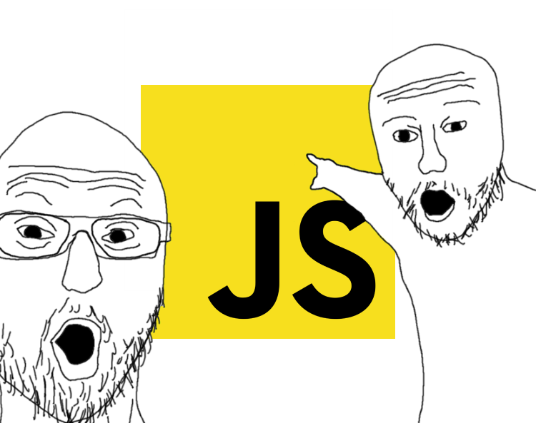

# JavaScript Cook Book
자바스크립트 활용법을 알려줍니다. 자바스크립트라는 프로그래밍 언어를 요리재료처럼 다루는 방법을 알려드리기 위한 리포지토리입니다. 절대 웹으로 봐주시길 바랍니다. 관련 유튜브 링크를 많이 포함하고 있습니다. 

작성시작: 2022.09.24.  
Status: meme 🫠  
Version: 0.01  

# 이것을 왜 작성하는가?
자바스크립트를 다루는 법을 정리하는 리포지토리입니다. MDN과 다른 이유는 MDN을 참고할 뿐입니다. 자바스크립트 전체에서 훨씬더 간소한 부분만 다루기 때문입니다.
최대한 개념을 학습하면 문제를 제공하려고 합니다.
개인적으로 자바스크립트를 다루었던 경험을 공유하고자 합니다.

# 목차

1. 자바스크립트에 대한 이런 저런 것들
2. 개발환경
3. 기본 문법
4. 심화 문법

예약어, 키워드
주석
특수 객체
다양한 특수 용어
클린코드

저의 목표는 이 개그의 모든 요소를 이해할 수 있게 여러분의 자바스크립트 지식을 끌어올리고자 합니다.

# 분류가 필요한 것들

this 키워드

[Why I try to avoid the “this” keyword in javascript](https://www.youtube.com/watch?v=ZXlnqOGUb6c)

랙시컬 스코프

재귀함수

클로저

고차함수

immutable JavaScript

함수형 프로그래밍

[JavaScript로 함수형 프로그래밍 배우기 - Anjana Vakil - JSUnconf](https://www.youtube.com/watch?v=e-5obm1G_FY)

선행학습: 고차함수

자료구조와 알고리즘