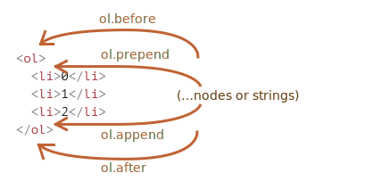
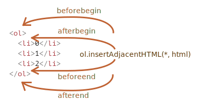

# 모던 자바스크립트 튜토리얼 읽는 순서

## 코어 자바스크립트

### 자바스크립트 기본

자바스크립트는 ‘웹페이지에 생동감을 불어넣기 위해’ 만들어진 프로그래밍 언어입니다.

웹페이지의 HTML 안에 작성할 수 있는데, 웹페이지를 불러올 때 자동으로 실행됩니다.

자바스크립트 엔진은 다양한 아티클에서 언급됩니다. V8, SpiderMonkey, Trident, Chakra, ChakraCore, SquirrelFish 등이 존재합니다.

### 엔진은 어떻게 동작하나요?

기본 원리는 다음과 같이 간단합니다.

1. 엔진(브라우저라면 내장 엔진)이 스크립트를 읽습니다(파싱).
2. 읽어 들인 스크립트를 기계어로 전환합니다(컴파일).
3. 기계어로 전환된 코드가 실행됩니다. 기계어로 전환되었기 때문에 실행 속도가 빠릅니다.

#### 브라우저에서 할 수 있는 일

자바스크립트는 메모리 세이프스러운(memory safeish) 언어입니다.

메모리나 CPU 같은 저수준 영역의 조작을 허용하지 않습니다. 애초에 이러한 접근이 필요치 않은 브라우저를 대상으로 만든 언어이기 때문이죠.

node.js 환경에서는 임의의 파일을 읽거나 쓰고, 네트워크 요청을 수행하는 함수를 지원합니다.

브라우저 환경에선 웹페이지 조작, 클라이언트와 서버의 상호작용에 관한 모든 일을 할 수 있습니다.

- 페이지에 새로운 HTML을 추가하거나 기존 HTML, 혹은 스타일 수정하기
- 마우스 클릭이나 포인터의 움직임, 키보드 키 눌림 등과 같은 사용자 행동에 반응하기
- 네트워크를 통해 원격 서버에 요청을 보내거나, 파일 다운로드, 업로드하기(AJAX나 COMET과 같은 기술 사용)
- 쿠키를 가져오거나 설정하기. 사용자에게 질문을 건네거나 메시지 보여주기
- 클라이언트 측에 데이터 저장하기(로컬 스토리지)

간소하게 정의한 자바스크립트 장점

- HTML/CSS와 완전히 통합할 수 있음
- 간단한 일은 간단하게 처리할 수 있게 해줌
- 모든 주요 브라우저에서 지원하고, 기본 언어로 사용됨

### 매뉴얼과 명세서

자바스크립트 고인물들은 매뉴얼보단 명세서를 더 많이 읽습니다.

[자바스크립트 명세서](https://www.ecma-international.org/publications/standards/Ecma-262.htm)

위 자바스크립트 명세서는 무조건 읽도록 합니다.

[최신 초안](https://tc39.es/ecma262/)

매뉴얼은 MDN을 검색하고 읽으면 됩니다. 특별이 어려울 것은 없습니다.

[can i use](https://caniuse.com/)

can i use는 호환성표입니다. 트렌스파일러 사용하면 간단하게 해결할 수 있지만 면접 질문용으로 낼 가능성이 있습니다.

[kangax](https://kangax.github.io/compat-table/es6/)

kangax도 좋은 리소스입니다.

# 개발자 콘솔

Cmd+Opt+J로 브라우저 콘솔을 접근합니다.

# 변수

```js
const BIRTHDAY = "18.04.1982"; // 대문자 상수로 바꿔도 괜찮을까요?

const age = someCode(BIRTHDAY);
```

프로그램에서 하드코딩한 값만 대문자료 표기합니다.

# 자료형

`Infinity`, `-Infinity`, `NaN`같은 '특수 숫자 값(special numeric value)'

```js
console.log(1 / 0); // Infinity
```

자바스크립트는 놀랍게도 `divide by zero error`가 없습니다.

숫자가 아닌 것과 숫자를 계산하면 `NaN`이 됩니다.

BigInt는 암호와 관련된 작업에 많이 사용합니다.

```js
// 끝에 'n'이 붙으면 BigInt형 자료입니다.
const bigInt = 1234567890123456789012345678901234567890n;
```

영단어 줍줍

entity: 실재

## typeof 연산자

```js
console.log(
  typeof undefined, // "undefined"

  typeof 0, // "number"

  typeof 10n, // "bigint"

  typeof true, // "boolean"

  typeof "foo", // "string"

  typeof Symbol("id"), // "symbol"

  typeof Math, // "object"  (1)

  typeof null, // "object"  (2)

  typeof alert // "function"  (3)
);
```

# alert, prompt, confirm을 이용한 상호작용

`alert`은 브라우저가 제공합니다. 확인 누르고 닫을 수 있습니다.

자바스크립트 공식 문서를 읽는 중간에 인수에 대괄호(`[]`)로 감싼 것은 선택적으로 대입할 수 있다는 의미입니다.

```js
result = prompt(title, [default]);
```

```js
let age = prompt("나이를 입력해주세요.", 100);

alert(`당신의 나이는 ${age}살 입니다.`); // 당신의 나이는 100살입니다.
```

이런 예시가 있을 수 있습니다.

```js
let isBoss = confirm("당신이 주인인가요?");

alert(isBoss); // 확인 버튼을 눌렀다면 true가 출력됩니다.
```

모달 창이 떠 있는 동안은 스크립트의 실행이 일시 중단됩니다.

모달 창의 모양은 브라우저마다 다릅니다. 개발자는 창의 모양을 수정할 수 없습니다.

# 형변환

생성자 함수를 활용해서 해당하는 자료형으로 변환하는 것이 일반적입니다.

```js
let value = true;
console.log(typeof value); // boolean

value = String(value); // 변수 value엔 문자열 "true"가 저장됩니다.
console.log(typeof value); // string

let str = "123";
console.log(typeof str); // string

let num = Number(str); // 문자열 "123"이 숫자 123으로 변환됩니다.

console.log(typeof num); // number

console.log(Boolean(1)); // 숫자 1(true)
console.log(Boolean(0)); // 숫자 0(false)

console.log(Boolean("0")); // 문자열(true)
console.log(Boolean(" ")); // 문자열(true)
console.log(Boolean("")); // 빈 문자열(false)
```

## Number

| 전달받은 값      | 형 변환 후                                                                                                                   |
| ---------------- | ---------------------------------------------------------------------------------------------------------------------------- |
| `undefined`      | `NaN`                                                                                                                        |
| `null`           | `0`                                                                                                                          |
| `true` / `false` | `1` / `0`                                                                                                                    |
| `string`         | 전달받은 문자열을 “그대로” 읽되, 처음과 끝의 공백을 무시합니다. 문자열이 비어있다면 `0`이 되고, 오류 발생 시 `NaN`이 됩니다. |

## Boolean

| 전달받은 값                           | 형 변환 후 |
| ------------------------------------- | ---------- |
| `0`, `null`, `undefined`, `NaN`, `""` | `false`    |
| 그 외의 값                            | `true`     |

비이어 있지 않은 모든 문자열은 `true`입니다. `"0"`, `" "`도 `true`입니다.

# 기본 연산자와 수학

unary: 단항
binary: 이항

```js
// 숫자에는 아무런 영향을 미치지 않습니다.
let x = 1;
console.log(+x); // 1

let y = -2;
console.log(+y); // -2

// 숫자형이 아닌 피연산자는 숫자형으로 변화합니다.
console.log(+true); // 1
console.log(+""); // 0
```

## 연산자 우선순위

```js
let apples = "2";
let oranges = "3";

// 이항 덧셈 연산자가 적용되기 전에, 두 피연산자는 숫자형으로 변화합니다.
console.log(+apples + +oranges); // 5
```

하나의 표현식에 둘 이상의 연산자가 있는 경우, 실행 순서는 연산자의 우선순위(precedence) 에 의해 결정됩니다.

[우선순위 표 - MDN](https://developer.mozilla.org/en-US/docs/Web/JavaScript/Reference/Operators/Operator_Precedence)

```js
let a = 1;
let b = 2;

let c = 3 - (a = b + 1);

console.log(a); // 3
console.log(c); // 0
```

```js
let a, b, c;

a = b = c = 2 + 2;

console.log(a); // 4
console.log(b); // 4
console.log(c); // 4
```

## 증가·감소 연산자

- `counter++`와 같이 피연산자 뒤에 올 때는, '후위형(postfix form)'이라고 부릅니다.
- `++counter`와 같이 피연산자 앞에 올 때는, '전위형(prefix form)'이라고 부릅니다.

```js
let counterA = 1;
let a = ++counterA; // (*)

console.log(a); // 2

let counterB = 1;
let b = counterB++; // (*) ++counter를 counter++로 바꿈

console.log(b); // 1
```

`a`는 증가시키고 할당했습니다. `b`는 할당하고 증가시켰습니다.

## 비트 연산자

비트 조작 관련 연산자는 자바스크립트뿐만 아니라 대부분의 프로그래밍 언어에서 지원합니다.

- 비트 AND ( `&` )
- 비트 OR ( `|` )
- 비트 XOR ( `^` )
- 비트 NOT ( `~` )
- 왼쪽 시프트(LEFT SHIFT) ( `<<` )
- 오른쪽 시프트(RIGHT SHIFT) ( `>>` )
- 부호 없는 오른쪽 시프트(ZERO-FILL RIGHT SHIFT) ( `>>>` )

비트 연산자는 저수준(2진 표현)에서 숫자를 다뤄야 할 때 쓰이므로 흔하게 쓰이진 않습니다. 웹 개발 시엔 이런 일이 자주 일어나지 않기 때문에 비트 연산자를 만날 일은 거의 없죠. 그렇긴 해도 암호를 다뤄야 할 땐 비트 연산자가 유용합니다.

[Bitwise - MDN](https://developer.mozilla.org/en-US/docs/Web/JavaScript/Reference/Operators)

부조리한 기업은 면접 질문으로 낼 가능성이 충분히 있습니다.

## 쉼표(`,`) 연산자

```js
let a = (1 + 2, 3 + 4);

console.log(a); // 7 (3 + 4의 결과)
```

쉼표 연산자 ,는 여러 표현식을 코드 한 줄에서 평가할 수 있게 해줍니다. 이때 표현식 각각이 모두 평가되지만, 마지막 표현식의 평가 결과만 반환되는 점에 유의해야 합니다.

```js
"" + 1 + 0 = "10" // (1)
"" - 1 + 0 = -1 // (2)
true + false = 1
6 / "3" = 2
"2" * "3" = 6
4 + 5 + "px" = "9px"
"$" + 4 + 5 = "$45"
"4" - 2 = 2
"4px" - 2 = NaN
7 / 0 = Infinity
"  -9  " + 5 = "  -9  5" // (3)
"  -9  " - 5 = -14 // (4)
null + 1 = 1 // (5)
undefined + 1 = NaN // (6)
" \t \n" - 2 = -2 // (7)
```

5. 숫자형으로 변환 시 `null`은 `0`이 됩니다.

6. `undefined`는 숫자형으로 변환시 NaN이 됩니다.

7. 문자열이 숫자형으로 변할 땐 문자열 앞뒤의 공백이 삭제됩니다. 뺄셈 연산자 앞의 피연산자는 공백을 만드는 문자 `\t`와 `\n`, 그 사이의 “일반적인” 공백으로 구성됩니다. 따라서 `" \t \n"`는 숫자형으로 변환 시 길이가 `0`인 문자열로 취급되어 숫자 `0`이 됩니다.

# 비교연산

## 문자열 비교

lexicographical: 사전편집순

사전 뒤쪽의 문자열은 사전 앞쪽의 문자열보다 크다고 판단합니다.

```js
console.log("Z" > "A"); // true
console.log("Glow" > "Glee"); // true
console.log("Bee" > "Be"); // true

console.log("하" > "가"); // true
console.log("하마" > "기차"); // true
console.log("자바스크립트" > "자바"); // true
```

정확히는 사전 순이 아니라 유니코드 순입니다.

자바스크립트는 대·소문자를 따진다는 것입니다. 대문자 'A'와 소문자 'a'를 비교했을 때 소문자 'a'가 더 큽니다. 자바스크립트 내부에서 사용되는 인코딩 표인 유니코드에선 소문자가 대문자보다 더 큰 인덱스를 갖기 때문이죠.

## 특이한 비교

```js
console.log("2" > 1); // true, 문자열 '2'가 숫자 2로 변환된 후 비교가 진행됩니다.
```

```js
console.log(null > 0); // (1) false
console.log(null == 0); // (2) false
console.log(null >= 0); // (3) true
```

`null`은 `0`이상이라고 합니다.

```js
console.log(undefined > 0); // false (1)
console.log(undefined < 0); // false (2)
console.log(undefined >= 0); // false (3)
```

## if와 '?'를 사용한 조건 처리

`if (…)` 문은 괄호 안의 표현식을 평가하고 그 결과를 불린값으로 형 변환합니다.

자바스크립트에서 피연산자를 3개나 받는 연산자는 조건부 연산자가 유일합니다.

```js
let accessAllowed = age > 18 ? true : false;
```

# 논리 연산자

## OR 단락 평가

OR `||` 연산자를 여러 개 체이닝(chaining) 하면 첫 번째 truthy를 반환합니다. 피연산자에 truthy가 하나도 없다면 마지막 피연산자를 반환합니다.

```js
let firstName = "";
let lastName = "";
let nickName = "바이올렛";

console.log(firstName || lastName || nickName || "익명"); // 바이올렛
```

OR`||`은 왼쪽부터 시작해서 오른쪽으로 평가를 진행하는데, truthy를 만나면 나머지 값들은 건드리지 않은 채 평가를 멈춥니다. 이런 프로세스를 `단락 평가`라고 합니다.

## AND 평가

- 각 피연산자는 불린형으로 변환됩니다. 변환 후 값이 `false`이면 평가를 멈추고 해당 피연산자의 변환 전 원래 값을 반환합니다.
- 피연산자 모두가 평가되는 경우(모든 피연산자가 `true`로 평가되는 경우)엔 마지막 피연산자가 반환됩니다.

```js
console.log(1 && 2 && null && 3); // null
console.log(1 && 2 && 3); // 마지막 값, 3
```

참고. `&&`의 우선순위가 `||`보다 높습니다. 또 `NOT` 연산자의 우선순위는 모든 논리 연산자 중에서 가장 높기 때문에 항상 `&&`나 `||` 보다 먼저 실행됩니다.

# nullish 병합 연산자 '??'

```js
let firstName = null;
let lastName = null;
let nickName = "바이올렛";

// null이나 undefined가 아닌 첫 번째 피연산자
console.log(firstName ?? lastName ?? nickName ?? "익명의 사용자"); // 바이올렛
```

nullish 병합 연산자는 OR 연산자 `||`와 상당히 유사해 보입니다.

`undefined`, `null`이 아니면 그 해당 식별자의 값이 됩니다. 아니면 그 뒤의 값이 됩니다.

```js
let height = null;
let width = null;

// 괄호를 추가!
let area = (height ?? 100) * (width ?? 50);

console.log(area); // 5000
```

`??`은 연산자 우선순위 5위입니다. 상당히 높습니다.

```js
let x = 1 && 2 ?? 3; // SyntaxError: Unexpected token '??'
```

괄호 없이 `??`를 `||`나 `&&`와 함께 사용하는 것은 금지되어있습니다.

# while과 for 반복문

```js
let i = 3;
while (i) console.log(i--);
```

조건문과 동일하게 반복문이면 1줄로 작성할 수 있습니다.

```js
let i = 0;
do {
  console.log(i);
  i++;
} while (i < 3);
```

`do…while` 반복문은 `while`의 조건이 `true`인 동안 실행합니다.

## 다음 반복으로 넘어가기

```js
for (let i = 0; i < 10; i++) {
  // 조건이 참이라면 남아있는 본문은 실행되지 않습니다.
  if (i % 2 == 0) continue;

  console.log(i); // 1, 3, 5, 7, 9가 차례대로 출력됨
}
```

`continue`는 전체 반복문을 멈추지 않습니다. 대신에 현재 실행 중인 이터레이션을 멈추고 반복문이 다음 이터레이션을 강제로 실행시키도록 합니다.

표현식이 아닌 문법 구조(`syntax construct`)는 삼항 연산자 `?`에 사용할 수 없다는 점을 항상 유의하시기 바랍니다. 특히 `break`나 `continue` 같은 지시자는 삼항 연산자에 사용하면 안 됩니다.

```js
(i > 5) ? alert(i) : continue; // 여기에 continue를 사용하면 안 됩니다.
```

레이블(label) 은 반복문 앞에 콜론과 함께 쓰이는 식별자입니다.

```js
outer: for (let i = 0; i < 3; i++) {
  for (let j = 0; j < 3; j++) {
    let input = prompt(`(${i},${j})의 값`, "");

    // 사용자가 아무것도 입력하지 않거나 Cancel 버튼을 누르면 두 반복문 모두를 빠져나옵니다.
    if (!input) break outer; // (*)

    // 입력받은 값을 가지고 무언가를 함
  }
}
alert("완료!");
```

소수만들기 활용

```js
let n = 10;

nextPrime: for (let i = 2; i <= n; i++) {
  // 각 i에 대하여 반복문을 돌림

  for (let j = 2; j < i; j++) {
    // 제수(나눗수)를 찾음
    if (i % j == 0) continue nextPrime; // 소수가 아니므로 다음 i로 넘어감
  }

  console.log(i); // 소수
}
```

# switch문

```js
let a = 2 + 2;

switch (a) {
  case 3:
    console.log("비교하려는 값보다 작습니다.");
    break;
  case 4:
    console.log("비교하려는 값과 일치합니다.");
    break;
  case 5:
    console.log("비교하려는 값보다 큽니다.");
    break;
  default:
    console.log("어떤 값인지 파악이 되지 않습니다.");
}
```

```js
let a = 2 + 2;

switch (a) {
  case 3:
    console.log("비교하려는 값보다 작습니다.");
  case 4:
    console.log("비교하려는 값과 일치합니다.");
  case 5:
    console.log("비교하려는 값보다 큽니다.");
  default:
    console.log("어떤 값인지 파악이 되지 않습니다.");
}
// 비교하려는 값과 일치합니다.
// 비교하려는 값보다 큽니다.
// 어떤 값인지 파악이 되지 않습니다.
```

`break`문 잊지말도록 합니다.

```js
let a = 3;

switch (a) {
  case 4:
    console.log("계산이 맞습니다!");
    break;

  case 3: // (*) 두 case문을 묶음
  case 5:
    console.log("계산이 틀립니다!");
    console.log("수학 수업을 다시 들어보는걸 권유 드립니다.");
    break;

  default:
    console.log("계산 결과가 이상하네요.");
}
```

`3`, `5`인경우 모두 실행하고 처리할 수 있습니다.

```js
let arg = prompt("값을 입력해주세요.");
switch (arg) {
  case "0":
  case "1":
    console.log("0이나 1을 입력하셨습니다.");
    break;

  case "2":
    console.log("2를 입력하셨습니다.");
    break;

  case 3:
    console.log("이 코드는 절대 실행되지 않습니다!");
    break;
  default:
    console.log("알 수 없는 값을 입력하셨습니다.");
}
```

switch case문은 자료형이 중요합니다. 자료형도 일치해야 실행합니다.

# 함수

- 매개변수는 함수 선언 방식 괄호 사이에 있는 변수입니다(선언 시 쓰이는 용어).
- 인수는 함수를 호출할 때 매개변수에 전달되는 값입니다(호출 시 쓰이는 용어).

```js
function showMessage(from, text = "no text given") {
  console.log(from + ": " + text);
}

showMessage("Ann"); // Ann: no text given
```

자바스크립트도 인자 기본값 설정을 할 수 있습니다.

```js
return some + long + expression + or + whatever * f(a) + f(b);
```

표현식을 여러 줄에 걸쳐 작성하고 싶다면 표현식이 `return` 지시자가 있는 줄에서 시작하도록 작성해야 합니다. 또는 아래와 같이 여는 괄호를 `return` 지시자와 같은 줄에 써줘도 괜찮습니다.

```js
showMessage(..)     // 메시지를 보여줌
getAge(..)          // 나이를 나타내는 값을 얻고 그 값을 반환함
calcSum(..)         // 합계를 계산하고 그 결과를 반환함
createForm(..)      // form을 생성하고 만들어진 form을 반환함
checkPermission(..) // 승인 여부를 확인하고 true나 false를 반환함
```

함수 명명법입니다. 함수는 동작하기 때문에 보통 접두어로 동사를 사용합니다.

```js
function showPrimes(n) {
  const answer = [];
  for (let i = 2; i < n; i++) {
    if (!isPrime(i)) continue;

    answer.push(i); // a prime
  }
  return answer;
}

function isPrime(n) {
  for (let i = 2; i < n; i++) {
    if (n % i == 0) return false;
  }
  return true;
}

console.log(showPrimes(10));
```

```js
// 고차함수로 풀이 접근
function isPrime(n) {
  return (
    [...Array(n - 1).keys()]
      .map((num) => num + 2)
      .filter((num) => n % num === 0).length === 1
  );
}

function showPrimes(n) {
  return [...Array(n - 1).keys()]
    .map((num) => num + 2)
    .filter((num) => isPrime(num));
}
```

함수의 책임을 분리하는 것으로 훨씬더 높은 가독성을 얻을 수 있습니다. 또 함수 자체는 하나의 주석처럼 기능합니다. 코드를 보면 자명하게 만들기 쉽습니다.

자바스크립트에서 함수를 실행하기 위해서는 함수명 뒤에 괄호(`()`)가 붙어 있어야 합니다.

```js
function sayHi() {
  console.log("Hello");
}

console.log(sayHi); // 함수 코드가 보임
```

```js
function sayHi() {
  // ...
}

let sayHi = function () {
  // ...
};
```

- `if { ... }`, `for { }`, `function f { }` 같이 중괄호로 만든 코드 블록 끝엔 `;`이 없어도 됩니다.
- 함수 표현식은 `let sayHi = ...;`과 같은 구문 안에서 값의 역할을 합니다. 코드 블록이 아니고 값처럼 취급되어 변수에 할당되죠. 모든 구문의 끝엔 세미 콜론 `;`을 붙이는 게 좋습니다. 함수 표현식에 쓰인 세미 콜론은 함수 표현식 때문에 붙여진 게 아니라, 구문의 끝이기 때문에 붙여졌습니다.

자바스크립트의 함수는 동작을 나타내는 값입니다.

# 엄격 모드

```js
"use strict";
// 모듈 전체
function funcName() {
  "use strict";
  // 현재 함수만 적용
}
```

# 브라우저 환경과 다양한 명세서

호스트환경: 브라우저, 웹서버, 심지어는 커피 머신등의 실행 환경입니다.

브라우저 실행환경에서는 전역객체로 window가 존재합니다. 전역객체 혹은 루트 객체입니다.

window 객체는 2가지 역할을 합니다.

1. 자바스크립트 코드의 전역 객체입니다.
2. 브라우저 창을 대변하고, 이를 제어할 수 있는 메서드를 제공합니다.

문서 객체 모델(Document Object Model, DOM)은 웹 페이지 내의 모든 콘텐츠를 객체로 나타내줍니다. 하나의 조작가능한 인터페이스입니다.

CSSOM(CSS 객체 모델)이라는 것도 존재합니다. CSS 객체로 나타내고 읽고 쓸 수 있는 인터페이스가 존재합니다. 실무에서 자주 접하지는 않을 것입니다.

브라우저 객체 모델(BOM)이라는 것도 존재합니다. Document 이외의 모든 것을 제어하기 위해 호스트환경인 브라우저가 제공하는 추가 객체입니다.

navigator 객체는 userAgent, platform으로 특수한 정보를 알아낼 수 있습니다.

location 객체는 현재 URL을 읽을 수 있고 URL을 변경(Redirect)할 수 있게합니다.

alert/confirm/prompt도 BOM의 일부입니다.

# DOM 트리

기형적인 `HTML`을 만나면 브라우저는 `DOM` 생성과정에서 `HTML`을 자동으로 교정합니다.

테이블은 조금 흥미롭습니다. `DOM` 명세서에선 테이블에 반드시 `<tbody>`가 있어야 한다고 못 박아 놓았지만, `HTML`에선 `<tbody>`를 생략하곤 합니다. 이때, 브라우저는 자동으로 `DOM`에 `<tbody>`를 만들어줍니다.

주석 노드라는 것도 존재합니다. 주석도 DOM을 구성합니다. 텍스트 노드 사이에 존재합니다. 또 문자는 텍스트 노드로 존재합니다.

[크롬 개발자 도구 사용 설명서](https://developer.chrome.com/docs/devtools/)

# DOM 탐색하기

```js
document.documentElement; // = <html>
document.body; // = <body>
document.head; // = <head>
```

`html` 루트도, `head` 태그도 선택할 수 있습니다.

```html
<html>
  <head>
    <script>
      alert("HEAD: " + document.body); // null, 아직 <body>에 해당하는 노드가 생성되지 않았음
    </script>
  </head>

  <body>
    <script>
      alert("BODY: " + document.body); // HTMLBodyElement, 지금은 노드가 존재하므로 읽을 수 있음
    </script>
  </body>
</html>
```

`script`는 선언순서로 접근하고 읽습니다. `head`에 선언하면 `body`를 아직 안 만들었기 때문에 `null`을 반환합니다.

DOM에서 주의할 점은 `null`이 존재하지 않음을 반환한다는 사실입니다. `undefined`가 아닙니다.

참고로 자식 노드의 존재 여부를 검사할 땐 함수 `elem.hasChildNodes()`를 사용할 수도 있습니다.

## DOM 컬렉션

`childNodes`는 마치 배열 같아 보입니다. 하지만 `childNodes`는 배열이 아닌 반복 가능한(iterable, 이터러블) 유사 배열 객체인 컬렉션(collection) 입니다.

```js
for (let node of document.body.childNodes) {
  console.log(node); // 컬렉션 내의 모든 노드를 보여줍니다.
}

console.log(document.body.childNodes.filter); // undefined (filter 메서드가 없습니다.)

console.log(Array.from(document.body.childNodes)); // [ ... ]
```

이터러블이기 때문에 `Symbol.iterator` 프로퍼티가 구현되어 있어서 `for..of`를 사용하는 것이 가능합니다. 하지만 배열이 아니기 때문에 배열 메서드를 쓸 수 없습니다. `Array.from`을 사용하면 ‘진짜’ 배열을 만들 수 있습니다.

- DOM 컬렉션은 READ only입니다.
- DOM 컬렉션은 실시간 반영됩니다.
- 컬렉션에 `for ... in` 반복문을 사용하지 마세요.

## 부모와 형제 노드

```html
<html>
  <head>
    ...
  </head>
  <body>
    ...
  </body>
</html>
```

```js
// <body>의 부모 노드는 <html>입니다
console.log(document.body.parentNode === document.documentElement); // true

// <head>의 다음 형제 노드는 <body>입니다.
console.log(document.head.nextSibling); // HTMLBodyElement

// <body>의 이전 형제 노드는 <head>입니다.
console.log(document.body.previousSibling); // HTMLHeadElement
```

DOM을 선택하고 DOM의 부모 혹은 형제를 접근한 프로퍼티도 존재합니다.

```js
console.log(document.documentElement.parentNode); // document
console.log(document.documentElement.parentElement); // null
```

반환 값이 다른 이유는 `<html>`에 해당하는 `document.documentElement`의 부모는 `document`인데, `document` 노드는 엘리먼트 노드가 아니기 때문입니다. 따라서 위 예시에서 `parentNode`는 의도한 대로 `document` 노드를 반환하지만, `parentElement`는 `null`을 반환합니다.

이런 사소한 차이는 임의의 요소 노드 `elem`에서 시작해 `<html>`까지 거슬러 올라가고 싶은데, `document`까지는 가고 싶지 않을 때 유용하게 활용할 수 있습니다.

```js
while ((elem = elem.parentElement)) {
  // <html>까지 거슬러 올라갑니다.
  console.log(elem);
}
```

`<table>` 요소는 기본 프로퍼티 이외에 다음과 같은 프로퍼티를 지원합니다.

- `table.rows`는 `<tr>`요소를 담은 컬렉션을 참조합니다.
- `table.caption/tHead/tFoot`은 각각 `<caption>`, `<thead>`,`<tfoot>` 요소를 참조합니다.
- `table.tBodies`는 `<tbody>` 요소를 담은 컬렉션을 참조합니다. 표준에 따르면, 테이블 내에 여러 개의 `<tbody>`가 존재하는 게 가능한데, 최소한 하나는 무조건 있어야 합니다.

- `<thead>`, `<tfoot>`, `<tbody>` 요소는 `rows` 프로퍼티를 지원합니다.

- `tbody.rows`는 `tbody` 내 `<tr>` 요소 컬렉션을 참조합니다.

- `<tr>` 요소는 다음 프로퍼티를 지원합니다.

- `tr.cells`는 주어진 `<tr>` 안의 모든 `<td>`, `<th>`을 담은 컬렉션을 반환합니다.
- `tr.sectionRowIndex`는 주어진 `<tr>`이 `<thead>`/`<tbody>`/`<tfoot>`안쪽에서 몇 번째 줄에 위치하는지를 나타내는 인덱스를 반환합니다.
- `tr.rowIndex`는 `<table>`내에서 해당 `<tr>`이 몇 번째 줄인 지를 나타내는 숫자를 반환합니다.
- `<td>`와 `<th>` 요소는 다음 프로퍼티를 지원합니다.

- `td.cellIndex`는 `<td>`나 `<th>`가 속한 `<tr>`에서 해당 셀이 몇 번째인지를 나타내는 숫자를 반환합니다.

```html
<table id="table">
  <tr>
    <td>일</td>
    <td>이</td>
  </tr>
  <tr>
    <td>삼</td>
    <td>사</td>
  </tr>
</table>

<script>
  // '이'가 적힌 td를 가져옴(첫 번째 줄, 두 번째 칸)
  let td = table.rows[0].cells[1];
  td.style.backgroundColor = "red"; // 강조
</script>
```

# getElement*, querySelector*로 요소 검색하기

가상 클래스도 선택할 수 있습니다.

`querySelectorAll`에는 `:hover`나 `:active` 같은 `CSS` 선택자의 가상 클래스(pseudo-class)도 사용할 수 있습니다. `document.querySelectorAll(':hover')`을 사용하면 마우스 포인터가 위에 있는(`hover` 상태인) 요소 모두를 담은 컬렉션이 반환됩니다. 이때 컬렉션은 DOM 트리 최상단에 위치한 `<html>`부터 가장 하단의 요소 순으로 채워집니다.

## matches

```html
<a href="http://example.com/file.zip">...</a>
<a href="http://ya.ru">...</a>

<script>
  // document.body.children가 아니더라도 컬렉션이라면 이 메서드를 적용할 수 있습니다.
  for (let elem of document.body.children) {
    if (elem.matches('a[href$="zip"]')) {
      alert("주어진 CSS 선택자와 일치하는 요소: " + elem.href);
    }
  }
</script>
```

이 메서드는 요소 `elem`이 주어진 CSS 선택자와 일치하는지 여부를 판단해줍니다. 일치한다면 `true`, 아니라면 `false`를 반환합니다.

## closest

```html
<h1>목차</h1>

<div class="contents">
  <ul class="book">
    <li class="chapter">1장</li>
    <li class="chapter">2장</li>
  </ul>
</div>

<script>
  let chapter = document.querySelector(".chapter"); // LI

  console.log(chapter.closest(".book")); // UL
  console.log(chapter.closest(".contents")); // DIV

  console.log(chapter.closest("h1")); // null(h1은 li의 조상 요소가 아님)
</script>
```

노드의 부모-자식 관계를 확인할 수 있도록 도와주는 유용한 메서드입니다. `elemA.contains(elemB)`는 `elemB`가 `elemA`에 속하거나(`elemB`가 `elemA`의 후손인 경우) `elemA==elemB`일 때, 참을 반환합니다.

# 주요 노드 프로퍼티

## DOM 노드 클래스

DOM 노드는 종류에 따라 대응하는 내장 클래스가 다릅니다.

계층 구조 꼭대기엔 `EventTarget`이 있는데, `Node`는 `EventTarget`을, 다른 DOM 노드들은 `Node` 클래스를 상속받습니다.

노드 클래스들입니다.

- EventTarge: 루트에 있는 ‘추상(abstract)’ 클래스로, 이 클래스에 대응하는 객체는 실제로 만들어지지 않습니다. EventTarget가 모든 DOM 노드의 베이스에 있기때문에 DOM 노드에서 '이벤트’를 사용할 수 있습니다.
- Node: ‘추상’ 클래스로, DOM 노드의 베이스 역할을 합니다. getter 역할을 하는 parentNode, nextSibling, childNodes 등의 주요 트리 탐색 기능을 제공합니다. Node 클래스의 객체는 절대 생성되지 않습니다. 하지만 이 클래스를 상속받는 클래스는 여럿 있습니다. 텍스트 노드를 위한 Text 클래스와 요소 노드를 위한 Element 클래스, 주석 노드를 위한 Comment클래스는 Node클래스를 상속받습니다.
- Element: DOM 요소를 위한 베이스 클래스입니다. nextElementSibling, children 이나 getElementsByTagName, querySelector 같이 요소 전용 탐색을 도와주는 프로퍼티나 메서드가 이를 기반으로 합니다. 브라우저는 HTML뿐만 아니라 XML, SVG도 지원하는데 Element 클래스는 이와 관련된 SVGElement, XMLElement, HTMLElement 클래스의 베이스 역할을 합니다.
- HTMLElement: HTML 요소 노드의 베이스 역할을 하는 클래스입니다. 아래 나열한 클래스들은 실제 HTML 요소에 대응하고 HTMLElement를 상속받습니다.
  - HTMLInputElement: `<input>` 요소에 대응하는 클래스
  - HTMLBodyElement: `<body>` 요소에 대응하는 클래스
  - HTMLAnchorElement: `<a>` 요소에 대응하는 클래스
  - 이외에도 다른 클래스가 많은데, 각 태그에 해당하는 클래스는 고유한 프로퍼티와 메서드를 지원합니다.

`instanceof`로 상속 여부를 알아낼 수 있습니다.

```js
console.log(document.body instanceof HTMLBodyElement); // true
console.log(document.body instanceof HTMLElement); // true
console.log(document.body instanceof Element); // true
console.log(document.body instanceof Node); // true
console.log(document.body instanceof EventTarget); // true
```

`console.log(elem)`는 요소의 DOM 트리를 출력합니다.
`console.dir(elem)`는 요소를 DOM 객체처럼 취급하여 출력합니다. 따라서 프로퍼티를 확인하기 쉽다는 장점이 있습니다.

## nodeName과 tagName으로 태그 이름 확인하기

```js
console.log(document.body.nodeName); // BODY
console.log(document.body.tagName); // BODY
```

## `innerHTML+=` 사용 시 주의점

`innerHTML+=`은 추가가 아니라 내용을 덮어쓰기 때문에 주의해서 사용해야 합니다.

## outerHTML로 요소의 전체 HTML 보기

```html
<div id="elem">Hello <b>World</b></div>

<script>
  console.log(elem.outerHTML); // <div id="elem">Hello <b>World</b></div>
</script>
```

`outerHTML`에 하는 할당 연산이 DOM 요소(`outerHTML` 연산의 대상으로, 위 예시에선 변수 `div`)를 수정하지 않기 때문입니다.

## hidden 프로퍼티

`hidden`은 기술적으로 `style="display:none"`와 동일합니다. 짧다는 점만 다르죠.

```html
<div>아래 두 div를 숨겨봅시다.</div>

<div hidden>HTML의 hidden 속성 사용하기</div>

<div id="elem">자바스크립트의 hidden 프로퍼티 사용하기</div>

<script>
  elem.hidden = true;
</script>
```

```js
console.log(HTMLDocument.prototype.constructor.name); // HTMLDocument
console.log(HTMLDocument.prototype.__proto__.constructor.name); // Document
console.log(HTMLDocument.prototype.__proto__.__proto__.constructor.name); // Node
```

# 속성과 프로퍼티

`Element`라는 내장 객체에 `sayHi` 메서드를 추가하는 코드입니다.

```js
Element.prototype.sayHi = function () {
  console.log(`Hello, I'm ${this.tagName}`);
};

document.documentElement.sayHi(); // Hello, I'm HTML
document.body.sayHi(); // Hello, I'm BODY
```

`id` 같은 표준 속성으로만 구성되어 있다면, 이에 해당하는 프로퍼티가 자연스레 만들어집니다. 하지만 표준이 아닌 속성일 때는 상황이 달라집니다.

```html
<body id="test" something="non-standard">
  <script>
    console.log(document.body.id); // test
    // 비표준 속성은 프로퍼티로 전환되지 않습니다.
    console.log(document.body.something); // undefined
  </script>
</body>
```

한 요소에선 표준인 속성이 다른 요소에선 표준이 아닐 수 있다는 점에도 주의해야 합니다. `type`은 `<input>` 요소(`HTMLInputElement`)에선 표준이지만, `<body>`(`HTMLBodyElement`)에선 아닙니다.

```html
<body id="body" type="...">
  <input id="input" type="text" />
  <script>
    console.log(input.type); // text
    console.log(body.type); // type은 body의 표준 속성이 아니므로 DOM 프로퍼티가 생성되지 않아 undefined가 출력됩니다.
  </script>
</body>
```

## DOM 속성 조작

- `elem.hasAttribute(name)` – 속성 존재 여부 확인
- `elem.getAttribute(name)` – 속성값을 가져옴
- `elem.setAttribute(name, value)` – 속성값을 변경함
- `elem.removeAttribute(name)` – 속성값을 지움

HTML 속성은 아래와 같은 특징을 보입니다.

- 대·소문자를 가리지 않습니다. `id`와 `ID`는 동일합니다.
- 값은 항상 문자열입니다.

```html
<input id="input" type="checkbox" checked /> checkbox

<script>
  console.log(input.getAttribute("checked")); // 속성 값: 빈 문자열
  console.log(input.checked); // 프로퍼티 값: true
</script>
<div id="div" style="color:red;font-size:120%">Hello</div>

<script>
  // string
  console.log(div.getAttribute("style")); // color:red;font-size:120%

  // object
  console.log(div.style); // [object CSSStyleDeclaration]
  console.log(div.style.color); // red
</script>
```

## 비표준속성

```html
<style>
  /* 스타일이 커스텀 속성 'order-state'에 따라 변합니다. */
  .order[order-state="new"] {
    color: green;
  }

  .order[order-state="pending"] {
    color: blue;
  }

  .order[order-state="canceled"] {
    color: red;
  }
</style>

<div class="order" order-state="new">A new order.</div>

<div class="order" order-state="pending">A pending order.</div>

<div class="order" order-state="canceled">A canceled order.</div>

<script>
  // 새 클래스를 추가하거나 지우는 것보다 더 쉽게 상태(state)를 바꿀 수 있습니다
  div.setAttribute("order-state", "canceled");
</script>
```

`data-`로 시작하는 속성 전체는 개발자가 용도에 맞게 사용하도록 별도로 예약됩니다. `dataset` 프로퍼티를 사용하면 이 속성에 접근할 수 있습니다. 비표준 속성 활용의 더 좋은 패턴입니다.

요소 `elem`에 이름이 `data-about`인 속성이 있다면 `elem.dataset.about`을 사용해 그 값을 얻을 수 있습니다.

```html
<body data-about="Elephants">
  <script>
    console.log(document.body.dataset.about); // Elephants
  </script>
</body>
```

활용 예시입니다.

```html
<style>
  .order[data-order-state="new"] {
    color: green;
  }

  .order[data-order-state="pending"] {
    color: blue;
  }

  .order[data-order-state="canceled"] {
    color: red;
  }
</style>

<div id="order" class="order" data-order-state="new">A new order.</div>

<script>
  // 읽기
  console.log(order.dataset.orderState); // new

  // 수정하기
  order.dataset.orderState = "pending"; // (*)
</script>
```

# 문서 수정하기

- `node.append(노드나 문자열)` – 노드나 문자열을 `node` 끝에 삽입합니다.
- `node.prepend(노드나 문자열)` – 노드나 문자열을 `node` 맨 앞에 삽입합니다.
- `node.before(노드나 문자열)` –- 노드나 문자열을 `node` 이전에 삽입합니다.
- `node.after(노드나 문자열)` –- 노드나 문자열을 `node` 다음에 삽입합니다.
- `node.replaceWith(노드나 문자열)` –- `node`를 새로운 노드나 문자열로 대체합니다.



```html
<div id="div"></div>
<script>
  div.insertAdjacentHTML("beforebegin", "<p>안녕하세요.</p>");
  div.insertAdjacentHTML("afterend", "<p>안녕히 가세요.</p>");
</script>
<!-- 이런 생김새를 갖습니다. -->
<p>안녕하세요.</p>
<div id="div"></div>
<p>안녕히 가세요.</p>
```



## 노드 삭제하기

`node.remove()` 사용하면 노드를 삭제할 수 있습니다.

참고로, 요소 노드를 다른 곳으로 옮길 때 기존에 있던 노드를 지울 필요가 없습니다.

모든 노드 삽입 메서드는 자동으로 기존에 있던 노드를 삭제하고 새로운 곳으로 노드를 옮기기 때문입니다.

## cloneNode로 노드 복제하기

`elem.cloneNode(true)`을 호출하면 `elem`의 ‘깊은’ 복제본이 만들어집니다. 속성 전부와 자손 요소 전부가 복사됩니다. `elem.cloneNode(false)`을 호출하면 후손 노드 복사 없이 `elem`만 복제됩니다.

## DocumentFragment

`DocumentFragment` 내장 객체가 존재합니다. `template Element`를 다룰 때 필요합니다.

# 스타일과 클래스

```html
<body class="main page">
  <script>
    // 클래스 추가
    document.body.classList.add("article");

    console.log(document.body.className); // main page article
  </script>
</body>
```

클래스 속성값 전체를 바꾸고 싶을 때는 `className`으로, 개별 클래스를 조작하고 싶을 때는 `classList`를 사용하면 됩니다. 필요에 따라 취사선택하면 되죠.

- `elem.classList.add/remove("class")` – `class`를 추가하거나 제거
- `elem.classList.toggle("class")` – `class`가 존재할 경우 `class`를 제거하고, 그렇지 않은 경우엔 추가
- `elem.classList.contains("class")` – `class` 존재 여부에 따라 `true`/`false`를 반환

```txt
background-color  => elem.style.backgroundColor
z-index           => elem.style.zIndex
border-left-width => elem.style.borderLeftWidth
```

케밥 케이스에서 카멜 케이스가 됩니다.

## style.cssText로 완전히 다시 쓰기

```html
<div id="div">버튼</div>

<script>
  // cssText를 사용하면 'important' 같은 규칙도 설정할 수 있습니다.
  div.style.cssText = `color: red !important;
    background-color: yellow;
    width: 100px;
    text-align: center;
  `;

  console.log(div.style.cssText);
</script>
```

# 브라우저 이벤트 소개

마우스 이벤트:

- `click` – 요소 위에서 마우스 왼쪽 버튼을 눌렀을 때(터치스크린이 있는 장치에선 탭 했을 때) 발생합니다.
- `contextmenu` – 요소 위에서 마우스 오른쪽 버튼을 눌렀을 때 발생합니다.
- `mouseover`와 `mouseout` – 마우스 커서를 요소 위로 움직였을 때, 커서가 요소 밖으로 움직였을 때 발생합니다.
- `mousedown`과 `mouseup` – 요소 위에서 마우스 왼쪽 버튼을 누르고 있을 때, 마우스 버튼을 뗄 때 발생합니다.
- `mousemove` – 마우스를 움직일 때 발생합니다.

폼 요소 이벤트:

- `submit` – 사용자가 `<form>`을 제출할 때 발생합니다.
- `focus` – 사용자가 `<input>`과 같은 요소에 포커스 할 때 발생합니다.

문서 이벤트:

- `DOMContentLoaded` – HTML이 전부 로드 및 처리되어 DOM 생성이 완료되었을 때 발생합니다.

CSS 이벤트:

- `transitionend` – CSS 애니메이션이 종료되었을 때 발생합니다.

## 이벤트 핸들러

HTML 속성으로 넣는 전략이 있습니다.

```html
<script>
  function countRabbits() {
    for (let i = 1; i <= 3; i++) {
      console.log(`토끼 ${i}마리`);
    }
  }
</script>

<input type="button" onclick="countRabbits()" value="토끼를 세봅시다!" />
```

조금더 우아한 DOM 속성값을 활용하는 방법입니다.

```html
<input id="elem" type="button" value="클릭해 주세요." />
<script>
  elem.onclick = function () {
    alert("감사합니다.");
  };
</script>
```

사람들이 자주 하는 실수입니다.

```js
function sayThanks() {
  alert("감사합니다!");
}

elem.onclick = sayThanks;
```

괄호(`()`)를 사용하지않고(`sayThanks`만) 할당해야 합니다. 할당하는 것은 함수값(`sayThanks`)이지 함수의 반환값(`sayThanks()`)이 아닙니다.

## `addEventListener`

`addEventListener`는 복수의 이벤트를 할당할 수 있습니다.

```js
input.onclick = function () {
  alert(1);
};
// ...
input.onclick = function () {
  alert(2);
}; // 이전 핸들러를 덮어씀
```

```js
element.addEventListener(event, handler, [options]);
```

이런 구조로 사용하면 됩니다. 첫번째 인자는 이벤트 이름입니다. 두번째 인자는 이벤트가 발생하면 실행할 함수입니다. 세번째는 프로퍼티가 갖는 객체입니다.

- `once`: `true`이면 이벤트가 트리거 될 때 리스너가 자동으로 삭제됩니다.
- `capture`: 어느 단계에서 이벤트를 다뤄야 하는지를 알려주는 프로퍼티로, 관련 내용은 버블링과 캡처링과 연결됩니다.
- `passive`: `true`이면 리스너에서 지정한 함수가 `preventDefault()`를 호출하지 않습니다.

생성의 역인 삭제입니다.

```js
function handler() {
  alert("감사합니다!");
}

input.addEventListener("click", handler);
// ....
input.removeEventListener("click", handler);
```

삭제할 때는 동일한 함수를 삭제해야 합니다. 그래서 삭제하려면 함수를 참조할 수 있게하도록 권장합니다.

DOM 프로퍼티에 할당할 수 없는 이벤트가 몇몇 있습니다. 이런 이벤트는 무조건 `addEventListener`를 써야 합니다.

```js
// 이 얼럿창은 절대 뜨지 않습니다.
document.onDOMContentLoaded = function () {
  alert("DOM이 완성되었습니다.");
};
// 이 얼럿창은 제대로 뜹니다.
document.addEventListener("DOMContentLoaded", function () {
  alert("DOM이 완성되었습니다.");
});
```

## 이벤트 객체

이벤트가 발생하면 브라우저는 *이벤트 객체(event object)*라는 것을 만듭니다. 여기에 이벤트에 관한 상세한 정보를 넣은 다음, 핸들러에 인수 형태로 전달합니다.

객로도 할당이 가능합니다.

```html
<button id="elem">클릭해 주세요.</button>

<script>
  let obj = {
    handleEvent(event) {
      alert(
        event.type + " 이벤트가 " + event.currentTarget + "에서 발생했습니다."
      );
    },
  };

  elem.addEventListener("click", obj);
</script>
```

사용하면 정상작동합니다.

# 브라우저 기본 동작

상당수 이벤트는 발생 즉시 브라우저에 의해 특정 동작을 자동으로 수행합니다.

- 링크를 클릭하면 해당 URL로 이동합니다.
- 폼 전송 버튼을 클릭하면 서버에 폼이 전송됩니다.
- 마우스 버튼을 누른 채로 글자 위에서 커서를 움직이면 글자가 선택됩니다.

## addEventListener의 ‘passive’ 옵션

`addEventListener`의 `passive: true` 옵션은 브라우저에게 `preventDefault()`를 호출하지 않겠다고 알리는 역할을 합니다.

이 옵션은 왜 필요한 걸까요?

모바일 기기에는 사용자가 스크린에 손가락을 대고 움직일 때 발생하는 `touchmove`와 같은 이벤트가 있습니다. 이런 이벤트는 기본적으로 스크롤링(`scrolling`)을 발생시킵니다. 그런데 핸들러의 `preventDefault()`를 사용하면 스크롤링을 막을 수 있습니다.

브라우저는 스크롤링을 발생시키는 이벤트를 감지했을 때 먼저 모든 핸들러를 처리하는데, 이때 `preventDefault`가 어디에서도 호출되지 않았다고 판단되면, 그제야 스크롤링을 진행합니다. 이 과정에서 불필요한 지연이 생기고, 화면이 ‘덜덜 떨리는’ 현상이 발생합니다.

`passive: true` 옵션은 핸들러가 스크롤링을 취소하지 않을 것이라는 정보를 브라우저에게 알려주는 역할을 합니다. 이 정보를 바탕으로 브라우저는 화면을 최대한 자연스럽게 스크롤링 할 수 있게 하고 이벤트는 적절하게 처리됩니다.

`Firefox`, `Chrome` 같은 몇몇 브라우저에서 `touchstart` 와 `touchmove` 이벤트의 `passive` 는 기본값이 `true`입니다.

`event.stopPropagation()`으로 자손에 이벤트가 전달되는 것을 막을 수 있습니다. `event.defaultPrevented`도 사용할 수 있습니다.

```html
<p>문서 레벨 컨텍스트 메뉴(event.defaultPrevented를 확인함)</p>
<button id="elem">버튼 레벨 컨텍스트 메뉴</button>

<script>
  elem.oncontextmenu = function (event) {
    event.preventDefault();
    alert("버튼 컨텍스트 메뉴");
  };

  document.oncontextmenu = function (event) {
    if (event.defaultPrevented) return;

    event.preventDefault();
    alert("문서 컨텍스트 메뉴");
  };
</script>
```

컨텍스트 메뉴를 만들 때 이런 전략을 활용할 수 있습니다.

# Chrome으로 디버깅하기

[Chrome으로 디버깅하기](https://ko.javascript.info/debugging-chrome)

# 객체

```js
let user = new Object(); // '객체 생성자' 문법
let user = {}; // '객체 리터럴' 문법
```

```js
let user = {
  // 객체
  name: "John", // 키: "name",  값: "John"
  age: 30, // 키: "age", 값: 30
};
user.isAdmin = true;
delete user.age;
```

```js
let fruit = prompt("어떤 과일을 구매하시겠습니까?", "apple");
let bag = {};

// 변수 fruit을 사용해 프로퍼티 이름을 만들었습니다.
bag[fruit] = 5;
```

프로퍼티 이름을 동적으로 생성하는 방법입니다. 대괄호표기법은 이런이유로 강력하지만 작성이 번거롭습니다.

```js
let obj = {};
obj.__proto__ = 5; // 숫자를 할당합니다.
alert(obj.__proto__); // [object Object] - 숫자를 할당했지만 값은 객체가 되었습니다. 의도한대로 동작하지 않네요.
```

역사속의 프로퍼티 `__proto__`입니다. 프로토타입 상속 개념을 먼저 이해해야 왜 업데이트가 불가능한지 알 수 있습니다.

## in 연산자

```js
"key" in object;
```

이런 형식으로 키의 존재여부를 알아낼 수 있습니다.

`for ... in` 반복문으로 순회가 가능합니다.

```js
let user = {
  name: "John",
  age: 30,
  isAdmin: true,
};

for (let key in user) {
  // 키
  console.log(key); // name, age, isAdmin
  // 키에 해당하는 값
  console.log(user[key]); // John, 30, true
}
```

참고로 `key` 이외 변수명을 사용해도 됩니다. 많은 사람들은 `prop`을 활용합니다.

## 객체 정렬 방식

객체는 놀랍게도 정렬 방식이 존재합니다.

객체는 '특별한 방식으로 정렬’됩니다. 정수 프로퍼티(integer property)는 자동으로 정렬되고, 그 외의 프로퍼티는 객체에 추가한 순서 그대로 정렬됩니다.

# 참조에 의한 객체 복사

```js
let a = {};
let b = a; // 참조에 의한 복사

alert(a == b); // true, 두 변수는 같은 객체를 참조합니다.
alert(a === b); // true
```

```js
let a = {};
let b = {}; // 독립된 두 객체

alert(a == b); // false
```

이런 차이는 `a`, `b` 식별자에 데이터 그 자체를 할당하는 것이 아니라 주솟값을 할당하기 때문입니다.

객체를 독립적으로 복사는 방법입니다.

```js
let user = { name: "John" };

let permissions1 = { canView: true };
let permissions2 = { canEdit: true };

// permissions1과 permissions2의 프로퍼티를 user로 복사합니다.
Object.assign(user, permissions1, permissions2);
console.log(user); // { name: "John", canView: true, canEdit: true }
```

하지만 key가 같으면 덮어쓰기가 됩니다.

```js
let user = { name: "John" };

Object.assign(user, { name: "Pete" });

console.log(user); // { name: "Pete" }
```

깊은 복사 얕은 복사 문제가 존재합니다. 검색하고 붙이거나 면접을 위해 외우거나 lodash의 [\_.cloneDeep(value)](https://lodash.com/docs/4.17.15#cloneDeep)을 사용하기를 권장합니다.

# 옵셔널 체이닝 `?.`

`?.`은 `?.`'앞’의 평가 대상이 `undefined`나 `null`이면 평가를 멈추고 `undefined`를 반환합니다.

```js
let user = {}; // 주소 정보가 없는 사용자

console.log(user?.address?.street); // undefined, 에러가 발생하지 않습니다.
```

## 단락 평가

```js
let user = null;
let x = 0;

user?.sayHi(x++); // 아무 일도 일어나지 않습니다.

console.log(x); // 0, x는 증가하지 않습니다.
```

`?.`는 왼쪽 평가대상에 값이 없으면 즉시 평가를 멈춥니다. 참고로 이런 평가 방법을 단락 평가(short-circuit)라고 부릅니다.

## ?.()와 ?.[]

```js
let user1 = {
  admin() {
    console.log("관리자 계정입니다.");
  },
};

let user2 = {};

user1.admin?.(); // 관리자 계정입니다.
user2.admin?.();
```

`?.()`를 사용해 admin의 존재 여부를 확인했습니다. `user1`엔 `admin`이 정의되어 있기 때문에 메서드가 제대로 호출되었습니다. 반면 `user2`엔 `admin`이 정의되어 있지 않았음에도 불구하고 메서드를 호출하면 에러 없이 그냥 평가가 멈추는 것을 확인할 수 있습니다.

참고로 객체 메서드는 단순히 `메서드명() {}` 방식으로 정의하고 사용할 수 있습니다.

```js
let user1 = {
  firstName: "Violet",
};

let user2 = null; // user2는 권한이 없는 사용자라고 가정해봅시다.

let key = "firstName";

console.log(user1?.[key]); // Violet
console.log(user2?.[key]); // undefined

console.log(user1?.[key]?.something?.not?.existing); // undefined
```

`?.`은 읽기나 삭제하기에는 사용할 수 있지만 쓰기에는 사용할 수 없습니다.

# 나머지 매개변수와 스프레드 문법

## 나머지 매개변수 `...`

```js
function sumAll(...args) {
  // args는 배열의 이름입니다.
  let sum = 0;

  for (let arg of args) sum += arg;

  return sum;
}

console.log(sumAll(1)); // 1
console.log(sumAll(1, 2)); // 3
console.log(sumAll(1, 2, 3)); // 6
```

참고. 나머지 매개변수는 항상 마지막에 있어야 합니다.

```js
function f(arg1, ...rest, arg2) { // ...rest 후에 arg2가 있으면 안 됩니다.
  // SyntaxError: Rest parameter must be last formal parameter
}
```

## arguments 객체

유사 배열 객체(array-like object)인 `arguments`를 사용하면 인덱스를 사용해 인수에 접근할 수 있습니다.

```js
function showName() {
  alert(arguments.length);
  alert(arguments[0]);
  alert(arguments[1]);

  // arguments는 이터러블 객체이기 때문에
  // for(let arg of arguments) alert(arg); 를 사용해 인수를 펼칠 수 있습니다.
}

// 2, Bora, Lee가 출력됨
showName("Bora", "Lee");

// 1, Bora, undefined가 출력됨(두 번째 인수는 없음)
showName("Bora");
```

하지만 아래처럼 고차함수를 사용할 수 있습니다.

```js
function f(...rest) {
  return Array.prototype.map.call(arguments, (num) => num + 2);
}

console.log(f(1, 2, 3, 4, 5)); // [ 3, 4, 5, 6, 7 ]
```

## 스프레드 문법

매개변수에서는 Rest이지만 객체와 배열에서는 스프레드 문법이 됩니다.

```js
let arr1 = [1, -2, 3, 4];
let arr2 = [8, 3, -8, 1];

console.log(Math.max(...arr1, ...arr2)); // 8
```

```js
let str = "Hello";

console.log([...str]); // H,e,l,l,o
```

문자열을 배열로 변환하는 방법입니다. `"Hello".split("")`과 `Array.from("Hello")`처럼 동일한 효과를 만듭니다.

## 배열과 객체의 복사본 만들기

```js
let arr = [1, 2, 3];
let arrCopy = [...arr]; // 배열을 펼쳐서 각 요소를 분리후, 매개변수 목록으로 만든 다음에
// 매개변수 목록을 새로운 배열에 할당함

// 배열 복사본의 요소가 기존 배열 요소와 진짜 같을까요?
console.log(JSON.stringify(arr) === JSON.stringify(arrCopy)); // true

// 두 배열은 같을까요?
console.log(arr === arrCopy); // false (참조가 다름)

let obj = { a: 1, b: 2, c: 3 };
let objCopy = { ...obj }; // 객체를 펼쳐서 각 요소를 분리후, 매개변수 목록으로 만든 다음에
// 매개변수 목록을 새로운 객체에 할당함

// 객체 복사본의 프로퍼티들이 기존 객체의 프로퍼티들과 진짜 같을까요?
console.log(JSON.stringify(obj) === JSON.stringify(objCopy)); // true

// 두 객체는 같을까요?
console.log(obj === objCopy); // false (참조가 다름)
```

# 전역 객체

전역 객체를 사용하면 어디서나 사용 가능한 변수나 함수를 만들 수 있습니다. 전역 객체는 언어 자체나 호스트 환경에 기본 내장되어 있는 경우가 많습니다.

```js
// node.js 환경입니다.
console.log("Hello");
// 위와 동일하게 동작합니다.
globalThis.console.log("Hello");
```

```js
// 모든 스크립트에서 현재 사용자(current user)에 접근할 수 있게 이를 전역 객체에 추가함
globalThis.currentUser = {
  name: "John",
};

console.log(currentUser.name); // John

// 지역 변수 'currentUser'가 있다면
// 지역 변수와 충돌 없이 전역 객체 window에서 이를 명시적으로 가져올 수 있음
console.log(globalThis.currentUser.name); // John
```

## 폴리필

전역 객체를 이용해 현재 사용중인 브라우저가 최신 자바스크립트 기능을 지원하는지 여부를 확인할 수 있습니다.

```js
if (!globalThis.Promise) {
  console.log("구식 브라우저를 사용 중이시군요!");
}
```

출력 결과가 보이면 해당 기능이 브라우저 버전에 없는 것입니다.

# 콜백

```js
function loadScript(src, callback) {
  // <script> 태그를 만들고 페이지에 태그를 추가합니다.
  // 태그가 페이지에 추가되면 src에 있는 스크립트를 로딩하고 실행합니다.
  let script = document.createElement("script");
  script.src = src;
  script.onload = () => callback(script);
  document.head.append(script);
}

// 해당 경로에 위치한 스크립트를 불러오고 실행함
loadScript(
  "https://cdnjs.cloudflare.com/ajax/libs/lodash.js/3.2.0/lodash.js",
  (script) => {
    alert(`${script.src}가 로드되었습니다.`);
    alert(_); // 스크립트에 정의된 함수
  }
);
```

‘콜백 기반(callback-based)’ 비동기 프로그래밍이라고 합니다. 무언가를 비동기적으로 수행하는 함수는 함수 내 동작이 모두 처리된 후 실행되어야 하는 함수가 들어갈 `콜백`을 인수로 반드시 제공해야 합니다.

```js
function loadScript(src, callback) {
  let script = document.createElement("script");
  script.src = src;

  script.onload = () => callback(null, script);
  script.onerror = () =>
    callback(new Error(`${src}를 불러오는 도중에 에러가 발생했습니다.`));

  document.head.append(script);
}

loadScript("/my/script.js", function (error, script) {
  if (error) {
    // 에러 처리
  } else {
    // 스크립트 로딩이 성공적으로 끝남
  }
});
```

이렇게 에러를 처리하는 방식은 흔히 사용되는 패턴입니다. 이런 패턴은 '오류 우선 콜백(error-first callback)'이라고 불립니다.

1. callback의 첫 번째 인수는 에러를 위해 남겨둡니다. 에러가 발생하면 이 인수를 이용해 callback(err)이 호출됩니다.
2. 두 번째 인수(필요하면 인수를 더 추가할 수 있음)는 에러가 발생하지 않았을 때를 위해 남겨둡니다. 원하는 동작이 성공한 경우엔 callback(null, result1, result2...)이 호출됩니다.

# async와 await

`function` 앞에 `async`를 붙이면 해당 함수는 항상 프라미스를 반환합니다. 프라미스가 아닌 값을 반환하더라도 이행 상태의 프라미스(`resolved promise`)로 값을 감싸 이행된 프라미스가 반환되도록 합니다.

## async 함수

```js
async function f() {
  return 1;
}

f().then((solution) => console.log(solution)); // 1
```

함수를 호출하면 `result`가 `1`인 이행 프라미스가 반환됩니다.

## await

```js
async function f() {
  let promise = new Promise((resolve, reject) => {
    setTimeout(() => resolve("완료!"), 1000);
  });

  let result = await promise; // 프라미스가 이행될 때까지 기다림 (*)

  console.log(result); // "완료!"
}

f();
```

함수를 호출하고, 함수 본문이 실행되는 도중에 `(*)`로 표시한 줄에서 실행이 잠시 '중단’되었다가 프라미스가 처리되면 실행이 재개됩니다. 이때 프라미스 객체의 `result` 값이 변수 `result`에 할당됩니다. 따라서 위 예시를 실행하면 1초 뒤에 `완료!`가 출력됩니다.

`await`는 말 그대로 프라미스가 처리될 때까지 함수 실행을 기다리게 만듭니다. 프라미스가 처리되면 그 결과와 함께 실행이 재개되죠. 프라미스가 처리되길 기다리는 동안엔 엔진이 다른 일(다른 스크립트를 실행, 이벤트 처리 등)을 할 수 있기 때문에, CPU 리소스가 낭비되지 않습니다.

`await`는 `promise.then`보다 좀 더 세련되게 프라미스의 `result` 값을 얻을 수 있도록 해주는 문법입니다. `promise.then`보다 가독성 좋고 쓰기도 쉽습니다.

클래스 메서드도 놀랍게 비동기처리가 가능합니다.

```js
class Waiter {
  async wait() {
    return await Promise.resolve(1);
  }
}

new Waiter().wait().then(alert); // 1
```

async 클래스 메서드

## 에러 핸들링

```js
async function f() {
  await Promise.reject(new Error("에러 발생!"));
}
```

```js
async function f() {
  throw new Error("에러 발생!");
}
```

모두 에러를 처리하는 코드입니다.

```js
async function f() {
  try {
    let response = await fetch("http://유효하지-않은-주소");
    let user = await response.json();
    console.log(user);
  } catch (err) {
    // fetch와 response.json에서 발행한 에러 모두를 여기서 잡습니다.
    console.log(err);
  }
}

f();
```

다른 방법으로 에러를 처리할 수 있습니다.

```js
async function f() {
  let response = await fetch("http://유효하지-않은-주소");
}

// f()는 거부 상태의 프라미스가 됩니다.
f().catch((error) => console.log(error)); // TypeError: failed to fetch // (*)
```

프라미스 에러핸들링 `promise.then/catch`를 섞어 사용하기도 합니다.

`async/await`는 `Promise.all`과도 함께 쓸 수 있습니다.

```js
// 프라미스 처리 결과가 담긴 배열을 기다립니다.
let results = await Promise.all([fetch(url1), fetch(url2)]);
```

# 모듈

모듈은 단지 파일 하나에 불과합니다. 스크립트 하나는 모듈 하나입니다.

```js
// 📁 sayHi.js
export function sayHi(user) {
  console.log(`Hello, ${user}!`);
}
```

```js
// 📁 main.js
import { sayHi } from "./sayHi.js";

console.log(sayHi); // 함수
sayHi("John"); // Hello, John!
```

모듈은 특수한 키워드나 기능과 함께 사용되므로 `<script type="module">` 같은 속성을 설정해 해당 스크립트가 모듈이란 걸 브라우저가 알 수 있게 해줘야 합니다.

모듈은 항상 엄격 모드(`use strict`)로 실행됩니다. 선언되지 않은 변수에 값을 할당하는 등의 코드는 에러를 발생시킵니다.

동일한 모듈이 여러 곳에서 사용되더라도 모듈은 최초 호출 시 단 한 번만 실행됩니다. 실행된 모듈은 필요한 곳에 공유됩니다. 실행 후 결과는 이 모듈을 가져가려는 모든 모듈에 내보내 집니다.

## 인라인 스크립트의 비동기 처리

```html
<!-- 필요한 모듈(analytics.js)의 로드가 끝나면 -->
<!-- 문서나 다른 <script>가 로드되길 기다리지 않고 바로 실행됩니다.-->
<script async type="module">
  import { counter } from "./analytics.js";

  counter.count();
</script>
```

## 모듈 내보내고 가져오기

클래스나 함수를 내보낼 땐 세미콜론을 붙이지 마세요.

```js
export function sayHi(user) {
  alert(`Hello, ${user}!`);
} // 끝에 ;(세미콜론)을 붙이지 않습니다.
```

### 선언부와 떨어진 곳에 export 붙이기

```js
// 📁 say.js
function sayHi(user) {
  console.log(`Hello, ${user}!`);
}

function sayBye(user) {
  console.log(`Bye, ${user}!`);
}

export { sayHi, sayBye }; // 두 함수를 내보냄
```

```js
import { sayHi, sayBye } from "./say.js";

sayHi("John"); // Hello, John!
sayBye("John"); // Bye, John!
```

### as

```js
// 📁 main.js
import { sayHi as hi, sayBye as bye } from "./say.js";

hi("John"); // Hello, John!
bye("John"); // Bye, John!
```

```js
// 📁 say.js
export { sayHi as hi, sayBye as bye };
```

```js
// 📁 main.js
import * as say from "./say.js";

say.hi("John"); // Hello, John!
say.bye("John"); // Bye, John!
```

### export default

함수, 클래스, 변수 등의 개체는 전용 모듈 안에 구현됩니다.

그런데 이렇게 모듈을 만들다 보면 자연스레 파일 개수가 많아질 수밖에 없습니다. 그렇더라도 모듈 이름을 잘 지어주고, 폴더에 파일을 잘 나눠 프로젝트를 구성하면 코드 탐색이 어렵지 않으므로 이는 전혀 문제가 되지 않습니다.

```js
// 📁 user.js
export default class User {
  // export 옆에 'default'를 추가해보았습니다.
  constructor(name) {
    this.name = name;
  }
}
```

`named export`와 `default export`를 같은 모듈에서 동시에 사용해도 문제는 없습니다. 그런데 실무에선 이렇게 섞어 쓰는 사례가 흔치 않습니다. 한 파일엔 `named export`나 `default export` 둘 중 하나만 사용합니다.

`default export`의 이름에 관한 규칙이 있습니다. 내보내기 할 때 쓴 이름과 가져오기 할 때 쓸 이름이 동일해야 한다는 제약이 있죠.

```js
import { User } from "./user.js";
// import {MyUser}은 사용할 수 없습니다. 반드시 {User}이어야 합니다.
```

named export와는 다르게 default export는 가져오기 할 때 개발자가 원하는 대로 이름을 지정해 줄 수 있습니다.

```js
import User from "./user.js"; // 동작
import MyUser from "./user.js"; // 동작
// 어떤 이름이든 에러 없이 동작합니다.
```

물론 컨벤션상 혼란을 줄이기 위해 동일하게 유지하는 것도 전략입니다.

`export ... from ...` 문법으로 이름을 바꿔 내보낼 수 있습니다.

```js
export { sayHi } from "./say.js"; // sayHi를 다시 내보내기 함

export { default as User } from "./user.js"; // default export를 다시 내보내기 함
```
