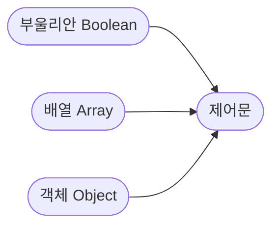

# 제어문

학습 의존성: 자료형 기초



다른 프로그래밍 언어를 공부해봤으면 크게 어려울 것은 없습니다.

## 조건문
<p align="center">

</p>

저의 목표는 여러분에게 이 밈을 이해시키는 것입니다.

아내(개발자)가 잘못했네요. 남편(컴퓨터)은 시키는데로 했습니다. ~~이래서 개발자는 연애를 못하나 봅니다.~~

조건문, 논리연산자, 비교연산자

```JavaScript
if (true) {
    // 실행
}
```

## if문

### 삼항연산자

꽤 자주 쓰는 문법입니다. 코드 복잡성은 낮출 수 있습니다.

주의사항이 있습니다. 중첩 삼항연산자는 자제합니다.

## 논리 연산자

|| && !

논리연산자는 진리표랑 똑같습니다. 진리표라고 하니 뭔가 간지나네요. 진리의 문이 다 생각납니다.

## 반복문

https://www.youtube.com/watch?v=QO-3d128l28

자바스크립트의 기본 반복문은 C스타일 반복문이라고 합니다. C언어의 반복문하고 비슷하게 생겼기 때문입니다.

### for 문
```C
#include<stdio.h>
 
int main(void)
{
    printf("for 반복문 예제1 : ");
    
    int i;
    for (i = 0; i < 10; ++i)
    {
        printf("%d ", i);
    }
    printf("\n");
}
```
출처: https://blockdmask.tistory.com/457 [개발자 지망생:티스토리]

실행할 필요는 없습니다. 여기서 for문이 `for (i = 0; i < 10; ++i)`으로 작성되어 있습니다. 자바스크립트의 전통적인 반복문을 보겠습니다.

```JS
const arr = ['a', 'b', 'c', 'd', 'f']

for (let i=0; i < arr.length; i++) {
    console.log(arr[i])  // a  b  c  d  f
}
```
for문이 상당히 닮았습니다. 여러분은 이것을 이해하고 앞으로 안 쓸 것입니다.

### while문

될때까지 계속하는 반복문입니다. 한국적인 반복문입니다.

입문자는 while문을 사용할 때 주의하기 바랍니다. 사용하지 말라는 것이 아닙니다. 스택오버플로우의 기원을 알아볼 수 있는 좋은 기회로 다음을 배울 것입니다.

```js
while true {
    console.log('ㅇㅇ')
}
```

위 코드를 브라우저 콘솔에 붙여넣세요.


