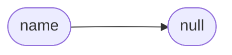

# 자료형 시작하기

학습의존성: (없음)

본격적인 프로그래밍 시작입니다. 일반적으로 사람들은 프로그래머가 수학을 잘 할 것이라고 생각을 많이 합니다. 이런 편견이 근거가 없는 것은 아닙니다. 프로그래밍을 처음 시작하면 여러분이 잘해야 할 것은 수학이 아닙니다. 조금더 자세히 말하자면 수학에서 계산을 잘 시켜야 합니다. 컴퓨터는 계산해주는 기계입니다. 우리는 컴퓨터에게 계산을 하라고 시키는 법을 배울 것입니다.

~~우리는 코딩노예지만 컴퓨터는 우리의 계산 노예입니다.~~

프로그래밍은 조금더 고급스러운 계산이라고 생각해도 좋습니다.

https://web.dev/structured-clone/

# 자료형

간단하게 `string`, `number`, `boolean`, `null`, `undefined`, `array`, `object`, `function`, `class`를 중심으로 다룰 수 있습니다. 이정도는 자바스크립트를 작성하면서 무의식 중 외워집니다. 참고로 `class`는 초기에는 피할 수 있지만 나중에는 피할 수 없습니다.

혹시 다른 언어로 프로그래밍 경험을 해봤다면 자바스크립트의 자료형은 생각보다 많지 않습니다. 그래서 처음 배우기 쉬운 언어입니다. 하지만 잘하기 어려운 언어입니다.

프로그래밍을 하면서 자료를 보관하고 호출하고 변형하는 것이 중요합니다. 가정 먼저할 것은 자료를 보관하고 호출해서 계산으로 변형하는 순서로 이해하는 게 좋습니다. 아래는 자료를 보관하는 법입니다.

```JS
const 식별자 = '자료'
```

자바스크립트는 위와 같은 방식으로 변수를 정의(하고 할당까지)합니다. 부르는 방식은 다양합니다. 많은 경우 조금 포괄적이게 변수 선언이라 하고 `변수명 = 변수값`으로 부르는 사람들도 있습니다. 하지만 더 좋은 표현은 식별자입니다. 자바스크립트는 메모리에서 다양한 식별자들을 보고 식별자에 할당되어 있는 값을 가져오는 것입니다. 처음 배울 때는 많이 추상적인 내용입니다.

자바스크립트 엔진은 조금 특이하게 동작합니다. 호이스팅을 합니다. 그리고 GC를 자동으로 처리합니다(물론 비효율적이게 처리합니다).

## 원시형

FP 패러다임을 따르고 있으면 최대한 `const`로 정의합니다. 원시형이 참조하는 대상을 변형하는 경우가 발생하는 경우가 많지 않습니다.

### String 문자열

```JavaScript
string = 'hello, JavaScript!';
```

사람이 읽고 쓰는 문자 정보입니다. 문자열은 따옴표(`''`), 쌍따옴표(`""`), 백틱(``) 3가지로 만들 수 있습니다.

협업 중이라면 컨벤션에 주의하도록 합니다. 쌍따옴표를 안 쓰고 따옴표랑 백틱만 사용하는 컨벤션이 있을 수 있습니다.

```js
console.log(String.fromCharCode(97), "a".charCodeAt(0));
```

`fromCharCode` 정적 매서드랑 `charCodeAt` 동적 매서드를 암기하고 코딩테스트를 풀도록 합시다.

### Number 숫자

```JavaScript
number = 100;
```

다른 프로그래밍 언어를 보면 보통 정수랑 소수까지 제공해주는 경우가 일반적입니다.
숫자입니다.

```python
print(type(1.1), type(2))  # <class 'float'> <class 'int'>
```

파이썬처럼 정상적인 언어의 경우입니다.

<details>
<summary>파이썬을 알 필요는 없습니다.</summary>
<div markdown="1">
<!-- TODO 실행환경 링크, 파이썬에 대한 간단한 설명 -->
어떤 내용
파이썬은 상당히 설계가 잘 되어있고 문법이 쉬운 언어입니다. 그래서 자바스크립트에서 이상한 부분은 파이썬과 비교하는 것을 권장합니다. 파이썬이 표준은 아니지만 2022년에 파이썬은 상당히 상정적인 언어입니다.
</div>
</details>


파이썬의 자료형은 Number 하위에 구체적으로 정수랑 소수를 구분합니다.


자바스크립트의 숫자(Number)에 대한 자료형은 이런 구분이 없습니다. 물론 구현이 불가능한 것은 아닙니다.

프로그래밍 관례 중 하나는 상수는 모두 Uppercase로 작성합니다.

```JS
const AGE_REQUIREMENTS = 25;
```

```js
console.log(10_000); // 출력은 10000 읽기는 10,000같은 느낌
```

숫자의 자릿수를 가독성있게 보기 위해서 언더스코어를 숫자 중간에 사용할 수 있습니다. 금액단위를 다룰 때 이렇게 하면 더 읽기 편합니다.

### Boolean 부울리안

```JavaScript
boolean = true;
```

참과 거짓을 다룹니다. 참은 1 거짓은 0입니다. 우리가 약간의 상상력을 가진다면 조건에 따라 무엇을 시킬 수 있을 것 같습니다.

### null과 undefined

존재하지 않는 것(`null`)과 정의를 아직 못한 것(`undefined`)의 차이입니다. 지금 문장을 보면 상당히 추상적이고 형이상학적으로 보입니다. 그래서 더 실용적으로 외울 방침이 있습니다. `null`이 나오면 의도한 것이고 `undefined`이 나오면 의도한 것이 아닙니다. 이것은 외웁니다. ~~ 컨벤션 상 undefined도 활용하자고 제안하는 곳도 있습니다. ~~ 조금 깊게 들어가면 메모리상 차이가 있습니다.

```JS
const name;
console.log(name);  // undefined
const name = null;
console.log(name);  // null
```

`name`이라는 식별자가 바라보고 있는 메모리 주소가 없으면 `undefined`를 표시합니다.


메모리는 현재 이런 상태입니다. `name`이라는 식별자가 어느것도 참조하고 있지 못하고 있습니다.



`name`이라는 식별자는 `null`을 참조하고 있습니다. 식별자가 바라볼 곳이 있습니다. 이런 경우 프로그래머가 의도한 경우가 대부분입니다.

### Symbol

https://developer.mozilla.org/ko/docs/Web/JavaScript/Reference/Global_Objects/Symbol

## 참조형

### array

https://youtu.be/f-7gUixaETw

자바스크립트의 이상한 점을 또 발견했습니다. 물론 대부분의 프로그래밍 경험상 `array.length`는 보통 배열의 길이를 확인하기 위해 사용했습니다. 조작할 때 사용하지 않았습니다. 그래서 Read Only로 생각하고 있었지만 역시 자바스크립트는 저를 실망시키지 않고 또 억지 실행을 합니다(나중에 버그로 제품이 저를 실망시킵니다).

```js
let arr = [1, 2, 3]; // 배열리터럴로 정의
let arr = new Array(1, 2, 3); // 객체 생성자를 통한 생성
```

리액트에서 자주 사용하는 문법인 배열 구조분해할당은 늘 암기합니다.

```js
const [number, setNumber] = useState(0);
```

배열 첫번째 원소는 `state`값이고 두번째 원소는 함수입니다. 리액트는 관습적으로 이를 setter함수라고 부릅니다.

### 세트 Set

https://developer.mozilla.org/en-US/docs/Web/JavaScript/Reference/Global_Objects/Set

Set은 수학적 집합을 구현하기 위한 자료형입니다. 현재 자바스크립트에서는 리터럴이 없습니다. ES6에 새롭게 생긴 문법입니다.

[Is there a Set literal in JavaScript? - stack overflow](https://stackoverflow.com/questions/35368259/is-there-a-set-literal-in-javascript)

```js
let arr1 = new Set();
arr1.add("추가할 값");
arr1.delete("삭제할 값");
arr1.clear(); // 비우기

let arr2 = new Set().add("X").add("Y"); // 생성과 동시 삭제
```

`set`은 수학적 집합입니다. 중복과 순서가 없습니다.

```js
let testSet = new Set(["tiger", "lion", "dog", "cat"]);
const key_itr = testSet.keys();

console.log(key_itr.next().value); // tiger
console.log(key_itr.next().value); // lion
console.log(key_itr.next().value); // dog
console.log(key_itr.next().value); // cat

const val_itr = testSet.values();

console.log(val_itr.next().value); // tiger
console.log(val_itr.next().value); // lion
console.log(val_itr.next().value); // dog
console.log(val_itr.next().value); // cat
```

`key`랑 `value`가 동일한 `object`랑 유사해보입니다.

저의 추론이 완전히 근거가 없지는 않습니다.

```js
let testSet = new Set();

testSet5.add("홍길동");
testSet5.add("이순신");
testSet5.add("강감찬");

const entries = testSet5.entries();

for (let i of entries) {
  console.log(i);
}
//[ '홍길동', '홍길동' ]
//[ '이순신', '이순신' ]
//[ '강감찬', '강감찬' ]
```

[Object.entries() - MDN](https://developer.mozilla.org/en-US/docs/Web/JavaScript/Reference/Global_Objects/Object/entries)

### object

조금 고급 내용을 알게 된다면 자바스크립트의 모든 조상은 `object`입니다.

https://velog.io/@lilyoh/js-object-%EC%9A%94%EC%86%8C%EC%97%90-%EC%A0%91%EA%B7%BC%ED%95%98%EA%B3%A0-%EC%88%9C%ED%9A%8C%ED%95%98%EA%B8%B0

클래스로 생성한 것들 또한 객체입니다.

```js
let settings = { dark: true }; // 객체 리터럴
let settings = new Object(); // 리터럴을 안쓰고 생성하는 법
settings.dark = true;
```

`new Object()` 객체생성자에 넣으면 어떻게 되나요? `key`랑 `value`처럼 넣을 수 없습니다.

객체에는 메서드를 넣을 수 있습니다.

```js
const obj = {
  property: 20,
  method(pram) {},
};
```

`obj.method()`으로 함수를 사용할 수 있습니다.

API랑 통신하면 객체구조분해할당은 자주합니다. 서버에서 요청을 보내면 객체를 돌려받습니다. 그리고 성공하면 성공 property는 배열입니다. 그리고 배열 속에는 다시 객체가 있을 것입니다.

```js
[
  {
    userId: 1,
    id: 1,
    title:
      "sunt aut facere repellat provident occaecati excepturi optio reprehenderit",
    body: "quia et suscipit\n" + "reprehenderit molestiae ut ut quas totam\n",
  },
  {
    userId: 1,
    id: 2,
    title: "qui est esse",
    body:
      "est rerum tempore vitae\n" +
      "qui aperiam non debitis possimus qui neque nisi nulla",
  },
  {
    userId: 1,
    id: 3,
    title: "ea molestias quasi exercitationem repellat qui ipsa sit aut",
    body:
      "et iusto sed quo iure\n" +
      "voluptatem occaecati omnis eligendi aut ad\n",
  },
].forEach((elem) => {
  const { userId, id, title, body } = elem; // 객체구조분해할당
  console.log();
});
```

서버에서 배열을 받아 화면에서 표시를 해줄일이 많을 것입니다.

객체구조분해할당은 함수 내에서도 가능합니다.

```js
const ironMan = {
  name: "토니 스타크",
  actor: "로버트 다우니 주니어",
  alias: "아이언맨",
};

const captainAmerica = {
  name: "스티븐 로저스",
  actor: "크리스 에반스",
  alias: "캡틴 아메리카",
};

function print({ alias, name, actor }) {
  const text = `${alias}(${name}) 역할을 맡은 배우는 ${actor} 입니다.`;
  console.log(text);
}
```

인자를 객체로 주면 간단하게 사용할 수 있습니다.

### Map

https://developer.mozilla.org/en-US/docs/Web/JavaScript/Reference/Global_Objects/Map

### 함수

https://www.bangseongbeom.com/javascript-closures.html

자바스크립트는 언어에서 함수의 위상은 격이 다릅니다. 많은 자바스크립트 엔지니어는 FP 패러다임을 추구하기 때문에 함수를 정복할 수 없으면 입문자 수준에 멈춰있을 것입니다. 최소한 초급자 수준이라도 되고 싶다면 함수를 아주잘 이해해야 합니다.

자바스크립트에서 함수 또한 객체입니다. 그것도 일급객체입니다.

함수는 선언식과 표현식이 있습니다.

```js
function fn() {
  // 함수선언식
  return "hello";
}
const fn = () => {}; //함수표현식
```

함수선언식한 줄 이전에서도 호출할 수 있습니다. `environment record`에서 함수 이름을 식별자로 함수의 내용도 같이 저장하기 때문에 (쉬운 설명으로 호이스팅 현상 때문에) 오류없이 실행할 수 있습니다. 하지만 함수표현식은 정의(할당)한 줄 이전에서 호출하면(값은 `undefined`이므로) 오류가 발생합니다. `environment record`는 함수의 이름인 식별자는 알지만 식별자에 값으로서 함수가 할당이 안 되어 있습니다.

함수도 스프레드 연산자를 지원합니다.

```js
function myFunction(v, w, x, y, z) {}
var args = [0, 1];
myFunction(-1, ...args, 2, ...[3]);
```

IIFE

https://developer.mozilla.org/ko/docs/Glossary/IIFE

함수를 선언과 동시에 사용할 수 있습니다.

### 클래스

클래스는 템플릿이고 객체는 구체화한 것처럼 생각하면 간단합니다.

클래스에는 동적메서드와 정적메서드가 존재합니다.

클래스를 사용하는 이유는 코드재사용성이 좋습니다. 물론 장점만 있는 것은 아닙니다. 상속하는 세대가 너무 많으면 코드베이스의 복잡성이 엄청 커질 수 있습니다.

# 초급자

만약 여기로 내려왔다면 축하합니다. 여기서부터는 조금 더 복잡한 이야기를 시작합니다. 자바스크립트 자료형은 크게 2가지로 분류할 수 있습니다. 하나는 원시형 다른 하나는 참조형입니다.

자바스크립트에서 자료형을 다룰 때 조심할 것들이 상당히 많습니다. 왜냐하면 자료형을 알아내기 어렵기 때문입니다. 간단한 예로 모든 참조형은 객체입니다.

## 특수 자료형

### symbol

많이 사용하지 않지만 용도를 알면 코딩인생이 편해지는 것들을 알아보겠습니다.

bigint, symbol의 용도를 알아 볼 것입니다.

### map

### set

# 호이스팅과 메모리

특수성이 아주 강한 자료형을 공부해볼 것입니다.
코어 자바스크립트를 참고했습니다. 자바스크립트가 메모리에서 식별자와 주소를 할장, 정의, 바인딩 등을 할 때 아래처럼 추상화되어 있습니다.

또 자바스크립트 실행 중 호이스팅을 알 수 있습니다.

<!-- TODO 호이스팅 개념 정리하기 -->

호이스팅은 입문자용 개념하고 실무용 개념 2가지가 있습니다. 입문자는 자바스크립트 실행하면 함수 스코프별로 식별자와 함수 선언문을 에디터에서 안 보이는 0번째 줄에서 실행하고 나머지를 이어서 실행한다고 할 것입니다.

```JS
console.log(a)  // undefined
let a = 1;
```

실제코드

```js
let a;
console.log(a);
let a = 1;
```

개념적으로 실행하고 있을 것 같은 코드입니다. 어디까지나 개념적입니다.

호이스팅이란 무엇인가? 다들 그냥 끌어올린다고 답할 것입니다. 그리고 식별자와 함수 선언식을 컴퓨터가 정보를 저장하고 저장하고 실행한다고 할 것입니다. 면접에서 이런 질문은 몸풀기도 아닙니다. 이런 질문이 나온다는 것 자체가 업무를 잘할지 자질이 의심스럽다고 하는 것과 동일합니다. 그래도 부끄럽기 싫으면 엄일한 정의를 답해주도록 합니다.

호이스팅을 처음 배울 때는 무조건 엄밀한 정의로 배워야 합니다. 실용적인 정의로 배워도 무리없다고 하는데 학교, 학원 같은데서 하는 말입니다.

이런 코드를 작성하면 `console.log(a)`가 `undefined`를 출력한다고 나왔습니다. 자바스크립트를 실행하면 스코프별로 호이스팅 됩니다. 그래서 a같은 식별자와 함수 선언문을 상단에서 끌어올려 실행한 것과 같은 효과입니다. 라고 말하면 그 자리에서 고용계약 취소당합니다. 실제로 끌어올려지지 않습니다. 식별자 정보, 함수 선언문을 미리 저장한다고 답해야 자바스크립트 초보자로 취급받을 수 있습니다. 동작은 동일해도 개념은 다릅니다.

위에 있던 코드가 이렇게 실행되는 것입니다가 아닙니다. 동작은 비슷해도 틀린 개념입니다. 호이스팅은 다른 사람들이 이해하기 편하라는 의도로 붙은 개념이고 편한 방식으로 이해하면 혼납니다.

```JS
var a = 1;
```

a라는 식별자에 1을 할 당했습니다.

<!-- TODO 원시형 메모리 자료할당 방식


a에 1을 할 당할 때 중간에 참조하는 주소가 있는 것입니다.
 -->
