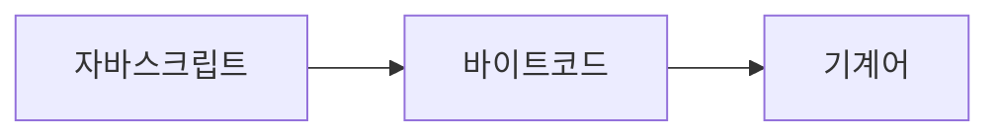
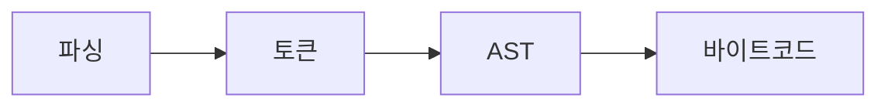

<!-- TODO: 출간 보류 -->

:::danger 경고

이 문서를 신뢰할 수 없습니다. 자바스크립트는 여러 계층의 추상화로 내부 구현의 정확한 직접 인용은 실질적으로 어렵습니다.

모든 설명에 V8 엔진 스펙을 직접 인용하기 전까지는 이 문서를 신뢰하면 안 됩니다.

<!-- 자바스크립트는 다양한 자바스크립트 엔진을 활용하고 있습니다. 그래서 임의의 표준으로 8V엔진을 활용할 것입니다. -->

브라우저 랜더링 과정에 대한 설명은 생략했습니다.

:::

# 자바스크립트 컴파일 과정

자바스크립트는 JIT 컴파일러 언어입니다. JIT 방식으로 컴파일하기 때문에 인터프린터 언어 같은 느낌이 듭니다. 하지만 엄밀한 분류를 해야 한다면 컴파일 언어입니다. 물론 실용적인 분류로 인터프린터 언어로 봐도 됩니다. 컴파일 속도가 빠르기 때문에 작성한 코드를 실행하고 피드백 받기 좋습니다.

## 컴파일과 인터프리터의 차이

먼저 컴파일과 인터프리터의 차이입니다. 아주 간단하게는 다음처럼 차이를 논할 수 있습니다.

컴파일은 소스코드를 변환하는 과정입니다. Java, Golang 같은 언어는 소스코드를 컴파일하고 얻은 실행파일로 프로그램을 실행합니다(물론 컴파일 안하고 실행하는 것도 가능합니다.). 컴파일 언어를 우리가 설치하면 우리는 변환기를 설치했다고 봐도 됩니다.

인터프리터는 소스코드를 그대로 실행합니다. Python, Ruby 같은 언어는 컴퓨터가 소스코드를 해석하고 바로 실행하는 것입니다. 그래서 실행파일이 생기지 않습니다. 우리가 프로그래밍 언어를 설치하면 해석기를 설치했다고 봐도 됩니다.

실행을 위해 컴파일은 하지만 실행파일이 따로 만들어지지 않습니다.

## 참고 이미지

- 자바스크립트 소스코드부터 실행까지[^1]

- 자바스크립트 소스코드부터 바이트코드까지[^1]

이 두 이미지를 보는 것부터 시작합시다.

## 자바스크립트 코드 작성

우리가 작성하는 일반적인 자바스크립트 코드를 보고 소스코드라고 부릅니다. 사람의 언어와 기계어의 중간에 위치합니다. 사람이 읽기 편하도록 작성합니다.

컴퓨터는 직접 소스코드를 읽을 수 없습니다. 하지만 읽을 수 있게 여러가지 처리과정을 거칩니다. 소가 우리 식탁에 올때까지 여러 처리과정이 있는 것처럼 소스코드가 CPU와 메모리로 도달할때까지 여러 처리과정이 있습니다.

소스코드는 html을 통해서 자바스크립트 코드 혹은 파일을 발견하는 시점부터 시작합니다. 스트림으로 읽기 시작합니다.

기본 원리는 다음과 같이 간단합니다.

## 자바스크립트 소스코드에서 바이트코드로 변환

### 소스코드의 토큰화

자바스크립트 스트림을 읽기 시작하고

자바스크립트 소스코드를 읽고 처리하는 것(parsing)부터 시작입니다. 많은 경우 소스코드를 파싱할 때 토큰화로 보통 시작합니다. 하지만 자바스크립트는 lexer(tokenizer)가 처리합니다. 토큰화란<!--[^토큰이란?]--> 소스코드를 의미단위로 쪼갠 조각으로 볼 수 있습니다. 단위는 단어단위입니다.

V8엔진의 경우 Lexer가 토큰을 생성해줍니다. V8 개발팀은 Lexer를 스케너(scanner)라고 부르고 있습니다.[^2] 스캐너는 토큰을 만들어서 스트림<!--[^스트림이란?]-->을 생성합니다.

여기서 중요한 포인트는 처음부터 바로 파서가 처리하지 않습니다.

<!-- 1. 엔진(브라우저라면 내장 엔진)이 스크립트를 읽습니다(파싱).
2. 읽어 들인 스크립트를 기계어로 전환합니다(컴파일).
3. 기계어로 전환된 코드가 실행됩니다. 기계어로 전환되었기 때문에 실행 속도가 빠릅니다. -->

### AST

V8엔진의 parser는 AST를 읽고 처리합니다.

## 바이트코드에서 기계어로 변환

## 엄밀한 정의를 계속 붙이면 생기는 오류

- 하이레벨 프로그래밍 언어는 자연어와 기계어 사이에 있는 것은 편의상 정의입니다. 사람이 컴퓨터에게 어떤 명령을 할 때 인간의 자연어와 비슷한 구조와 표현이 편안하기 때문에 이렇게 표현했습니다.

---

<!-- https://github.com/arch-spatula/Hyper-Modern-JavaScript-Cook-Book/issues/25 -->

[javascript 동작 원리](https://velog.io/@namezin/javascript-%EB%8F%99%EC%9E%91-%EC%9B%90%EB%A6%AC)

[How Does JavaScript Really Work? (Part 1) - Priyesh Patel](https://blog.bitsrc.io/how-does-javascript-really-work-part-1-7681dd54a36d)

[How Does JavaScript Really Work? (Part 2) - Priyesh Patel](https://blog.bitsrc.io/how-does-javascript-work-part-2-40cc15360bc)

[JavaScript engine - wikipedia](https://en.wikipedia.org/wiki/JavaScript_engine)

[turbofan - V8](https://v8.dev/docs/turbofan)

[ignition - V8](https://v8.dev/docs/ignition)

[컴파일러 이론에서 토크나이저(Tokenizer), 렉서(Lexer), 파서(Parse) 의 역할](https://velog.io/@mu1616/%EC%BB%B4%ED%8C%8C%EC%9D%BC%EB%9F%AC-%EC%9D%B4%EB%A1%A0%EC%97%90%EC%84%9C-%ED%86%A0%ED%81%AC%EB%82%98%EC%9D%B4%EC%A0%80Tokenizer-%EB%A0%89%EC%84%9CLexer-%ED%8C%8C%EC%84%9CParse-%EC%9D%98-%EC%97%AD%ED%95%A0)

[자바스크립트는 Compiler / Interpreter 언어다?](https://velog.io/@seungchan__y/%EC%9E%90%EB%B0%94%EC%8A%A4%ED%81%AC%EB%A6%BD%ED%8A%B8%EB%8A%94-Compiler-Interpreter-%EC%96%B8%EC%96%B4%EB%8B%A4)

[V8 에서 Javascript 코드를 실행하는 방법 정리해보기](https://pks2974.medium.com/v8-%EC%97%90%EC%84%9C-javascript-%EC%BD%94%EB%93%9C%EB%A5%BC-%EC%8B%A4%ED%96%89%ED%95%98%EB%8A%94-%EB%B0%A9%EB%B2%95-%EC%A0%95%EB%A6%AC%ED%95%B4%EB%B3%B4%EA%B8%B0-25837f61f551)

[BlinkOn 6 Day 1 Talk 2: Ignition - an interpreter for V8](https://www.youtube.com/watch?v=r5OWCtuKiAk)

[^1]: [자바스크립트 코드 실행 동작 원리: 엔진, 가상머신, 인터프리터, AST 기초 - 카레유](https://curryyou.tistory.com/237)
[^2]: [Scanner - V8 blog ](https://v8.dev/blog/scanner)

<!-- [^토큰이란?]: 소프트웨어 공학에서 토큰은 어휘분석의 단위입니다. 프로그래밍 언어의 경우 인터프리터 혹은 컴파일러를 통해 기계가 이해할 수 있게 변환해줘야 합니다. 이 번환을 위해 식별자, 연산, 예약어와 키워드 등 처리와 구분을 위한 최소단위를 말합니다. 프로그래밍 언어가 아닌 경우에도 토큰 처리를 합니다. HTML의 경우 마크업 언어로 특정 태그의 열고 닫고 속성의 이름과 값을 분리하고 처리하는 것을 보고 토큰화 과정이라 합니다. 자연어 처리의 경우 특정 단어는 물론 관용적인 표현, 속담, 의성어, 의태어 등을 처리할 때도 사용하는 개념입니다. 하지만 가장 쉬운 이해는 토큰은 문자를 어떤 기준을 갖고 덩어리로 구분하는 것으로 이해할 수 있습니다. -->
<!-- [^스트림이란?]: 컴퓨터 처리 환경에서 스트림(stream)은 시간이 지남에 따라 사용할 수 있게 되는 일련의 데이터 요소를 가리키는 수많은 방식에서 쓰인다. (https://ko.wikipedia.org/wiki/%EC%8A%A4%ED%8A%B8%EB%A6%BC_(%EC%BB%B4%ED%93%A8%ED%8C%85))-->

<!-- [^2]:  -->
<!-- [javascript 동작 원리](https://velog.io/@namezin/javascript-%EB%8F%99%EC%9E%91-%EC%9B%90%EB%A6%AC) -->
