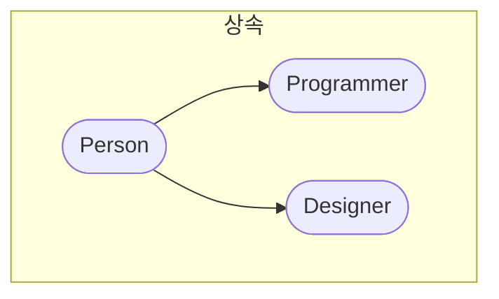

# prototype

ES6 이후 크게 의식할 필요가 없어진 개념입니다. 하지만 이론을 조금 이해하면 도움될 것입니다.

결론부터 이야기하자면 `prototype`을 많이 의식해서 프로그래밍 해야 하면 프로그램을 잘못 작성했을 가능성이 큽니다.

여기는 대부분의 내용에 이론을 이해하는데 초점을 두면 됩니다. 활용할 경우가 거의 없습니다.

## (생성자).prototype.(메서드)

MDN 공식 문서에거 `Array.prototype` 랑 그냥 `Array`를 봤을 것입니다.

차이는 동적 메서드와 정적 메서드입니다.

동적 메서드라는 것은 생성된 인스턴스에서 접근할 수 있는 메서드입니다.

정적 메서드는 생성자에서 접근해야 하는 메서드입니다.

이것은 자바스크립트가 ES5 시절 상속이 없던 시대에 만들어진 유산입니다.

## ES5 시대 유사 객체지향

먼저 `class`는 es6에서 지원하는 문법입니다.

```js
function Person(name) {
  this.name = name;
  this.introduce = function () {
    return 'My name is ' + this.name;
  };
}

let p1 = new Person('Jake');

console.log(p1.introduce()); // My name is Jake
```

ES5 시대에는 `function` 키워드로 생성자를 만들고 인스턴스도 구현했습니다. 위 코드를 보면 `introduce`에 함수를 값으로 할당해서 메서드를 구현하고 있습니다.

하지만 메서드를 추가하는데 다른 방식도 있습니다.

```js
function Person(name) {
  this.name = name;
}

Person.prototype.introduce = function () {
  // prototype를 설정하는 다른 방법
  return 'My name is ' + this.name;
};

let p1 = new Person('Jake');
console.log(p1.introduce()); // My name is Jake
```

이렇게 보면 `prototype`을 통해 메서드 추가를 알 수 있습니다.

```go
package main

import "fmt"

// Person 구조체 정의
type Person struct {
    Name string
    Age  int
}

// SayHello 메서드 정의
func (p Person) SayHello() {
    fmt.Printf("안녕하세요! 저는 %s이고, %d살입니다.\n", p.Name, p.Age)
}

func main() {
    // Person 구조체의 인스턴스 생성
    p := Person{
        Name: "Alice",
        Age:  25,
    }

    // 구조체의 메서드 호출
    p.SayHello()
}
```

golang이 구조체에 메서드를 추가하는 예시와 비슷합니다.

ES5 당시 상속도 특이하게 구현했습니다.

```js
function Person(name) {
  this.name = name;
}

Person.prototype.introduce = function () {
  return 'My name is ' + this.name;
};

let p1 = new Person('Jake');
console.log(p1.introduce()); // My name is Jake

// 메서드를 상속하는 예제입니다.
function Programmer(name) {
  this.name = name;
}
Programmer.prototype = new Person();

let p2 = new Programmer('fin');
console.log(p2.introduce()); // My name is fin
```

메서드를 상속받아 실행하는 예시입니다.

```js
function Person(name) {
  this.name = name;
}

Person.prototype.introduce = function () {
  return 'My name is ' + this.name;
};

let p1 = new Person('Jake');
console.log(p1.introduce()); // My name is Jake
// console.log(p1.coding())  // Error 상속은 단 방향으로 흐릅니다.

// 메서드를 상속하는 예제입니다.
function Programmer(name) {
  this.name = name;
}
Programmer.prototype = new Person();
Programmer.prototype.coding = () => `hello world!`;

let p2 = new Programmer('fin');
console.log(p2.introduce()); // My name is fin
console.log(p2.coding()); // hello world!

function Designer(name) {
  this.name = name;
}
Designer.prototype = new Person();
Designer.prototype.design = () => `Framer is awesome`;

let p3 = new Designer('BMO');
console.log(p3.introduce()); // My name is BMO
console.log(p3.design()); // Framer is awesome
```

위 상속을 다이어그램으로 나타내면 아래와 같습니다.



이렇게 상속을 할 수 있는데 자바스크립트 내장객체에도 사용할 수 있습니다. 내장객체에 적용하면서 폴리필이 되는 것입니다.

## `prototype` vs `__proto__`

`(생성자).prototype`과 `(인스턴스).__proto__`은 서로 같은 원본을 바라봅니다. 생성된 인스턴스와 생성자 함수의 속성이 가리키는 대상은 동일합니다. 이 의미를 잘 파악하고 싶다면 다음 코드를 실행하면 됩니다.

```js
function Constructor() {
  this.name = name;
}

const instance = new Constructor();

console.log(instance.__proto__ === Constructor.prototype); // true
```

직접 코드를 복사하고 실험해보기 바랍니다.


이렇게 보면 상당히 단순합니다.[^1]

정재남 선생님의 `prototype`에 대한 이론은 저 이미지 하나면 충분합니다.

## 객체의 특수성

객체를 활용할 때는 대부분 정적메서드를 활용합니다.

만약에 자바스크립트 코드를 작성할 때 객체처럼 키와 값의 형태를 갖은 자료형을 활용할 예정이라면 `Map` 객체를 활용할 것을 권장합니다. 성능도 더 좋고 ES6의 의도입니다.

> ECMAScript 5 의미
> JavaScript 1.8.5 (Firefox 4)부터, ECMAScript 제5판 의미(semantics)와 일치하는 `toString()` 메서드는 일반(generic) 메서드이므로 모든 객체에 사용될 수 있습니다. 객체가 `join()` 메서드가 있는 경우, 호출되어 그 값이 반환됩니다. 그렇지 않으면 `Object.prototype.toString()`가 호출되어 그 결과값이 반환됩니다.

MDN을 직접 인용했습니다. 이 인용은 무슨 뜻인가?


가족관계도를 보면 이렇습니다. 모든 것은 `null`이라는 공허에서 탄생했고 `object`로 ~~아홉거인~~ 여러 자료형들이 상속받은 것입니다.[^2]

이런 이유로 `object`에 폴리필하면 주의해야 합니다. 다른 내장객체들이 상속으로 접근할 수 있습니다.

<!-- ## 지금도 유사 객체지향

지금도 자바스크립트는 유사 객체지향입니다. 사실 전통적인 객체지향을 학습해본적이 없습니다. -->

[^1]: [🙈[JS] 프로토타입(Prototype) 객체🐵 - victolee 이미지 제공](https://victorydntmd.tistory.com/52)
[^2]: [다양한 내장 객체의 프로토타입 - 모던 자바스크립트 튜토리얼](https://ko.javascript.info/native-prototypes#ref-430)
