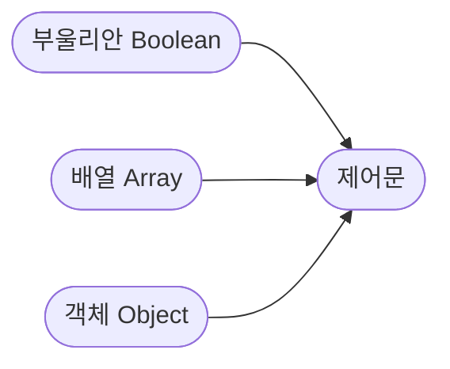

# 제어문

학습 의존성: 자료형 기초



다른 프로그래밍 언어를 공부해봤으면 크게 어려울 것은 없습니다.

## 조건문

<p align="center">

</p>

저의 목표는 여러분에게 이 밈을 이해시키는 것입니다.

아내(개발자)가 잘못했네요. 남편(컴퓨터)은 시키는데로 했습니다. ~~이래서 개발자는 연애를 못하나 봅니다.~~

조건문, 논리연산자, 비교연산자

```JavaScript
if (true) {
    // 실행
}
```

## if문

```js
if (true) console.log("one line test");
```

`if`문은 1줄로도 작성할 수 있습니다.

### 삼항연산자

```js
true ? console.log("true") : console.log("false");
```

꽤 자주 쓰는 문법입니다. 코드 복잡성은 낮출 수 있습니다. 리액트를 사용할 때 조건부 랜더링에 자주 사용하는 문법입니다.

주의사항이 있습니다. 중첩 삼항연산자는 자제합니다.

### optional chaining

어떤 객체의 메서드 혹은 프로퍼티의 존재여부를 판단하고 에러를 발생시키지 말아야 할 때 사용합니다.

```js
let user = {
  name: "kim",
  age: 20,
};

console.log(user?.age);
console.log(user?.name);
console.log(user?.nothing); // 에러 없는 undefined
console.log(user.nothing); // 에러 발생
```

[Use optional chaining in javascript to write better code #shorts](https://www.youtube.com/shorts/0N2OEQQ3pNg)

에러를 해결하는 문법이 아니라 에러를 감추는 문법입니다.

### nullish coalescing

[모르면 코딩인생 끝나는 자바스크립트 신문법 ?. / ??](https://www.youtube.com/watch?v=WHUvtiKy_pg)

```js
const a = false || "어떻게";
// a => "어떻게"
const b = false ?? "사람 이름이";
// b => false
const c = undefined ?? null ?? "엄",
// c => "엄"
```

nullish인 `null` 혹은 `undefined`이면 오른쪽에 보여줄 데이터를 넣습니다.

비동기 처리할 때 서버에서 데이터를 늦게 받거나 못받을 때 사용하는 문법입니다.

## switch문

리액트의 useReducer 훅에 자주 사용하는 조건문입니다. 조건확장 가능성이 높을 때 사용하기 좋은 조건문입니다.

```js
function reducer(state, action) {
  switch (action.type) {
    case "INCREMENT":
      return state + 1;
    case "DECREMENT":
      return state - 1;
    default:
      return state;
  }
}
```

## 논리 연산자

논리합(`||`), 논리곱(`&&`), 부정(`!`)

논리연산자는 진리표랑 똑같습니다. 진리표라고 하니 뭔가 간지나네요. 진리의 문이 다 생각납니다.

| 명제 P  | 명제 Q  | 연산형 | 결론    |
| ------- | ------- | ------ | ------- |
| `true`  | `true`  | `&&`   | `true`  |
| `false` | `true`  | `&&`   | `false` |
| `true`  | `false` | `&&`   | `false` |
| `false` | `false` | `&&`   | `false` |
| `true`  | `true`  | `\|\|` | `true`  |
| `false` | `true`  | `\|\|` | `true`  |
| `true`  | `false` | `\|\|` | `true`  |
| `false` | `false` | `\|\|` | `false` |

### 단축평가

[출처 - 벨로퍼트](https://learnjs.vlpt.us/useful/03-short-circuiting.html)

```js
console.log(true && "hello"); // hello
console.log(false && "hello"); // false
console.log("hello" && "bye"); // bye
console.log(null && "hello"); // null
console.log(undefined && "hello"); // undefined
console.log("" && "hello"); // ''
console.log(0 && "hello"); // 0
console.log(1 && "hello"); // hello
console.log(1 && 1); // 1
```

처리우선순위를 봅시다. 처리에 대한 진리표입니다. 즉 판별하고 남깁니다.

| 앞      | 뒤      | 연산형 | 결과값 |
| ------- | ------- | ------ | ------ |
| `true`  | `true`  | `&&`   | 뒤     |
| `false` | `true`  | `&&`   | 앞     |
| `true`  | `false` | `&&`   | 뒤     |
| `false` | `false` | `&&`   | 앞     |
| `true`  | `true`  | `\|\|` | 앞     |
| `false` | `true`  | `\|\|` | 뒤     |
| `true`  | `false` | `\|\|` | 앞     |
| `false` | `false` | `\|\|` | 뒤     |

이연산의 활용법은 fizzbuzz에 사용합니다.

```js
const arr = [...Array(100).keys()].map((x) => x + 1);

arr.forEach((elem) => {
  let print = "";
  elem % 3 === 0 ? (print += "fizz") : null;
  elem % 5 === 0 ? (print += "Buzz") : null;
  console.log(print || elem);
});
```

[1분 JS - AND OR 연산자로 코드 짧게 쓰기](https://www.youtube.com/shorts/4X7WqELD-Ls)

## 반복문

https://www.youtube.com/watch?v=QO-3d128l28

자바스크립트의 기본 반복문은 C스타일 반복문이라고 합니다. C언어의 반복문하고 비슷하게 생겼기 때문입니다.

### for 문

```C
#include<stdio.h>
 
int main(void)
{
    printf("for 반복문 예제1 : ");
    
    int i;
    for (i = 0; i < 10; ++i)
    {
        printf("%d ", i);
    }
    printf("\n");
}
```

출처: https://blockdmask.tistory.com/457 [개발자 지망생:티스토리]

실행할 필요는 없습니다. 여기서 for문이 `for (i = 0; i < 10; ++i)`으로 작성되어 있습니다. 자바스크립트의 전통적인 반복문을 보겠습니다.

```JS
const arr = ['a', 'b', 'c', 'd', 'f']

for (let i=0; i < arr.length; i++) {
    console.log(arr[i])  // a  b  c  d  f
}
```

for문이 상당히 닮았습니다. 여러분은 이것을 이해하고 앞으로 안 쓸 것입니다.

### while문

될때까지 계속하는 반복문입니다. 한국적인 반복문입니다.

입문자는 while문을 사용할 때 주의하기 바랍니다. 사용하지 말라는 것이 아닙니다. 스택오버플로우의 기원을 알아볼 수 있는 좋은 기회로 다음을 배울 것입니다.

```js
while true {
    console.log('ㅇㅇ')
}
```

위 코드를 브라우저 콘솔에 붙여넣세요.

# concatenation operation

```js
const a = "abc";
const b = "def";
console.log(a + b);
```

# 증감연산자

정식명칭이 있어서 소개합니다.

```js
const a = 1;
a++; // 증가연산자
a--; // 감소연산자
```

# 대입연산

할당연산과 유사하게 생겼지만 다릅니다.

```js
const a = 0;
a += 10;
```

연산하고 할당한다는 의미입니다. 대입연산을 함수에 대입한다는 의미로 착각하지 말도록 합니다.

# 비교와 일치

`>`, `>=`, `<=`, `<`은 비교연산자입니다. `==`, `===`은 일치연산입니다. 전자는 '단순일치연산자'이고 후자는 '엄밀일치연산자'입니다.

명칭은 암기합니다.

# 산술연산자

나머지 연산자(`%` remainder operator)라고 쉽게 부를 수 있지만 모듈로 연산자(modulo operator)라고 부르도록 합니다.

자바스크립트는 제곱연산자(`**` exponentiation operator)도 의외로 지원해줍니다.
