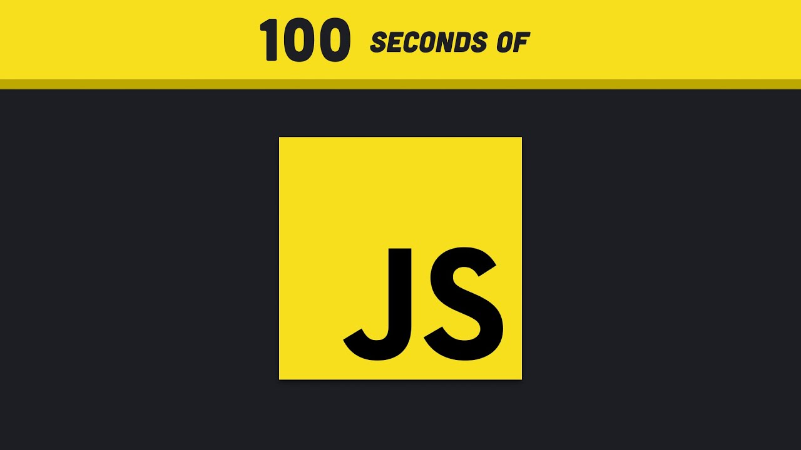
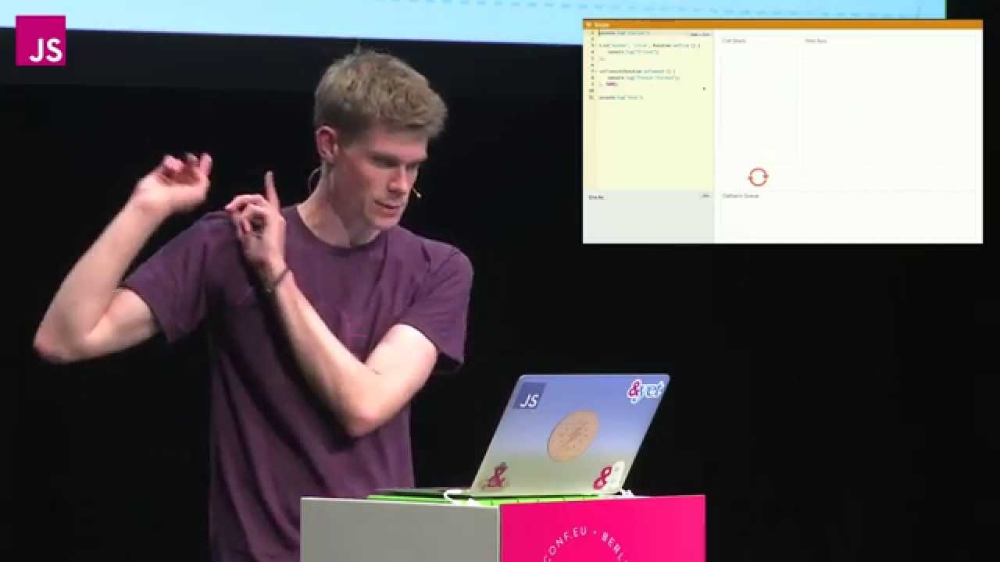

# 들어가며
자바스크립트는 웹 브라우저를 다룰 수 있게 해주는 프로그래밍 언어입니다. 처음에는 이것보다 더 많은 지식이 필요하지는 않습니다. 나중에 자바스크립트를 더 잘해지고 싶을 때 다시 읽을 것을 권합니다.

# 자바스크립트란 무엇인가?

> 자바(Java)랑 자바스크립트(JavaScript)랑 무슨 차이인가요?\
> [by 스택 오버플로우](https://stackoverflow.com/questions/245062/whats-the-difference-between-javascript-and-java)

> 햄과 햄스터의 차이\
> 인도와 인도네시아의 차이\
> 파와 파슬리의 차이\
> 쥐와 쥐며느리의 차이\
> 뱀과 뱀장어의 차이\
> 갈매기와 갈매기살의 차이\
> 팽이와 팽이버섯의 차이\
> cat과 catfish의 차이\
> Car와 Carpet의 차이 입니다.\
> \
> 그래서 그냥 다른 언어입니다.

100초 안에 설명하는 자바스크립트입니다.

1. 하이레벨
2. 싱글 쓰레드
3. 가비지 컬랙티드
4. 인터프리티드 || JIT 컴파일된
5. 프로토타입 기반
6. 멀티패러다임
7. 다이나믹 언어
8. 논블럭 이벤트 루프

https://dev.to/damxipo/javascript-versus-memes-explaining-various-funny-memes-2o8c

1995년에 ~~저랑 동갑이네요.~~ 브랜든 아이크에게 일주일만에 만들어졌습니다. 넷스케이프 브라우저에 쉽게 배울 수 있는 스크립트 언어를 만드는 게 목표였습니다. 

마케팅 목적으로 자바Java에 편승하기 위해 자바스크립트JavaScript로 명명했습니다.

> Any application that can be written in JavaScript, will eventually be written in JavaScript.  
> Jeff Atwood (a.k.a. Atwood's Law)

Node.js로 서버, 리액트 네이티브로 앱, 일랙트론으로 데스크탑 앱

## 하이레벨

하이레벨을 이해하기 위해서는 컴퓨터 언어의 레벨을 이해할 필요가 있습니다. 이런 말은 자주 들어봤을 것입니다. 

> 컴퓨터에게 모든 것은 결국 0과 1밖에 없다.

이 0과 1은 기계어를 의미합니다. 인간이 컴퓨터에게 명령하기 어려운 언어입니다. 이런 언어를 보고 로우레벨 언어라고 합니다. 하이레벨은 인간이 컴퓨터에게 명령하기 쉬운 언어입니다. 결국 기계어 혹은 어쎔블리어로 전달해주어야 하지만 변환을 대신해주는 것 중간 단계들이 있습니다.

## 싱글 쓰레드

싱글 쓰레드, 멀티 쓰레드가 있습니다. 여기서 쓰레드란 무엇인가?

> 스레드(thread)는 어떠한 프로그램 내에서, 특히 프로세스 내에서 실행되는 흐름의 단위를 말한다. 일반적으로 한 프로그램은 하나의 스레드를 가지고 있지만, 프로그램 환경에 따라 둘 이상의 스레드를 동시에 실행할 수 있다.  
> 위키 피디아

(https://ko.wikipedia.org/wiki/%EC%8A%A4%EB%A0%88%EB%93%9C_(%EC%BB%B4%ED%93%A8%ED%8C%85)#:~:text=%EC%8A%A4%EB%A0%88%EB%93%9C(thread)%EB%8A%94%20%EC%96%B4%EB%96%A0%ED%95%9C%20%ED%94%84%EB%A1%9C%EA%B7%B8%EB%9E%A8,%EB%A5%BC%20%EB%8F%99%EC%8B%9C%EC%97%90%20%EC%8B%A4%ED%96%89%ED%95%A0%20%EC%88%98%20%EC%9E%88%EB%8B%A4.)

## 가비지 컬랙티드

메모리 주소를 가르키는 것이 없으면 가비지 컬랙터가 알아서 삭제해줍니다.

https://www.youtube.com/watch?v=ip51Y5v3WLk

## 인터프리티드 || JIT 컴파일된

Just In Time 줄여서 짓이라고 부르기도 합니다.

[Franziska Hinkelmann: JavaScript engines - how do they even? | JSConf EU](https://www.youtube.com/watch?v=p-iiEDtpy6I)

## 프로토타입 기반

객체지향 프로그래밍할 때 방식이 조금 특이합니다. `this`라는 단어가 보이고 처리가 이상하면 겁부터 납니다. 자바스크립트의 세계에서 만물의 근원은 Object입니다.

## 멀티패러다임

멀티패러다임을 분해하는 것으로 이해해봅시다. 멀티라고 하면 여러, 동시 이런 의미를 파악할 수 있습니다. 패러다임은 무서워보이는 단어입니다(저는 상식수준을 어떻게 설정해야 할지 몰라서 모를 수 있다고 가정하겠습니다.). 안 무서워한다면 여러분은 상식이 풍부합니다(저는 무식해서 지잡대 전공 수업에 교수님이 패러다임이 무엇인지 설명해주셨습니다.). 패러다임은 지식을 바라보는 관점 및 배경이라고 할 수 있습니다. 예를 들어, 천문학에서 지동설, 천동설이 패러다임에 속합니다. 

프로그래밍을 작성할 수 있는 방식이 있습니다. 객체지향 프로그래밍 패러다임과 함수형 프로그래밍 패러다임이 있습니다. Java, Python같은 언어는 객체지향 프로그래밍 패러다임으로 작성합니다. 하지만 Scala 같은 언어는 함수형 프로그래밍 패러다임으로 작성합니다. 하지만 멀티패러다임은 2가지 모두 작성할 수 있습니다. 사실 방금 해당한 Java, Python, Scala모두 멀티 패러다임입니다.
자바스크립트는 객체지향, 함수형 모두 가능하지만 2022년 보통 함수형 프로그래밍 패러다임을 선호합니다.

## 다이나믹

자료형이 상황에 따라 유연하게 바뀝니다. 작업초반에는 자유도랑 생산성이 높아 좋습니다. 하지만 프로젝트의 사이즈가 커지면서 예측할 수 없는 문제들을 많이 만듭니다. 그래서 동적인 자료형보단 정적인 자료형을 선호하게 됩니다. 이런 이유로 ~~우리의 햄~~ Java가 인기가 많아진 것도 이런 이유입니다. 개발에서 항상 규모랑 자유도는 반비례해야 합니다. 큰 규모의 작업에게 자유도란 주적입니다.

나중에는 이 밈을 이해하게 될 것입니다.[1](#javaScriptMeme)

## 논블럭 이벤트 루프
선행학습: 자료구조 & 알고리즘의 `queue`, `stack`, `heap` 개념

콜스택을 사용합니다.

힙메모리

call stack

stack trace

블록킹은 실행이 느린 것이다. 서버랑 통신하는 것, 이미지 처리하는 것 등... 컴퓨터가 처리하기 느린 것들은 존재한다.

왜 문제가 되는가? 동기적으로 작동하면 간단한 실행은 앞의 실행을 기다려야 한다.

블록킹문제는 비동기처리로 해결할 수 있다. 

WebAPI

참고. while 문의 문제는 동기적으로 작동한다.

이벤트 루프는 call stack이 비어있으면 task queue에서 call stack으로 밀어넣는다.

[요약](https://velog.io/@paul_kang/%EC%96%B4%EC%A8%8C%EB%93%A0-%EC%9D%B4%EB%B2%A4%ED%8A%B8-%EB%A3%A8%ED%94%84%EB%8A%94-%EB%AC%B4%EC%97%87%EC%9E%85%EB%8B%88%EA%B9%8C)

# 자바스크립트의 역사

하나님이 7일만에 세계를 창조하듯이 브랜든 아이크가 자바스크립트를 7일만에 만들었습니다. 그래서 세상도 자바스크립트도 이모양입니다.

---
<a name="javaScriptMeme">1</a>: [Javascript vs memes](https://dev.to/damxipo/javascript-versus-memes-explaining-various-funny-memes-2o8c)
