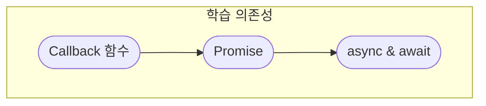

<!-- TODO Promise 관련 다이어그램 이미지를 추가합니다. -->
# 시작하기

문법적인 구조를 이해하기 어려워서 다양한 아티클 자료를 모은 것입니다.

학습의존성: 자바스크립트 엔진 및 브라우저 동작원리

학습 순서는 콜백을 먼저 이해하고 그 다음에 Promise를 이해하고 마지막으로 Async & Await을 이해합니다.

https://velog.io/@titu/JavaScript-Task-Queue%EB%A7%90%EA%B3%A0-%EB%8B%A4%EB%A5%B8-%ED%81%90%EA%B0%80-%EB%8D%94-%EC%9E%88%EB%8B%A4%EA%B3%A0-MicroTask-Queue-Animation-Frames-Render-Queue

https://velog.io/@dev-mish-mash/Task-queue%EC%97%90-%EB%8C%80%ED%95%9C-%EC%98%A4%ED%95%B4-%EC%A0%95%EB%A6%AC

# 스스로 정리하기

2022년에 프론트엔드 엔지니어가 궁극적으로 비동기처리에 대해서 알아야 하는 것은 async await입니다. async await을 바로 이해할 수는 없습니다. 그 전에 Promise부터 이해를 해야 하고 Promise를 이해하기 전에 Callback부터 이해해야 합니다. 그래서 Callback 함수부터 시작하겠습니다.



## Callback 함수

Callback 함수는 특정 조건을 만족하는 적절한 순간에 실행하는 함수라고 할 수 있겠습니다.

특정 조건을 만족하고 적절한 순간를 결정(=제어)하는 주체는 누구인가? 더 정확히 무엇이라고 할 수 있습니다. 콜백함수는 호출한 함수가 제어의 주체가 됩니다.

```js
const arr = [...Array(10).keys()].map(x => x + 1);
console.log(arr);  // [1, 2, 3, 4, 5, 6, 7, 8, 9, 10]
```
위 코드에서는 map의 인자로 넣은 함수가 콜백함수 입니다. `x => x + 1`은 화살표함수입니다. 화살표함수도 모르면 이 글읽을 자격이 없습니다. 자바스크립트에게 함수는 일급 객체입니다. 이것은 일급함수라는 프로그래밍 언어적인 개념입니다(다른 프로그래밍 언어 혹은 함수형 프로그래밍 언어에서 자주 볼 수 있습니다.). 함수 자체를 일급객체로 취급해서 인저로 넘기고 다른 함수속에서 실행할 수 있습니다. `map` 배열 메소드(a.k.a. 고차함수)는 `x => x + 1`함수를 호출하고 제어한 주체가 됩니다. 여기서 호출이 된 함수인 `x => x + 1`는 콜백함수입니다.

<!-- TODO Prototype을 배우고 DIY로 map함수 만들기 -->
map 함수를 DIY로 만드는 것은 제가 Prototype을 배우고 다시 오겠습니다.


```js
function controller(cb) {
    cb()
};
```


# 생활코딩

## Promise
[생활코딩 - JavaScript - Promise (then, catch)](https://youtu.be/Sn0ublt7CWM)

```js
console.log(1);
console.log(2);
setTimeout(() => console.log(3), 5000)
console.log(4);
// 1 2 4 3
```
위 코드는 비동기적으로 명령을 실행하는 것입니다. 각자가 자신의 시간표에 따라 실행하게 됩니다.

동기적인 실행의 장점은 예측이 쉽습니다. 비동기적인 실행은 효율적이지만 예측이 어렵습니다.

동기적인 명령의 단점은 하나의 명령이 끝날 때까지 다음 실행을 미루어둡니다.

비동기적인 명령은 언제하는가? 완료를 예측하기 어렵거나, 부가적인 작업에 자주 사용합니다. 더 구체적으로 통신에 활용합니다. 인터넷 혹은 서버가 느릴 수 있습니다. 통신이 완수 되었을 때 작업에 착수하는 게 더 효율적일 수 있습니다.

브라우저와 웹서버가 자바스크립트로 통신하는 것은 AJAX로 합니다. 

통신을 동기적으로 하면 통신하는 동안 어떤 행위도 할 수 없기 때문에 사용자는 성능이 떨어진다고 느낍니다.

fetch API는 기본적으로 `Promise`를 사용합니다.

```js
fetch('http://example.com/movies.json')
  .then((response) => response.json())
  .then((data) => console.log(data));
```

https://jsonplaceholder.typicode.com/

위 사이트는 프로토타입 API가 필요할 때 활용할 수 있습니다.

이 주소를 활용하면 JSON 데이터를 가져올 수 있습니다.
```js
console.log(1);
fetch('https://jsonplaceholder.typicode.com/posts')
  .then((response) => response.json())
  .then((data) => console.log(data));
console.log(2);
//  1  2  JSON데이터
```
`then`이 `Promise`에 해당합니다. 

`fetch`함수의 `Return value`는 `Promise`의 `response` 객체입니다. 이 개념을 보고 `fetch` 코드 블럭을 보기 바랍니다.

`then` 메소드와 `catch` 메소드를 지원합니다. 모두 콜백함수를 인자로 넣습니다. `then`은 서버랑 통신이 성공(`resolve`)해서 데이터를 받을 수 있었을 때 콜백함수를 실행하게 됩니다. `catch`는 통신에 실패했을 때 실패한 이유를 콜백함수로 알려줍니다.

`then` 메소드에 `then` 혹은 `catch` 메서드를 계속 뒤에 달아서 체이닝을 할 수 있습니다.

통신에 대한 코드값은 따로 공부하기를 권장합니다. 200은 성공을 의미합니다.

서버에서 통신으로 가져온 데이터는 자바스크립트로 조작하기 편하게 변환할 수 있습니다. `then((response) => response.json())`으로 자바스크립트 객체처럼 돌려 받을 수 있습니다. `then((response) => response.text())`로 텍스트로 필터할 수 있습니다.

방식은 Nested 방식과 promise chaining 방식이 있습니다. 가독성은 promise chaining이 더 좋습니다.

[JavaScript Promise 2 - new Promise](https://youtu.be/PasFh_t1mhY)

자체적인 Promise를 만드는 방법입니다.

```js
const task1 = new Promise((resolve, reject) => {
	resolve('Success Date');
});
task1.then((data) => {
	console.log('data', data) //data Success Data
})
```

Promise는 성공과 실패를 알려주는 콜백햄수를 인자로 넣어줘야 합니다. 첫번째 인자는 성공이고 두번째 인자는 실패입니다. 인자 이름은 관습적으로 resolve, reject으로 넣습니다. resolve 함수의 인자가 성공했을 때 돌려주는 데이터입니다.

Promise는 함수 속에서 실행하는 경우가 많습니다.
```js
const task1 = () => new Promise((resolve, reject) => {
	resolve('Success Date');
	reject('fall no Data');
});
task1
	.then((data) => {
	console.log('data', data) //data Success Data
})
	.catch(reason => {
		console.log(reason)
		return Promise.reject() // 통신 실패하면 이유를 알려주고 실행을 중지시키는 방법입니다.
	})
```

Promise는 여러개의 비동기적인 작업에 효율적입니다.

[JavaScript - async & await](https://youtu.be/1z5bU-CTVsQ)

비동기적인 작업은 콜백함수를 많이 사용합니다. 하지만 콜백을 많이 하면서 콜백지옥이 발생합니다. 코드는 종말의 피라미드가 됩니다.

이런 이유로 등장한 것이 Promise입니다. 작업이 성공하면 `then` 메서드로 계속이어 붙여줍니다. 하지만 다른 종류의 지옥 코는 종말의 탑이 됩니다.

종말의 탑을 부수기 위해 나온 것이 async & await가 나왔습니다.

동기적인 코드를 작성하는 것처럼 단순한 문법에 비동기적인 실행을 원해서 탄생했습니다.

비동기적으로 실행할 것이면 await를 앞에 붙여야 합니다. await를 붙일 수 있는 코드는 async가 앞에 붙은 함수 속에서 실행할 수 있습니다.

```js
const timer = () => new Promise((resolve, reject) => {
	// 이 함수의 내용 알 필요 없습니다.
	// time은 1000당 1초 뒤에 실행하는 함수입니다.
})
timer(1000)
	.then((time) => {
		console.log('time:'+time)
		return timer(time + 1000)
	})
	.then((time) => {
		console.log('time:'+time)
		return timer(time + 1000)
	})
	.then((time) => {
		console.log('time:'+time)
		return timer(time + 1000)
	})
```

위에 있는 코드는 전통적인 Promise입니다.

```js
const timer = (time) => new Promise((resolve, reject) => {
	// 이 함수의 내용 알 필요 없습니다.
	// time은 1000당 1초 뒤에 실행하는 함수입니다.
	setTimeout(() => {}, time);
})
async function run() {
	let time = await timer(1000);
	console.log('time:'+time)
	time = await timer(time + 1000);
	console.log('time:'+time)
	time = await timer(time + 1000);
	console.log('time:'+time)
	time = await timer(time + 1000);
}
run()
```
훨신더 간략한 코드입니다. async는 평범한 함수를 비동기함수로 바꿔줍니다. 더이상 Promise로 해결할 수 있습니다. 함수의 async를 붙이면 자동적으로 Promise가 됩니다. 하지만 함수가 반환값을 갖게 만들 수 있습니다.


# freecodecamp
[Asynchronous JavaScript Course (Async/Await, Promises, Callbacks) - 영상](https://www.youtube.com/watch?v=ZYb_ZU8LNxs)

[JavaScript Async/Await Tutorial – Learn Callbacks, Promises, and Async/Await in JS by Making Ice Cream 🍧🍨🍦 - 아티클](https://www.freecodecamp.org/news/javascript-async-await-tutorial-learn-callbacks-promises-async-await-by-making-icecream/)


비동기처를 하면 큰 과제를 작게 쪼갤 수 있습니다. 

Async/Await를 이해하려면 동기 비동기 처리를 이해해야 합니다.


[출처: Asynchronous VS Synchronous (1) 2편 미작성](https://velog.io/@dorazi/Asynchronous-VS-Synchronous)

동기적 처리는 10개의 과제에 대해서 1개의 손으로 해결할 수 있을 때 순서대로 과제를 처리하는 것을 말합니다. 비동기처리는 과제도 10개 손도 10개라서 순서, 의존성과 무관하게 처리하는 것입니다. 비동기적인 과제의 완수도 각각 과제를 처리하는 각각의 시간이 걸립니다.

```js
// synchronous 동기적 실행

console.log(" I ")

console.log(" eat ")

console.log(" ice cream ")

console.log(" with a ")

console.log(" spoon ")

// I eat ice cream with a spoon 순차적으로 출력합니다.
```

동기적 실행은 과제를 실행하는 중에 하나가 실행 실패하면 뒤 모든 실행도 정지합니다.

```js
// Asynchronous

console.log(" I ");

console.log(" eat ");

setTimeout(() => {
  console.log(" ice cream ");
}, 2000);

console.log(" with a ");

console.log(" spoon ");
// I eat with a spoon 2초 후 ice cream
```
코드 중간에 `setTimeout`을 미루고 그 뒤에 있는 코드를 실행합니다.

콜백은 함수 속에 함수를 인자로 넣었던 함수를 의미합니다.

```js
// Callback

function one() {
  console.log(" step 1 ");
}

function two() {
  console.log(" step 2 ");
}

one();
two();
// step 1  step 2  함수를 호출한 순서대로 실행합니다.
```

```js
// Callback

function one(call_two) {
  call_two();
  console.log(" step 1 complete. please call step 2 ");
}

function two() {
  console.log(" step 2 ");
}

one(two);

// step 2  step 1 complete. please call step 2
```

`console.log`의 출력 순서는 `one`함수에서 속에서 제어합니다. 콜백함수의 제어의 주체는 `one`함수가 됩니다.

```js
// Callback

const order = (call_production) => {
  console.log("order placed, please call production")
  call_production();
};

const production = () => {
  console.log("order received, starting production")
};
order(production)

/*
order placed, please call production 
order received, starting production 
*/
```
The storeroom will have all the ingredients [Our Backend]
We'll produce ice cream in our kitchen [The frontend]
창고에는 재료가 있는 백엔드가 될 것이고 부엌은 프론트 엔드로 아이스크림을 생산합니다.

```js
// Callback

let stocks = {
  Fruits: ["strawberry", "grapes", "banana", "apple"],
  liquid: ["water", "ice"],
  holder: ["cone", "cup", "stick"],
  toppings: ["chocolate", "peanuts"]
};

const order = (Fruits_name, call_production) => {
  setTimeout(() => {
    console.log(`${stocks.Fruits[Fruits_name]} was selected`);
  }, 2000);
  call_production();
};

const production = () => {
  setTimeout(() => {
    console.log("prodection has started");
  }, 0);
};

order(0, production);

/*
prodection has started 
strawberry was selected 
*/
```
출력하는 순서가 이상하다는 것을 발견했습니다. 생산을 먼저 출력하고 주문 수령을 다음에 출력합니다.

```js
// Callback

let stocks = {
  Fruits: ["strawberry", "grapes", "banana", "apple"],
  liquid: ["water", "ice"],
  holder: ["cone", "cup", "stick"],
  toppings: ["chocolate", "peanuts"]
};

const order = (Fruits_name, call_production) => {
  setTimeout(() => {
    console.log(`${stocks.Fruits[Fruits_name]} was selected`);
    call_production();
  }, 2000);
};

const production = () => {
  setTimeout(() => {
    console.log("prodection has started");

    setTimeout(() => {
      console.log("the fruit has been chopped");

      setTimeout(() => {
        console.log(`${stocks.liquid[0]} and ${stocks.liquid[1]} was added`);

        setTimeout(() => {
          console.log("the machien was started");

          setTimeout(() => {
            console.log(`ice cream was placed on ${stocks.holder[0]}`);

            setTimeout(() => {
              console.log(`${stocks.toppings[0]} was added as toppings`);

              setTimeout(() => {
                console.log("serve ice cream");
              }, 2000);
            }, 3000);
          }, 2000);
        }, 1000);
      }, 1000);
    }, 2000);
  }, 0);
};

order(0, production);

/*
strawberry was selected 
prodection has started 
the fruit has been chopped 
water and ice was added 
the machien was started 
ice cream was placed on cone 
chocolate was added as toppings 
serve ice cream 
*/
```
`setTimeout` 속에 넣어 동기적으로 처리했습니다. 과제는 성공적으로 달성했습니다. 코드 가독성이 엄청나게 떨어집니다. 이런 코드는 콜백 지옥이라고 부릅니다. 부모 자식 관계를 계속 만들면서 코드 가독성이 떨어집니다. 이론 코드베이스를 보고 종말의 피라미드라고 부릅니다. 그래서 등장한 것이 Promise입니다.

## Promise
Promise를 이해하려면 Promise 사이클을 이해해야 합니다.

- Relationship between time and work
- Promise chaining
- Error handling
- The .finally handler

처음 데이터를 요청하는 동안에는 pending 상태입니다. 하지만 pending에 대한 처리는 필요 없습니다.

데이터를 요청하고 통신이 성공적이면 Resolve가 발생합니다. 그리고 그 이후 then 메서드를 실행합니다.

데이터를 요청하고 통신에 실패하면 Reject가 발생합니다. 

데이터 요청의 성공과 실패와 무관하게 finally에서 실행이 종료되어야 합니다.

Promise chaining을 이해해야 합니다.

catch는 에러를핸들링합니다.	

```js
// Promise

let stocks = {
  Fruits: ["strawberry", "grapes", "banana", "apple"],
  liquid: ["water", "ice"],
  holder: ["cone", "cup", "stick"],
  toppings: ["chocolate", "peanuts"]
};

const isShopOpen = true;

const order = (work, time) => {
  return new Promise((resolve, reject) => {
    if (isShopOpen) {
      setTimeout(() => {
        resolve(work());
      }, time);
    } else {
      reject(console.log("our shop is closed"));
    }
  });
};

order(() => console.log(`${stocks.Fruits[0]} was selected`), 2000);
// strawberry was selected 
```

Promise를 만들고 실행하는 방법입니다. 이것은 Relationship between time and work에 해당합니다.

### Promise chaining

프로미스 체이닝은 `.then`으로 처리합니다. 


```js
// Promise

let stocks = {
  Fruits: ["strawberry", "grapes", "banana", "apple"],
  liquid: ["water", "ice"],
  holder: ["cone", "cup", "stick"],
  toppings: ["chocolate", "peanuts"]
};

const isShopOpen = true;

const order = (work, time) => {
  return new Promise((resolve, reject) => {
    if (isShopOpen) {
      setTimeout(() => {
        resolve(work());
      }, time);
    } else {
      reject(console.log("our shop is closed"));
    }
  });
};

order(() => console.log(`${stocks.Fruits[0]} was selected`), 2000)
  .then(() => {
    return order(() => console.log("production has started"), 0);
  })
  .then(() => {
    return order(() => console.log("the fruit was chopped"), 2000);
  })
  .then(() => {
    return order(
      () =>
        console.log(`${stocks.liquid[0]} and ${stocks.liquid[1]} was selected`),
      1000
    );
  })
  .then(() => {
    return order(() => console.log(`start the machine`), 1000);
  })
  .then(() => {
    return order(
      () => console.log(`ice cream placed on ${stocks.holder[0]}`),
      2000
    );
  })
  .then(() => {
    return order(() => console.log(`${stocks.toppings[0]} was selected`), 3000);
  })
  .then(() => {
    return order(() => console.log(`ice cream was served`), 1000);
  });

/*
strawberry was selected 
production has started 
the fruit was chopped 
water and ice was selected 
start the machine 
ice cream placed on cone 
chocolate was selected 
ice cream was served 
 */
```
then 메서드 속에는 콜백함수를 넣어서 실행시킵니다. 콜백함수의 반환 값을 통해서 실행합니다.

이제는 에러 핸들링입니다. `.catch`

```js
// Promise

let stocks = {
  Fruits: ["strawberry", "grapes", "banana", "apple"],
  liquid: ["water", "ice"],
  holder: ["cone", "cup", "stick"],
  toppings: ["chocolate", "peanuts"]
};

const isShopOpen = false; // true -> false

const order = (work, time) => {
  return new Promise((resolve, reject) => {
    if (isShopOpen) {
      setTimeout(() => {
        resolve(work());
      }, time);
    } else {
      reject(console.log("our shop is closed"));  // 실행
    }
  });
};

order(() => console.log(`${stocks.Fruits[0]} was selected`), 2000)
  .then(() => {
    return order(() => console.log("production has started"), 0);
  })
  .then(() => {
    return order(() => console.log("the fruit was chopped"), 2000);
  })
  .then(() => {
    return order(
      () =>
        console.log(`${stocks.liquid[0]} and ${stocks.liquid[1]} was selected`),
      1000
    );
  })
  .then(() => {
    return order(() => console.log(`start the machine`), 1000);
  })
  .then(() => {
    return order(
      () => console.log(`ice cream placed on ${stocks.holder[0]}`),
      2000
    );
  })
  .then(() => {
    return order(() => console.log(`${stocks.toppings[0]} was selected`), 3000);
  })
  .then(() => {
    return order(() => console.log(`ice cream was served`), 1000);
  })
  .catch(() => console.log("Customer left")); // 통신 실패로 실행


/*
our shop is closed 
Customer left 
 */
```

`reject` 함수와 `.catch` 메서드는 `Promise`에 실패했을 때 실행합니다. 
```js
// Promise

let stocks = {
  Fruits: ["strawberry", "grapes", "banana", "apple"],
  liquid: ["water", "ice"],
  holder: ["cone", "cup", "stick"],
  toppings: ["chocolate", "peanuts"]
};

const isShopOpen = true; // true -> false

const order = (work, time) => {
  return new Promise((resolve, reject) => {
    if (isShopOpen) {
      setTimeout(() => {
        resolve(work());
      }, time);
    } else {
      reject(console.log("our shop is closed")); // 실행
    }
  });
};

order(() => console.log(`${stocks.Fruits[0]} was selected`), 2000)
  .then(() => {
    return order(() => console.log("production has started"), 0);
  })
  .then(() => {
    return order(() => console.log("the fruit was chopped"), 2000);
  })
  .then(() => {
    return order(
      () =>
        console.log(`${stocks.liquid[0]} and ${stocks.liquid[1]} was selected`),
      1000
    );
  })
  .then(() => {
    return order(() => console.log(`start the machine`), 1000);
  })
  .then(() => {
    return order(
      () => console.log(`ice cream placed on ${stocks.holder[0]}`),
      2000
    );
  })
  .then(() => {
    return order(() => console.log(`${stocks.toppings[0]} was selected`), 3000);
  })
  .then(() => {
    return order(() => console.log(`ice cream was served`), 1000);
  })
  .catch(() => console.log("Customer left")) // 통신 실패로 실행
  .finally(() => console.log("day ended, shop is closed"));

  
/*
isShopOpen의 부울리안 값을 어떻게 해도 day ended, shop is closed은 출력됩니다.
 */

```
`finally()`는 `Promise`의 성공(`resolve`)과 실패(`reject`) 무관하게 실행합니다. `then`, `catch` 이후 무관하게 실행합니다. 그리고 순서상 뒤에 작성하게 되는 경우도 많고 권장합니다.

## Async/Await

- `try`, `catch` 메서드를 사용하는 법을 이해해야 합니다.
- `await` 키워드를 사용하는 방법을 이해해야 합니다.

```js
// function abc() {
//   null;
// }

// 비동기화를 하려면 async 키워드를 함수 앞에 붙여야 합니다.
// async는 Promise랑 유사하게 try, catch, finally로 돌아갑니다.
async function order() {
  try {
    await abc();
  } catch (error) {
    console.log("abc doesn't exist", error);  // error가 발생하면 실행하게 됩니다.
  } finally {
    console.log("runs code anyways");  // abc 함수의 주석 처리를 해제해도 실행됩니다. 
  }
}

order();
```

```js
// function abc() {
//   null;
// }

// 비동기화를 하려면 async 키워드를 함수 앞에 붙여야 합니다.
// async는 Promise랑 유사하게 try, catch, finally로 돌아갑니다.
async function order() {
  try {
    await abc();
  } catch (error) {
    console.log("abc doesn't exist", error);  // error가 발생하면 실행하게 됩니다.
  } finally {
    console.log("runs code anyways");  // abc 함수의 주석 처리를 해제해도 실행됩니다. 
  }
}

order()
	.then(() => console.log("method chaining"))
/*
abc doesn't exist -> ReferenceError: abc is not defined
runs code anyways 
method chaining 
*/
```
`async`로 정의한 함수는 이미 `Promise`로 취급하기 때문에 `.then` 메서드를 체인할 수 있습니다.

```js
// Async/Await

let stocks = {
  Fruits: ["strawberry", "grapes", "banana", "apple"],
  liquid: ["water", "ice"],
  holder: ["cone", "cup", "stick"],
  toppings: ["chocolate", "peanuts"]
};

const isShopOpen = true;

const toppingsChoice = () => {
  return new Promise((resolve, reject) => {
    setTimeout(
      () => resolve(console.log("which topping would you like?")),
      3000
    );
  });
};

async function kitchen() {
  console.log(" A ");
  console.log(" B ");
  console.log(" C ");
  await toppingsChoice(); //  비동기적으로 함수 호출
  console.log(" D ");  // call stack이 비어있을 때 다시 실행하기 시작합니다.
  console.log(" E ");
}

kitchen();
console.log("doing the dishes");  // await 키워드로 toppingsChoice함수가 callback Queue에 올라가있는 동안 실행합니다.
console.log("cleaning the tables");
console.log("taking orders");

/*
 A  
 B  
 C  
doing the dishes 
cleaning the tables 
taking orders 
which topping would you like? 
 D  
 E  
*/
```

```js
// Async/Await

let stocks = {
  Fruits: ["strawberry", "grapes", "banana", "apple"],
  liquid: ["water", "ice"],
  holder: ["cone", "cup", "stick"],
  toppings: ["chocolate", "peanuts"]
};

const isShopOpen = true;

function time(ms) {
  return new Promise((resolve, reject) => {
    if (isShopOpen) {
      setTimeout(resolve, ms);
    } else {
      reject(console.log("shop is closed"));
    }
  });
}

async function kitchen() {
  try {
    await time(2000);
    console.log(`${stocks.Fruits[0]} was selected`);
    await time(0);
    console.log("start the production");
    await time(2000);
    console.log("cut the fruit");
    await time(1000);
    console.log(`${stocks.liquid[0]} and ${stocks.liquid[1]} was added`);
    await time(1000);
    console.log("start the machine");
    await time(2000);
    console.log(`ice cream palce on ${stocks.holder[0]}`);
    await time(3000);
    console.log(`${stocks.toppings[0]} was selected`);
    await time(2000);
    console.log("serve ice cream");
  } catch (error) {
    console.log("customer left", error);
  } finally {
    console.log("day ended, shop is closed");
  }
}

kitchen();

/*
strawberry was selected 
start the production 
cut the fruit 
water and ice was added 
start the machine 
ice cream palce on cone 
chocolate was selected 
serve ice cream 
day ended, shop is closed 
*/
```


# Digital Fluency

[Intro to Async Web Dev - Part 1: Callbacks](https://www.youtube.com/watch?v=ueOG5uk7zo8)
비동기적으로 처리하면서 동기적으로 처리가 필요할 때 콜백이 필요합니다.

[Intro to Async Web Dev - Part 2: Promises](https://www.youtube.com/watch?v=f8IPKdQS1Cs)

# Fireship

[JavaScript Promise in 100 Seconds](https://www.youtube.com/watch?v=RvYYCGs45L4)

Promise는 현재는 모르지만 미래에 알게될 값을 알려줍니다. 비동기적인 값입니다.

카카오 택시 비유를 활용해서 이해할 수 있습니다.

저희(클라이언트)가 카카오 택시(서버가 보내준 Promise)에게 요청을 보냅니다. 카카오 택시는 요청을 확인하고 승인(resolve) 혹은 거부(reject)할 수 있습니다. 여기서 판단하는 시간동안 Pending 상태입니다. 승인(resolve)을 하면 저희를 찾아 올 것입니다. 가끔은 거부(reject)할 때도 있습니다. 어떤 방식으로든 요청 자체는 종료됩니다.

개발자로서 비동기적인 값을 담기 위해 Promise를 만들 것입니다. 프론트엔드 엔지니어로서 대부분의 경우 Promise의 소비자가 될 것입니다.

```js
const ride = new Promise(() => {

});
```

이 상태인 동안에는 pending 입니다.

```js
const ride = new Promise((resolved, reject) => {
    if (arrived) {
        console.log("택시의 승차 승인")
    } else {
        console.log("택시의 승차 거부")
    }
});
```

`resolved`, `reject`는 `executor`에 해당합니다. 성공 혹은 실패시 실행할 함수를 정의해야 합니다. 비동기작업은 여기서 시작합니다.


```js
// promise 소비자 관점
ride
    .then(value => {
        console.log(value)
    })
    .catch(error => {
        console.log(error)
    })
    .finally(() => {
        console.log('실행 종료')
    })
```
Promise가 성공하면 then, 실패하면 catch, 무관하게 실행이 필요하면 finally 메서드를 활용합니다.

```js
// promise 소비자 관점
ride
    .then()
    .then()
    .then()
    .catch()
    .finally()
```
`promise`의 `then`, `catch`, `finally는` 연속으로 체이닝할 수 있습니다.


[The Async Await Episode I Promised](https://www.youtube.com/watch?v=vn3tm0quoqE)

학습의존성: 이벤트루프, 콜백

자바스크립트는 싱글 쓰레드 언어입니다. 하나의 명령은 하나의 쓰레드를 통해서만 실행됩니다. 하지만 웹에서는 병목현상이 발생할 경우가 많습니다. 명령을 수행하기 위해 연산량이 많을 수 있습니다. 이런 이유로 비동기처리는 JavaScript 개발자로서 필수로 이해해야 하는 스킬입니다.

어느 비동기적인 작업을 이해하려면 이벤트루프부터 이해해야 합니다.

이벤트 루프는 비동기처리랑 무슨 관계가 있나요? 브라우저든 node.js 런타임이든 코드를 실행하기 위해 싱글 쓰레드 이벤트 루프를 실행하는 것은 같습니다. 첫 루프동안에는 동기 코드를 모두 실행할 것입니다. 하지만 일부 비동기 코드는 속칭 callback Queue에 올라갑니다. 네트워크에서 데이터를 호출해야 할 때는 브라우저에서 서버에게 요청하고 서버가 처리를 한 다음에 브라우저가 받는데까지 시간이 꽤 걸립니다. 그래서 서버에게 요청을 돌려받는 동안 callback Queue에 올려놓고 개별 쓰레드 풀로로 실행합니다. 요청의 응답이 돌아오면 이벤트 루프는 작업을 call stack에 올리고 실행합니다.

`setTimeout`, `setInterval`같은 macro task이면 다음 이벤트 루프에서 실행합니다.

성공한 Promise같은 micro task는 다음 이벤트 루프 실행전에 call stack 위에 올라갑니다.

```js
// L1
console.log('🥪 Synchronous 1');

// L2  macro task
setTimeout(_ => console.log(`🍅 Timeout 2`), 0);

// L3  micro task
Promise.resolve().then(_ => console.log('🍍 Promise 3'));

// L4
console.log('🥪 Synchronous 4');
/*
🥪 Synchronous 1 
🥪 Synchronous 4 
🍍 Promise 3 
🍅 Timeout 2
*/
```

출력순서를 보면 이벤트 루프의 동작방식을 이해할 수 있습니다. L1은 직관적으로 첫줄에 출력됩니다. 코드의 작성 순서랑 무관하게 4L가 바로 실행할 수 있어서 L2, L3보다 먼저 실행합니다. L2, L3는 callback Queue에 올라가는데 각각 다른 Queue에 올라갑니다. L3는 micro task Queue에 올라가고 L2의 macro task Queue보다 먼저 Dequeue를 합니다.

```js
import fetch from 'node-fetch';

const promise = fetch('https://jsonplaceholder.typicode.com/todos/1');

promise
  .then(res => res.json())
  .then(todo => {
    throw new Error('uh oh');
    return todo;
  })
  .then(todo => console.log('😛', todo.title))
  .catch(err => console.error('😭', err));

console.log('🥪 Synchronous');
/*
🥪 Synchronous
😭 Error: uh oh
*/
```
일반적인 콜백과 다르게 Promise의 장점은 에러핸들링을 간편하게 하나의 메서드로 처리할 수 있습니다. 에러가 발생하면 바로 `catch`메서드의 콜백을 실행합니다.


```js
const tick = Date.now();
const log = (v) => console.log(`${v} \n Elapsed: ${Date.now() - tick}ms`);

const codeBlocker = () => {
    // Blocking
    let i = 0;
    while(i < 1000000000) { i++;}
    return '🐷 billion loops done';
}

log('🥪 Synchronous 1');
codeBlocker().then(log)
log('🥪 Synchronous 2');
```

Promise를 직접만들면 실수를할 가능성이 더 큽니다. 위 코드를 실행하면 브라우저는 잠시 동작을 정지하는 비효율적인 코드입니다. 동기적으로 처리하면 경험할 수 있는 문제입니다.

```js

const tick = Date.now();
const log = (v) => console.log(`${v} \n Elapsed: ${Date.now() - tick}ms`);

const codeBlocker = () => {
    // Async blocking
    return new Promise((resolve, reject) => {
        let i = 0;
        while(i < 1000000000) { i++;}
        resolve('🐷 billion loops done');
    })
}

log('🥪 Synchronous 1');
codeBlocker().then(log)
log('🥪 Synchronous 2');
```

초보 개발자들이 실수하는 방식의 코드 작성입니다. `codeBlocker`의 반환값을 `Promise`로 두고 실행합니다. 메인 쓰레드에서 뺄 수 있을 것이라고 착각합니다. 메인 쓰레드에서 빠진 것은 resolve의 반환값만 micro task Queue위에 올라갑니다. 실행시간을 비교해보면 동기처리랑 차이가 없습니다.

```js
const tick = Date.now();
const log = (v) => console.log(`${v} \n Elapsed: ${Date.now() - tick}ms`);

const codeBlocker = () => {
    // Non-blocking
    return Promise.resolve().then(v =>  {
        let i = 0;
        while(i < 1000000000) { i++; }
        return '🐷 billion loops done';
    })
}

log('🥪 Synchronous 1');
codeBlocker().then(log)
log('🥪 Synchronous 2');
```

`Promise.resolve()`를 반환값으로 올려 놓으면 macro task가 모두 완수되었을 때 실행할 것이라고 확신할 수 있습니다.

Promise는 콜백에 비해하면 천국이지만 그럼에도 불구하고 코드 가독성이 떨어질 수 있습니다. 그래서 동기적으로 코드를 작성할 수 있는 Async Await가 있습니다.

```js
// Basic
export const getFruit = async name => {  // 함수명 앞에 async를 붙이면 반환값은 자동으로 Promise 객체입니다.
  const fruits = { // Promise 기반 API입니다.
    pineapple: '🍍',
    peach: '🍑',
    strawberry: '🍓'
  };

  return fruits[name]; // 반환값은 자동으로 resolve상태인 Promise입니다.
};

getFruit('peach').then(console.log);
```

```js
// Async + Await
// Async + Await의 진정한 힘은 Await 키워드 하나로 실행을 정지시킬 때입니다.

export const makeSmoothie = async () => {
  // await 키워드 하나로 then을 chaining 하는 대신에 resolve 값을 변수에 할당할 수 있습니다. 할당이 되면 다음 줄의 코드를 실행하게 됩니다.
  const a = await getFruit('pineapple');  
  const b = await getFruit('strawberry');

  return [a, b];
};

const makeSmoothie2 = () => {
  let a;
  return getFruit('pineapple')
    .then(v => {
      a = v;
      return getFruit('strawberry');
    })
    .then(v => [a, v]);
};
```

`makeSmoothie`는 비동기인데 함수 내에서 동기적으로 동작하는 코드입니다. 잘못 작성하는 코드입니다. 비동기처리로 성능을 높이려고 하는데 굳이 동기화를 시키고 있습ㄴ;디.

```js
import { getFruit } from './3-async-await';

const makeSmoothieFaster = async() => {
    const a = getFruit('pineapple');
    const b = getFruit('strawberry');

    const smoothie = await Promise.all([a, b])  // 동시에 실행할 수 있는 방법

    return smoothie;
}
```

async & await의 또 다른 장점은 에러 핸들링입니다.
```js
import { getFruit } from './3-async-await';

const badSmoothie = async() => {
    try {

        const a = getFruit('pineapple')
        const b = getFruit('strawberry');
        const smoothie = await Promise.all([a, b])

        throw 'broken!'

        return smoothie;

    } catch(err) {
        console.log(err)
        // return `😬 We are going to be fine...`
        throw `💩 It's broken!`
    }
}
```
`try`, `catch` 블록으로 에러핸들링을 더 간단하게 만들 수 있습니다. 에러 내용을 출력하거나 혹은 특정 값을 돌려주게 만들 수 있습니다. 에러 핸들링하는 방식에 따라 Promise 소비자의 제어흐름을 좌우할 것입니다. 에러가 발생했을 때 값을 돌려주면 에러를 무시하는 것과 비슷합니다. 대신할 값을 받아 활용하기 때문에 그렇습니다. `Error`를 `throw`하면 `catch` 콜백으로 처리합니다.

```js
import { getFruit } from './3-async-await';

const fruits = ['peach', 'pineapple', 'strawberry'];

const fruitLoop = async () => {
  for (const f of fruits) {
    const emoji = await getFruit(f);
    log(emoji);
  }
};

const fruitInspection = async () => {
  if ((await getFruit('peach')) === '🍑') {
    console.log('looks peachy!');
  }
};

import fetch from 'node-fetch';

const getTodo = async () => {
  const res = await fetch('https://jsonplaceholder.typicode.com/todos/1');

  const { title, userId, body } = await res.json();

  console.log(title, userId, body);
};
```

반복문을 비동기처리하고 싶으면 고차함수를 사용할 없습니다. 전통적인 반복문, 조건문에 서만 사용할 수 있습니다.


[Async Await try-catch hell](https://www.youtube.com/shorts/ITogH7lJTyE)

Async Await는 천국이라는 느낌이 들게 만듭니다.

```js
async () => {
    await promise
}
```

콜백 지옥 속에 종말의 피라미드를 코드베이스의 해결책처럼 보이기 때문입니다.

```js
function hell() { // 종말의 피라미드
    step1(a => {
        step2(b => {
            step3(c => {
                // 콜백지옥 어서오고!
            })
        })
    })
}
```


```js
async function heaven() {
    const a = await step();
    const b = await step(a);
    const c = await step(b);
    return a + b + c
}
```
콜백지옥에서 동기적인 코드처럼 보이게 만들었습니다. 에러핸들링까지만 이렇게 보입니다.

```js
async function towerOfTerror() {
    let a;
    let b;
    let c;
    try {
        const a = await step();
    } catch(error) {
        handle(error)
    }

    try {
        const b = await step(a);
    } catch(error) {
        handle(error)
    }

    try {
        const c = await step(b);
    } catch(error) {
        handle(error)
    }

    return a + b + c
}
```

공포의 탑입니다. 공포의 탑을 무너트리는 방법은 있습니다.

```js
const c = await step(b).catch(fun);
```
처음부터 `catch`메서드를 붙입니다. 가장 간단한 방법입니다.

```js
async function towerOfTerror() {
    const a = await step().catch(err => handle(err))
    const b = await step(a).catch(err => handle(err))
    const c = await step(b).catch(err => handle(err))
    return a + b + c
}
```

전보다는 확실히 좋지만 반복적이고 부족합니다.

```js
async function awesome() {
    try {
        const data = await promise();
        return [data, null]
    } catch(error) {
        console.error(error)
        return [null, error];
    }
}
```
함수하나로 `try`, `catch` 각각 하나만 만들고 다른 `try`, `catch`를 대체할 수 있습니다. 성공하면 첫번째 요소가 data이고 두번째 요소로 null을 받습니다. 에러가 발생하면 첫번째 요소는 null이고 두번째 요소는 error를 받고 Array Destructuring합니다.

```js
async function awesome() {
    const [data, error] = await awesome();
    if (error) {
        // 에러를 다른 방식으로 처리
    }
    const [data2, error2] = await awesome();
    const [data3, error3] = await awesome();
}
```
이런 방식으로 에러를 처리하고 에러 처리하는데 부족하면 if문으로 처리합니다.


# Web Dev Simplified

[Asynchronous Vs Synchronous Programming](https://www.youtube.com/watch?v=Kpn2ajSa92c)

동기적인 프로그램은 코드의 처음부터 끝까지 작성한 순서대로 실행하는 프로그램입니다.

비동기적인 프로그래밍은 실행이 오래걸리는 것을 뒤로 밀어두고 빨리 처리할 수 있는 코드를 먼저 실행합니다. 각자 다른 쓰레드에서 실행하게 됩니다.

비동기 프로그래밍은 일반적인 동기적인 프로그래밍보다 당연히 난이도가 높습니다.

```js
const a = 1;
const b = 2;

setTimeout(() => {
  console.log("비동기 처리");
}, 1000);

console.log(a);
console.log(b);
/*
1
2
비동기 처리 
*/
```
자주 본 예제입니다.

`Promise`도 비동기적으로 실행할 프로그래밍입니다. `Promise`는 완수 시간을 모르는 `setTimeout`이랑 유사합니다.

```js
let a = 1;
const b = 2;

setTimeout(() => {
  console.log("Timeout:" + a);  // 식별자에 변수를 할당한 다음에 실행하기 때문에 Timeout:10을 출력합니다.
}, 1000);

a = 10;

fetch("/").then(() => {
  console.log("fatch");
});

console.log(a);
console.log(b);

/*
10
2
fatch 
Timeout:10 
*/
```

많은 사람들에게 홀란을 발생시키는 부분입니다. 이런 이유로 함수는 순수함수를 추구해야 합니다. 외부 실행컨텍스트의 식별자를 참조하는 행위를 막아야 합니다. 가능하면 값은 함수의 인자를 통해 접근하게 하도록 합니다.

비동기처리가 어려운 이유는 직관적이지 않기 때문입니다.

# Traversy Media
[Async JS Crash Course - Callbacks, Promises, Async Await](https://www.youtube.com/watch?v=PoRJizFvM7s)

대부분의 API, 라이브러리는 Promise가 이미 다 만들어져 있고 프론트엔드 엔지니어는 대응하는 `then`, `catch` 메서드로 처리하게 될 것입니다. 하지만 기본적으로 만들 줄 알아야 합니다.

```js
async function fetchUsers() {
  const res = await fetch("https://jsonplaceholder.typicode.com/users");
  const data = await res.json();
  console.log(data);
}

fetchUsers()
// object가 담긴 배열을 돌려줍니다.
```

문법적 간결함에 감탄해보기 바랍니다.